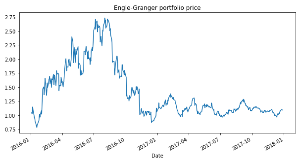
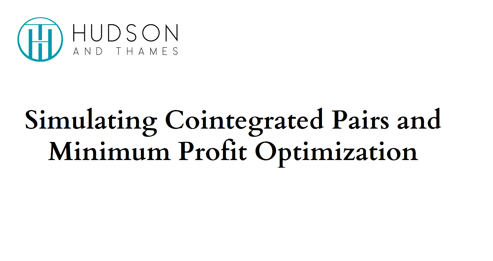

.. _cointegration_approach-cointegration_tests:

.. note::
   The following documentation closely follows the book by Ernest P. Chan:
   `Algorithmic Trading: Winning Strategies and Their Rationale <https://www.wiley.com/en-us/Algorithmic+Trading%3A+Winning+Strategies+and+Their+Rationale-p-9781118460146>`__.

   As well as the paper by Faik Bilgili:
   `Stationarity and cointegration tests: Comparison of Engle-Granger and Johansen methodologies <https://mpra.ub.uni-muenchen.de/75967/1/MPRA_paper_75967.pdf>`__.

=======================
Tests for Cointegration
=======================

.. raw:: html

    

        <iframe src="https://www.youtube.com/embed/1zz91G0nR14?start=170"
                frameborder="0"
                allowfullscreen
                style="position: absolute;
                       top: 0;
                       left: 0;
                       width: 100%;
                       height: 100%;">
        </iframe>
         
    

According to Ernest P. Chan:
"The mathematical description of a mean-reverting price series is that the change of the price series
in the next period is proportional to the difference between the mean price and the current price. This
gives rise to the ADF test, which tests whether we can reject the null hypothesis that the proportionality
constant is zero."

The Augmented Dickey–Fuller (ADF) test is based on the idea that the current price level gives us information about the future
price level: if it's lower than the mean, the next move will be upwards, and vice versa.

The ADF test uses the linear model that describes the price changes as follows:

.. math::

    \Delta y(t) = \lambda y(t-1) + \mu + \beta t + \alpha_1 \Delta y(t-1) + ... + \alpha_k \Delta y(t-k) + \epsilon_t

where :math:`\Delta y(t) \equiv y(t) - y(t-1)`, :math:`\Delta y(t-1) \equiv y(t-1) - y(t-2)`, ...

The hypothesis that is being tested is: :math:`\lambda = 0`. For simplicity we assume the drift term
to be zero (:math:`\beta = 0`). If we reject the hypothesis, this means that the next price move
depends on the current price level.

Mean reversion tests, such as ADF usually require at least 90 percent certainty. But in practice, we can
create strategies that are profitable even at lower certainty levels. The measure :math:`\lambda` can be
used to calculate the *half-life*, which indicates how long it takes for a price to mean revert:

.. math::

    \text{Half-life} = -log(2) / \lambda

Furthermore, we can see that if the :math:`\lambda` value is positive, the price series are not mean-reverting.
If it's close to zero, the half-life is very long and the strategy won't be profitable due to slow mean
reversion.

Half-life period can be helpful to determine some of the parameters to use in the trading strategy.
Say, if the half-life period is 20 days, then using 5 days backward-looking window for moving average
or volatility calculation may not give the best results.

The most common approach is to use two cointegrated price series to construct a portfolio. This is done by
simultaneously going long on one asset and short on the other, with an appropriate capital allocation
for each asset. This approach is also called a "pairs trading strategy". However, the approach can be
extended to three and more assets.

.. warning::

    From the mathematical standpoint, cointegration testing strives to prove that there exists at least
    one linear combination of given time series that is stationary. Hence sometimes during the testing,
    the cointegration vector might have only positive coefficients, making it not suitable for making a spread,
    while being completely theoretically sound.

.. Note::

    Another set of tools for pairs trading strategies is available in our Optimal Mean Reversion Module.

Johansen Cointegration Test
###########################

This is one of the most widely used cointegration tests, it's upside is that it can be applied to
multiple price series. Another common approach - the Cointegrated Augmented Dickey-Fuller (CADF)
test can only be used on a pair of price series and is not covered in this module.

A motivation to use the Johansen approach instead of the simple ADF test is that, first it allows
multiple price series for stationarity testing, and second it provides hedge ratios for price
series used to combine elements into a stationary portfolio.

To understand how to test the cointegration of more than two variables, we can transform the equation
used in the ADF test to a vector form. So :math:`y(t)` would be vectors representing multiple price
series, and the :math:`\lambda` and :math:`\alpha` are matrices. We also assume that the drift term is
zero (:math:`\beta t = 0`). So the equation can be rewritten as follows:

.. math::

    \Delta Y(t) = \Lambda Y(t-1) + M + A_1 \Delta Y(t-1) + ... + A_k \Delta Y(t-k) + \epsilon_t

This way we can test the hypothesis of :math:`\Lambda = 0`, in which case, we don't have cointegration
present. Denoting the rank of the obtained matrix :math:`\Lambda` as :math:`r` and the number of price series
as :math:`n`, the number of independent portfolios that can be formed is equal to :math:`r`.

The Johansen test calculates the :math:`r` and tests the hypotheses of :math:`r = 0` (cointegrating
relationship exists), :math:`r \le 1`, ..., :math:`r \le n - 1`. In case all the above hypotheses are
rejected, the result is that :math:`r = n` and the eigenvectors of the :math:`\Lambda` can be used as
hedge ratios to construct a mean-reverting portfolio.

Note that the Johansen test is independent of the order of the price series, in contrast to the CADF test.

The Johansen test from the ArbitrageLab package allows getting the cointegration vectors, trace statistics,
and eigenvector statistics from a given dataframe with price series. Note that the two last statistics
will be calculated only if the input dataframe contains 12 or less price series.

.. figure:: images/johansen_portfolio.png
    :scale: 100 %
    :align: center

    An example of a mean-reverting portfolio constructed using the Johansen test.

Implementation
**************

.. automodule:: arbitragelab.cointegration_approach.johansen

    .. autoclass:: JohansenPortfolio
        :members:
        :inherited-members:

        .. automethod:: __init__

Examples
********

.. code-block::

   # Importing packages
   import pandas as pd
   from arbitragelab.cointegration_approach.johansen import JohansenPortfolio

   # Getting the dataframe with time series of cointegrating asset prices
   data = pd.read_csv('X_FILE_PATH.csv', index_col=0, parse_dates = [0])

   # Running tests and finding test statistics and cointegration vectors
   portfolio = JohansenPortfolio()
   portfolio.fit(data)

   # Getting results for the eigenvalue statistic test
   eigenvalue_statistics = portfolio.johansen_trace_statistic

   # Getting results for the trace statistic test
   trace_statistics = portfolio.johansen_eigen_statistic

   # Resulting cointegration vectors that can be used for portfolio construction
   cointegration_vectors = portfolio.cointegration_vectors

   # Constructing series of portfolio prices
   portfolio_price = portfolio.construct_mean_reverting_portfolio(data, cointegration_vectors.loc[0])

Engle-Granger Cointegration Test
################################

The cointegration testing approach proposed by Engle-Granger allows us to test whether two or more price
series are cointegrated of a given order.

The Engle-Granger cointegration test is performed as follows:

- First, we need to determine the order of integration of variables :math:`x` and :math:`y`
  (or :math:`y_{1}, y_{2}, ...` in case of more than two variables). If they are integrated of the
  same order, we can apply the cointegration test.
- Next, if the variables are integrated of order one at the previous step, the following regressions
  can be performed:

.. math::

    x_t = a_0 + a_1 y_t + e_{1,t},

    y_t = b_0 + b_1 x_t + e_{2,t}

- Finally we run the following regressions and test for unit root for each equation:

.. math::

    \Delta e_{1,t} = a_1 e_{1, t-1} + v_{1, t},

    \Delta e_{2,t} = a_2 e_{2, t-1} + v_{2, t}

If we cannot reject the null hypotheses that :math:`|a_1| = 0` and :math:`|a_2| = 0`, we cannot
reject the hypotheis that the variables are not cointegrated.

The hedge ratios for constructing a mean-reverting portfolio in the case of the Engle-Granger test
are set to :math:`1` for the :math:`x` variable and the coefficient :math:`-a_1` for the :math:`y`
variable (or :math:`-a_1, -a_2, ..` in case of multiple :math:`y_i` price series).

The Engle-Granger cointegration test implemented in the ArbitrageLab package assumes that the first step
of the algorithm is passed and that the variables are integrated of order one. This test allows us to
get cointegration vectors, ADF test statistics for the null hypotheses in the final step from a given
dataframe with price series.

    An example of a mean-reverting portfolio constructed using the Engle-Granger test.

Implementation
**************

.. automodule:: arbitragelab.cointegration_approach.engle_granger

    .. autoclass:: EngleGrangerPortfolio
        :members:
        :inherited-members:

        .. automethod:: __init__

Examples
********

.. code-block::

   # Importing packages
   import pandas as pd
   from arbitragelab.cointegration_approach.engle_granger import EngleGrangerPortfolio

   # Getting the dataframe with time series of cointegrating asset prices
   data = pd.read_csv('X_FILE_PATH.csv', index_col=0, parse_dates = [0])

   # Running tests and finding test statistics and cointegration vectors
   portfolio = EngleGrangerPortfolio()
   portfolio.fit(data)

   # Getting results for the ADF test in the last step of the method
   adf_statistics = portfolio.adf_statistics

   # Resulting cointegration vector that can be used for portfolio construction
   cointegration_vectors = portfolio.cointegration_vectors

   # Constructing series of portfolio prices
   portfolio_price = portfolio.construct_mean_reverting_portfolio(data, cointegration_vectors.loc[0])

Research Notebooks
##################

* `Mean Reversion`_

.. _`Mean Reversion`: https://hudsonthames.org/notebooks/arblab/mean_reversion.html

.. raw:: html

    <a href="https://hudthames.tech/3iIGDvv"><button style="margin: 20px; margin-top: 0px">Download Notebook</button></a>
    <a href="https://hudthames.tech/2S03R58"><button style="margin: 20px; margin-top: 0px">Download Sample Data</button></a>

Presentation Slides
###################

References
##########

* `Chan, E., 2013. Algorithmic trading: winning strategies and their rationale (Vol. 625). John Wiley & Sons. <https://www.amazon.co.uk/Algorithmic-Trading-Winning-Strategies-Rationale/dp/1118460146>`_
* `Bilgili, F., 1998. Stationarity and cointegration tests: Comparison of Engle-Granger and Johansen methodologies. <https://mpra.ub.uni-muenchen.de/75967/1/MPRA_paper_75967.pdf>`_
