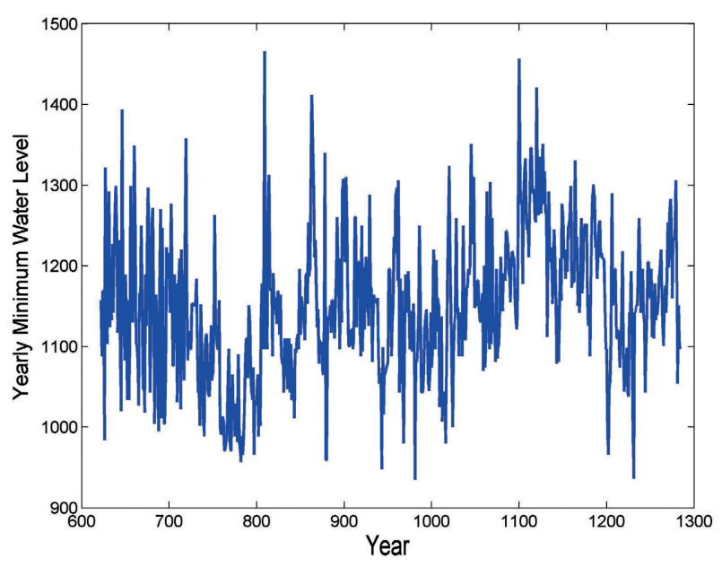

.. _cointegration_approach-introduction:

.. Note::

    These descriptions closely follow a book by Ernest P. Chan:
    `Algorithmic Trading: Winning Strategies and Their Rationale <https://www.wiley.com/en-us/Algorithmic+Trading%3A+Winning+Strategies+and+Their+Rationale-p-9781118460146>`__.

============
Introduction
============

Mean Reversion
##############

Mean-reverting processes and events often occur in nature. Observations of the processes that have a
mean-reverting nature tend to move to their average value over time. However, as mentioned in
the work of E.P. Chan, most financial price series are not mean-reverting.

The upside is that we can construct advanced financial instruments from multiple simple ones thus
obtaining the desired property. Observation series (stock, commodity prices, etc.) that can be combined
to achieve a mean-reverting process are called *cointegrating*. The approach described above allows us
to use the properties of mean-reverting processes to generate profit.

    A naturally occurring mean-reverting process: level of the Nile from 622 AD to 1284 AD.
    An example from `"Algorithmic Trading: Winning Strategies and Their Rationale" <https://www.wiley.com/en-us/Algorithmic+Trading%3A+Winning+Strategies+and+Their+Rationale-p-9781118460146>`__
    by Ernest P. Chan.

Tools presented in this module help testing if it's possible to create a mean-reverting portfolio
from a given set of elements, and what combination of these elements is needed for portfolio construction.
It also includes simple trading strategies that generate trading signals based on a given series of
portfolio prices. These strategies also explain how mean-reverting property can be used.

Another approach that is based on the mean reversion - cross-sectional mean reversion, where the
cumulative returns of the instruments in a basket revert to the cumulative return of the basket is
not covered in this module.
