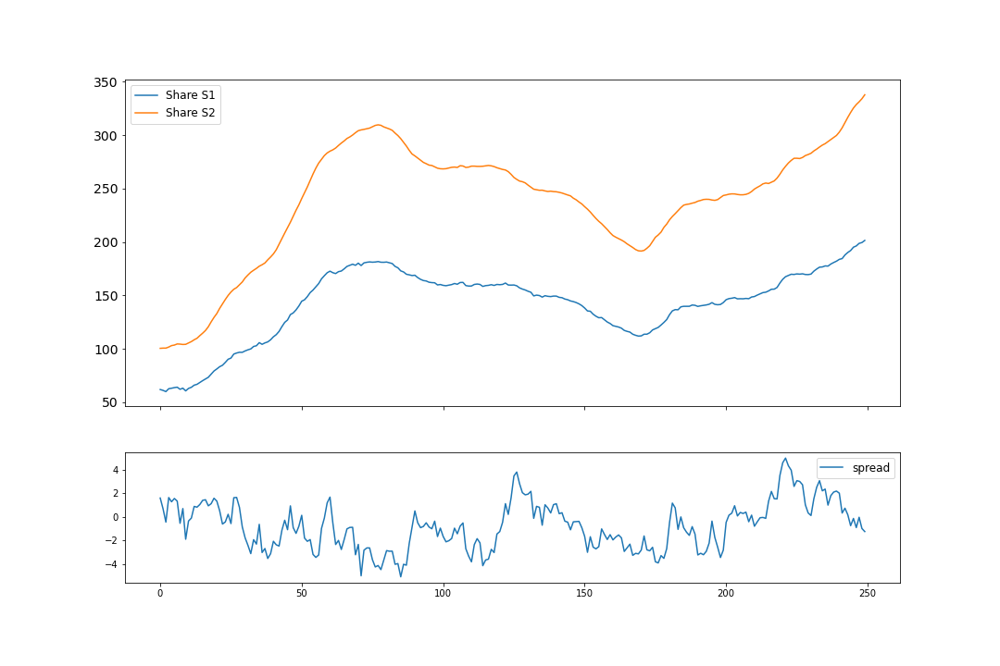

.. _cointegration_approach-cointegration_simulation:

.. note::
    The following documentation follows closely the paper:

    - `Loss protection in pairs trading through minimum profit bounds: a cointegration approach <http://downloads.hindawi.com/archive/2006/073803.pdf>`__ by Lin, Y.-X., McCrae, M., and Gulati, C. (2006)

==================================
Simulation of Cointegratred Series
==================================

This module allows users to simulate:

- AR(1) processes
- Cointegrated series pairs where the cointegration error follows an AR(1) process

Cointegration simulations are based on the following cointegration model:

.. math::
    :nowrap:

    \begin{gather*}
    P_{S_1}(t) + \beta P_{S_2}(t) = \varepsilon_t \\
    P_{S_2}(t) - P_{S_2}(t-1) = e_t
    \end{gather*}

where :math:`\varepsilon_t` and :math:`e_t` are AR(1) processes.

.. math::

    \varepsilon_t - \phi_1 \varepsilon_{t-1} = c_1 + \delta_{1,t} \qquad \delta_{1,t} \sim N(0, \sigma_1^2)

    e_t - \phi_2 e_{t-1} = c_2 + \delta_{2,t} \qquad \delta_{2,t} \sim N(0, \sigma_2^2)

The parameters :math:`\phi_1`, :math:`\phi_2`, :math:`c_1`, :math:`c_2`, :math:`\sigma_1`, :math:`\sigma_2`, and
:math:`\beta` can be defined by users. The module supports simulation in batches, which was shown in the example code
block.

    An example showcasing the cointegration simulation result. The parameters used are as follows.

    .. math::
        :nowrap:

        \begin{eqnarray}
            \phi_1 & = & 0.95 \\
            c_1 & = & 1.5 \\
            \sigma_1 & = & 0.5 \\
            \phi2 & = & 0.9 \\
            c_2 & = & 0.05 \\
            \sigma_2 & = & 1.0 \\
            \beta & = & -0.6 \\
        \end{eqnarray}

Implementation
**************

.. automodule:: arbitragelab.cointegration_approach.coint_sim

    .. autoclass:: CointegrationSimulation
        :members:
        :inherited-members:

        .. automethod:: __init__

Example
*******

.. code-block::

    # Importing packages
    from arbitragelab.cointegration_approach.coint_sim import CointegrationSimulation

    # Generate 50 cointegrated time series, each of which has 250 data points
    coint_simulator = CointegrationSimulation(50, 250)

    # Setup the parameters for the AR(1) processes and cointegration coefficient, beta
    price_params = {
    "ar_coeff": 0.95,
    "white_noise_var": 0.5,
    "constant_trend": 1.5
    }

    coint_params = {
        "ar_coeff": 0.9,
        "white_noise_var": 1.,
        "constant_trend": 0.05,
        "beta": -0.6
    }

    coint_simulator.load_params(price_params, target='price')
    coint_simulator.load_params(coint_params, target='coint')

    # Perform simulation
    s1_series, s2_series, coint_errors = coint_simulator.simulate_coint(initial_price=100.,
                                                                        use_statsmodel=True)

    # Verify if the simulated series are cointegrated and the cointegration coefficient is equal to beta
    beta_mean, beta_std = coint_simulator.verify_coint(s1_series, s2_series)

    # Plot an example of the simulated series and their corresponding cointegration error
    coint_sim_fig = coint_simulator.plot_coint_series(s1_series[:, 0], s2_series[:, 0],
                                                      coint_errors[:, 0])

Research Notebooks
##################

* `Minimum Profit Optimization`_

.. _`Minimum Profit Optimization`: https://github.com/Hudson-and-Thames-Clients/research/blob/master/Statistical%20Arbitrage/mean_reversion.ipynb

References
##########

* `Lin, Y.-X., McCrae, M., and Gulati, C., 2006. Loss protection in pairs trading through minimum profit bounds: a cointegration approach <http://downloads.hindawi.com/archive/2006/073803.pdf>`_
