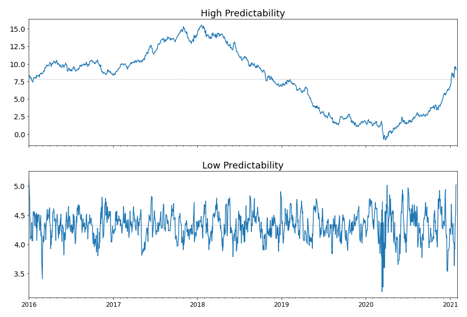
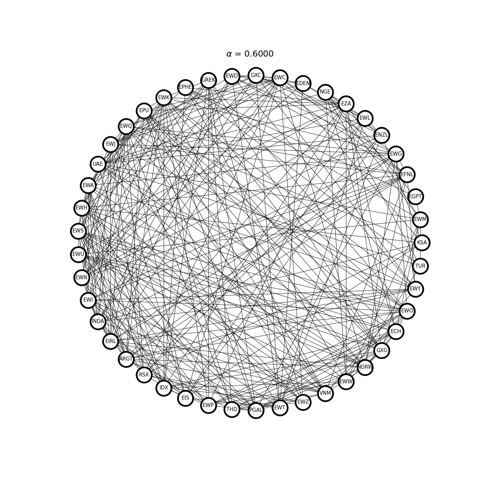
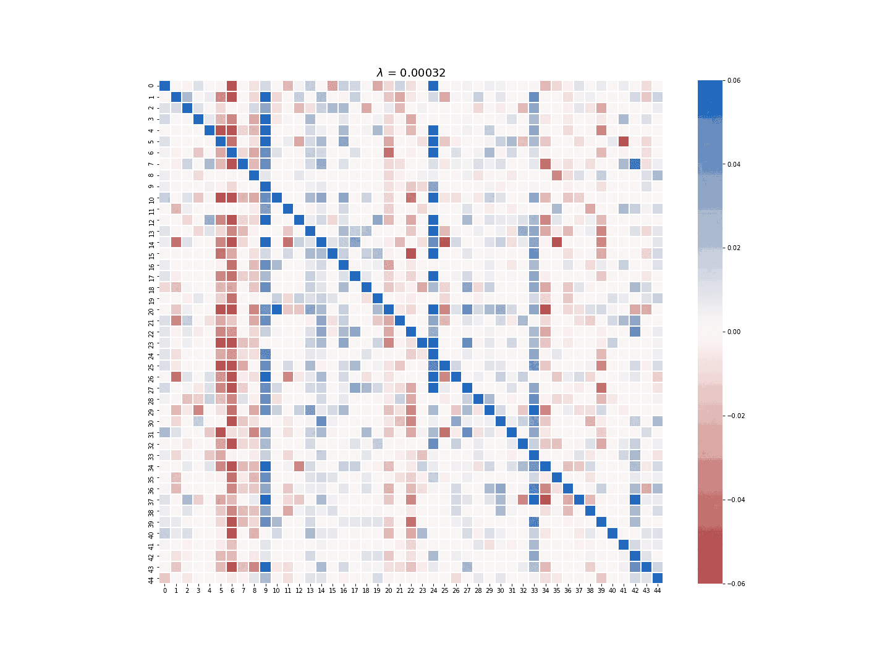
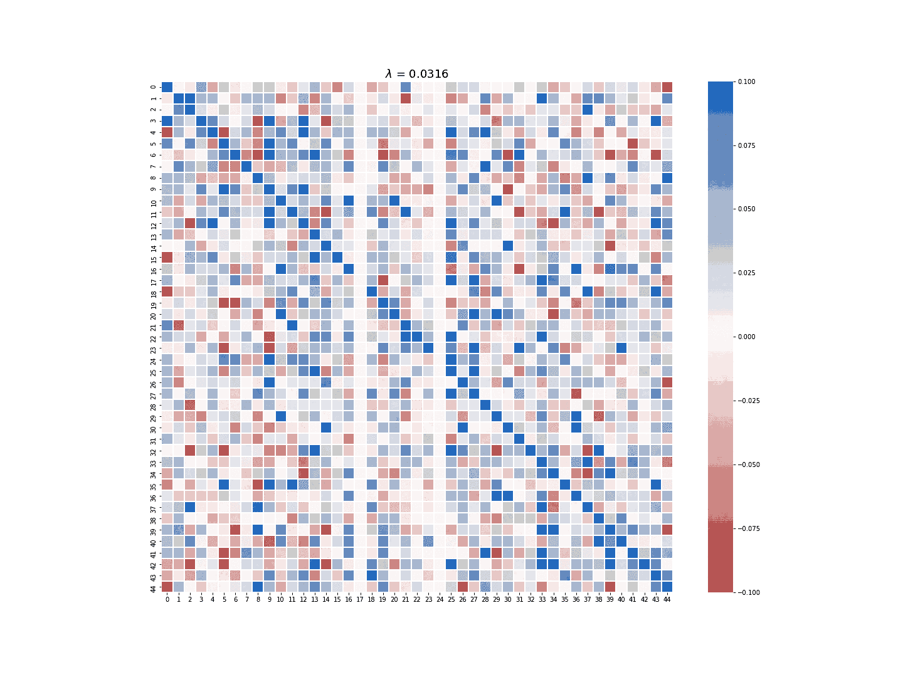
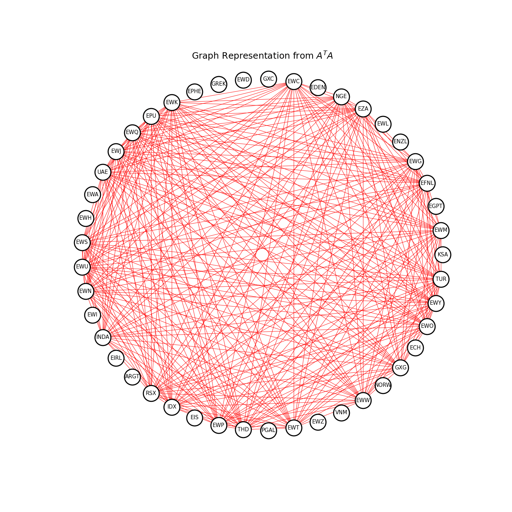
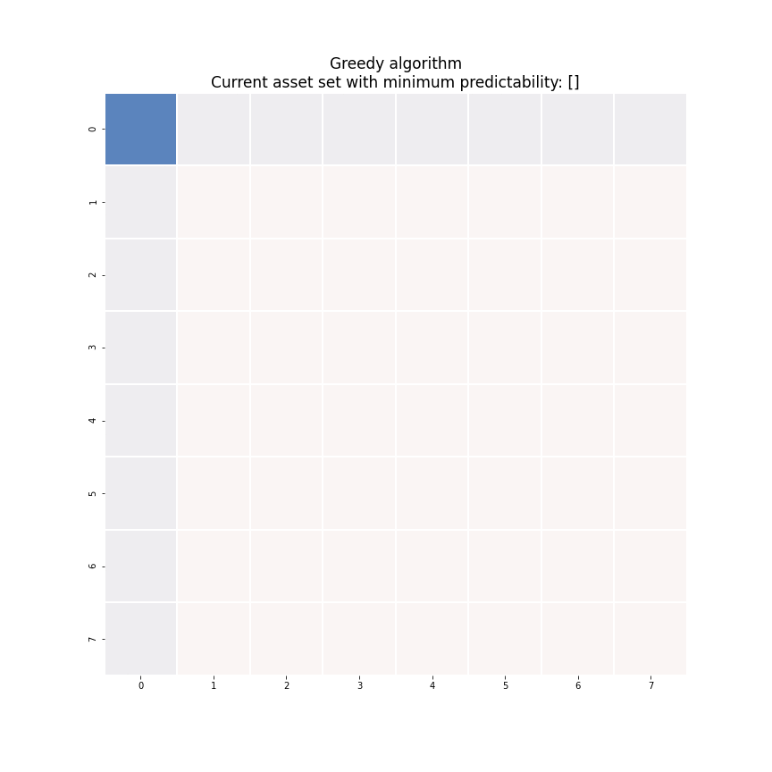

.. _cointegration_approach-sparse_mean_rev_portfolio:

.. note::

    The following documentation closely follows the papers:

    - `d'Aspremont, A. (2011). Identifying small mean-reverting portfolios. Quantitative Finance, 11(3), pp.351-364. <https://arxiv.org/pdf/0708.3048.pdf>`__
    - `Cuturi, M. and d'Aspremont, A. (2015). Mean-reverting portfolios: Tradeoffs between sparsity and volatility. arXiv preprint arXiv:1509.05954. <https://arxiv.org/abs/1509.05954>`__

.. warning::

    In order for this module to work correctly on Windows machines, please install the cvxpy package
    from conda:

    .. code-block::

      conda install -c conda-forge "cvxpy=1.1.10"

    For more information on the installation process, please visit :ref:`ArbitrageLab installation guide <getting_started-installation>`.

=========================================
Sparse Mean-reverting Portfolio Selection
=========================================

Introduction
############

Assets that exhibit significant mean-reversion are difficult to find in efficient markets. As a result, investors focus
on creating long-short asset baskets to form a mean-reverting portfolio whose aggregate value shows mean-reversion.
Classic solutions, including cointegration or canonical correlation analysis, can only construct dense mean-reverting
portfolios, i.e. they include every asset in the investing universe. These portfolios have shown significant
such as higher transaction costs, worse P&L interpretability, and inability to capture meaningful statistical arbitrage
opportunities. On the other hand, sparse mean-reverting portfolios, which require trading as few assets as possible, can
mitigate these shortcomings.

This module provides all the tools to construct sparse mean-reverting portfolios, including:

- Covariance selection and penalized regression techniques to narrow down the investing universe
- Greedy search to construct sparse mean-reverting portfolios
- Semidefinite programming (SDP) approach to construct sparse mean-reverting portfolios above a volatility threshold

In addition, the module also includes Box-Tiao canonical decomposition for constructing dense mean-reverting portfolios
and Ornstein-Uhlenbeck (OU) model fitting to directly compare mean-reversion strength of the portfolios.

Mean-reversion Strength Metrics and Proxies
###########################################

Suppose the investing universe consists of :math:`n`-assets, and the sparse mean-reverting portfolio selection problem
can be summarized as follows:

.. note::

    Maximize the mean-reversion strength, while trading :math:`k`-assets (:math:`k \ll n`) in the portfolio.

One solution is to assume the portfolio value follows an Ornstein-Uhlenbeck (OU) process and use the mean-reversion
speed parameter :math:`\lambda` to measure the mean-reversion strength.

.. math::
    :nowrap:

    \begin{gather*}
    dP_t = \lambda (\bar{P} - P_t)dt + \sigma dZ_t \\
    P_t = \sum_{i=1}^n x_i S_{ti} \\
    \lambda > 0
    \end{gather*}

However, it is hard to express the OU mean-reversion speed :math:`\lambda` as a function of the portfolio weight vector
:math:`\mathbf{x}`. Instead of optimizing :math:`\lambda`, this module will only use :math:`\lambda` to evaluate the
sparse portfolios generated and employ three other mean-reversion strength proxies to solve the sparse mean-reverting
portfolio selection problem.

1. Predictability based on Box-Tiao canonical decomposition.
2. Portmanteau statistic.
3. Crossing statistic.

Predictability and Box-Tiao Canonical Decomposition
***************************************************

Univariate Case
^^^^^^^^^^^^^^^

Assume that the portfolio value :math:`P` follows the univariate recursion below:

.. math::

    P_t = \hat{P}_{t-1} + \varepsilon_t

where :math:`\hat{P}_{t-1}` is a predictor of :math:`x_t` built upon all past portfolio values recorded up to :math:`t-1`,
and :math:`\varepsilon_t` is a vector i.i.d. Gaussian noise, where :math:`\varepsilon_t \sim N(0, \Sigma)`, independent
of all past portfolio values :math:`P_0, P_1, \ldots, P_{t-1}`.

Now calculate the variance of the both sides of the equation:

.. math::

    \mathbf{E}[x_t^2] = \mathbf{E}[\hat{x}_{t-1}^2] + \mathbf{E}[\varepsilon_t^2]

Denote the variance of :math:`x_t` by :math:`\sigma^2`, the variance of :math:`\hat{x}_{t-1}` by :math:`\hat{\sigma}^2`,
then we can write the above equation as:

.. math::
    :nowrap:

    \begin{align*}
    \sigma^2 & = \hat{\sigma}^2 + \Sigma \\
    1 & = \frac{\hat{\sigma}^2}{\sigma^2} + \frac{\Sigma}{\sigma^2}
    \end{align*}

The predictability is thus defined by the ratio:

.. math::

    \nu \equiv \frac{\hat{\sigma}^2}{\sigma^2}

and its meaning is straightforward. When :math:`\nu` is small, the variance of the Gaussian noise :math:`\Sigma`
dominates and the portfolio value process will look like noise and is more strongly mean-reverting. Otherwise, the
variance of the predicted value :math:`\hat{\sigma}^2` dominates and the portfolio value process can be accurately
predicted on average. Figure 1 shows a comparison between a series with high predictability and a series with low
predictability.

    Figure 1. Two series with different levels of predictability.

.. _predictability:

Multivariate Case
^^^^^^^^^^^^^^^^^

The portfolio value is a linear combination of the asset prices, and can be explicitly expressed as:

.. math::

    \mathbf{x}^T S_t = \mathbf{x}^T \hat{S}_{t-1} + \mathbf{x}^T \varepsilon_t

Without loss of generality, the price of each asset can be assumed to have a zero mean, and the predictability can now
be written as:

.. math::

    \nu = \frac{\mathbf{x}^T \hat{\Gamma_0} \mathbf{x}}{\mathbf{x}^T \Gamma_0 \mathbf{x}}

where :math:`\hat{\Gamma_0}` and :math:`\Gamma_0` are the covariance matrices of :math:`\hat{S}_{t-1}` and :math:`S_t`,
respectively. The machinery of Box-Tiao canonical decomposition requires a model assumption to form :math:`\hat{S}_{t-1}`,
the conditional expectation of :math:`S_t` given previous observations, and here the vector autoregressive model of order
one - the VAR(1) model - is chosen. The process :math:`S_t` can be now written as:

.. math::

    S_t = S_{t-1} A + Z_t

where :math:`A` is a :math:`n` by :math:`n` square matrix and :math:`Z_t` is a vector of i.i.d. Gaussian noise with
:math:`Z_t \sim N(0, \Sigma)`, independent of :math:`S_{t-1}`.

There are two ways to get the estimate of :math:`A`. Either use the ordinary least square (OLS) estimate:

.. math::

    \hat{A} = (S_{t-1}^T S_{t-1})^{-1} S_{t-1}^T S_t

or the Yule-Walker estimate:

.. math::

    \hat{A} = \gamma_0^{-1} \gamma_1

where :math:`\gamma_k` is the sample lag-:math:`k` autocovariance matrix, defined as:

.. math::
    :nowrap:

    \begin{align*}
    \gamma_k & \equiv \frac{1}{T-k-1} \sum_{t=1}^{T-k}\tilde{S}_t \tilde{S}_{t+k}^T \\
    \tilde{S}_t & \equiv S_t - \frac{1}{T} \sum_{t=1}^T S_t
    \end{align*}

The module follows closely to the d'Aspremont (2011) and Cuturi (2015) papers as to which estimate of :math:`A` is used
in the portfolio selection optimization.

The predictability of the time series under the VAR(1) model assumption can be now written as:

.. math::

    \nu = \frac{\mathbf{x}^T A^T \Gamma_0 A \mathbf{x}}{\mathbf{x}^T \Gamma_0 \mathbf{x}}

Finding a strongly mean-reverting portfolio is equivalent to minimizing the predictability of the portfolio value, and
the solution is given by the minimum generalized eigenvalue :math:`\lambda_{\text{min}}` by solving

.. math::

    \det (\lambda_{\text{min}} \Gamma_0 - A^T \Gamma_0 A) = 0

For most financial series, :math:`\Gamma_0` is positive definite, and the portfolio weight is the eigenvector
corresponding to the smallest eigenvalue :math:`\lambda_{\text{min}}` of the matrix :math:`\Gamma_0^{-1} A \Gamma_0 A^T`.
The Box-Tiao canonical decomposition in this module will solve all eigenvectors of this matrix and sort them according
to their corresponding eigenvalues in descending order, which represents :math:`n` portfolios ranked by decreasing
predictability.

Portmanteau Statistic
*********************

Portmanteau statistic of order :math:`p` (Ljung and Box, 1978) tests if a process is a white noise.
By definition, the portmanteau statistic is 0 if a process is a white noise. Therefore, maximizing mean-reversion strength
is equivalent to minimizing the portmanteau statistic.

The advantage of the portmanteau statistic over the Box-Tiao predictability is that this statistic requires no modeling
assumptions. The disadvantage, on the other hand, is higher computational complexity. The estimate of the portmanteau
statistic of order :math:`p` is given as follows:

.. math::

    \hat{\phi}_p(y) = \frac{1}{p} \sum_{i=1}^p \Big( \frac{\mathbf{x}^T \gamma_i \mathbf{x}}{\mathbf{x}^T \gamma_0 \mathbf{x}} \Big)^2

The definition of :math:`\gamma_i` has already been given in the previous subsection.

Crossing Statistic
******************

Kedem and Yakowitz (1994) define the crossing statistic of a univariate process :math:`x_t` as the expected number of
crosses around 0 per unit of time:

.. math::

    \xi(x_t) = \mathbf{E} \Bigg[ \frac{\sum_{t=2}^T \unicode{x1D7D9}_{\{x_t x_{t-1} \leq 0 \}}}{T-1} \Bigg]

For a stationary AR(1) process, the crossing statistic can be reformulated with the cosine formula:

.. math::

    \xi(x_t) = \frac{\arccos (a)}{\pi}

where :math:`a` is the first-order autocorrelation, or the AR(1) coefficient of the stationary AR(1) process, where
:math:`\lvert a \rvert < 1`. The function :math:`y = \arccos (a)` is monotonic decreasing with respect to :math:`a`
when :math:`\lvert a \rvert < 1`. Therefore, stronger mean-reversion strength implies a greater crossing statistic,
which in turn implies a smaller first-order autocorrelation. To extend this result to the multivariate case,
Cuturi (2015) proposed to minimize :math:`\mathbf{x}^T \gamma_1 \mathbf{x}` and ensure that all absolute higher-order
autocorrelations :math:`\lvert \mathbf{x}^T \gamma_k \mathbf{x} \rvert, \, k > 1` are small.

Covariance Selection via Graphical LASSO and Structured VAR(1) Estimate via Penalized Regression
################################################################################################

The Box-Tiao canonical decomposition relies on estimates of both the covariance matrix :math:`\Gamma_0` and the VAR(1)
coefficient matrix :math:`A` of the asset prices. Using an :math:`\ell_1`-penalty, as shown in d'Aspremont (2011),
is able to simultaneously obtain numerically stable estimates and isolate key idiosyncratic dependencies
in the asset prices. The penalized estimates of :math:`\Gamma_0` and :math:`A` provides a different perspective on the
conditional dependencies and their graphical representations help cluster the assets into several smaller groups.
Therefore, both covariance selection and structured VAR(1) estimation can be regarded as a preprocessing step for the
sparse canonical decomposition techniques, i.e. the greedy search and the SDP approach.

Covariance Selection
********************

Covariance selection is a process where the maximum likelihood estimation of the covariance matrix :math:`\Gamma_0` is
penalized by setting a certain number of coefficients in the inverse covariance matrix :math:`\Gamma_0^{-1}` to zero.
Zeroes in :math:`\Gamma_0^{-1}` corresponds to conditionally independent assets in the model, and the penalized, or
sparse, estimate of :math:`\Gamma_0^{-1}` is both numerically robust and indicative of the underlying structure of the
asset price dynamics.

The sparse estimate of :math:`\Gamma_0^{-1}` is obtained by solving the following optimization problem:

.. math::

    \max_X \log \det X - \mathbf{Tr} (\Sigma X) - \alpha \lVert X \rVert_1

where :math:`\Sigma = \gamma_0` is the sample covariance matrix, :math:`\alpha> 0` is the :math:`\ell_1`-regularization
parameter, and :math:`\lVert X \rVert_1` is the sum of the absolute value of all the matrix elements.
Figure 2 demonstrates an example where the graph structure of the inverse covariance matrix becomes sparser as
:math:`\alpha` increases.

    Figure 2. Covariance selection at work.

Structured VAR(1) Model Estimate
********************************

Recall that under a VAR(1) model assumption, the asset prices :math:`S_t` follow the following process:

.. math::

    S_t = S_{t-1} A + Z_t

For most financial time series, the noise terms are correlated such that :math:`Z_t \sim N(0, \Sigma)`, where the noise
covariance is :math:`\Sigma`. In this case, the VAR(1) coefficient matrix :math:`A` has to be directly estimated from
the data. A structured (penalized), or sparse, estimate of :math:`A` can be obtained column-wise via a LASSO regression
by minimizing the following objective function:

.. math::

    \DeclareMathOperator*{\argmin}{arg\,min}
    a_i = \argmin_x \lVert S_{it} - S_{t-1}x \rVert^2 + \lambda \lVert x \rVert_1

where :math:`a_i` is a column of the matrix :math:`A`, and :math:`S_{it}` is the price of asset :math:`i`.

The sparse estimate of :math:`A` can be also obtained by applying a more aggressive penalty under a multi-task LASSO
model. The objective function being minimized is:

.. math::

    \DeclareMathOperator*{\argmin}{arg\,min}
    \argmin_A \lVert S_{t} - S_{t-1}A \rVert^2 + \alpha \sum_i \sqrt{\sum_j a_{ij}^2}

where :math:`a_{ij}` is the element of the matrix :math:`A`.

The multi-task LASSO model will suppress the coefficients in an entire column to zero, but its estimate is less robust
than the column-wise LASSO regression in terms of numerical stability. The module provides the option to choose which
LASSO model to use for the sparse estimate of :math:`A`. Figure 3 and 4 demonstrate the difference between the estimate
generated by the column-wise LASSO regression and the one by the multi-task LASSO.

    Figure 3. Column-wise LASSO at work.

    Figure 4. Multi-task LASSO at work.

Pinpoint the Clusters
*********************

If the Gaussian noise in the VAR(1) model is uncorrelated:

.. math::

    S_t = S_{t-1} A + Z_t, \; Z_t \sim N(0, \sigma \mathbf{I}), \, \sigma > 0

then Gilbert (1994) has shown that the graph of the inverse covariance matrix :math:`\Gamma_0^{-1}` and the graph of
:math:`A^T A` share the same structure, i.e. the graph of :math:`\Gamma_0^{-1}` and :math:`A^T A` are disconnected along
the same clusters of assets.

When the Gaussian noise :math:`Z_t` is correlated, however, the above relation is no longer valid, but it is still
possible to find common clusters between the graph of penalized estimate of :math:`\Gamma_0^{-1}` and penalized estimate
of :math:`A^T A`. This will help find a much smaller investing universe for sparse mean-reverting portfolios. Figure 5
demonstrates an example of the clustering process.

    Figure 5. The clustering process via penalized estimates of the inverse covariance matrix and VAR(1) coefficient matrix.

Greedy Search
#############

It has been already shown in the previous :ref:`section<predictability>` that Box-Tiao canonical decomposition can find
a dense mean-reverting portfolio, i.e. using all the assets in the investing universe, by solving the generalized
eigenvalue problem,

.. math::

    \det (\lambda_{\text{min}} \Gamma_0 - A^T \Gamma_0 A) = 0

and retrieve the eigenvector corresponding to the smallest eigenvalue. This generalized eigenvalue problem can be also
written in the variational form as follows:

.. math::

    \lambda_{\text{min}}(A^T \Gamma_0 A, \Gamma_0) = \min_{\mathbf{x} \in \mathbb{R}^n} \frac{\mathbf{x}^T A^T \Gamma_0 A \mathbf{x}}{\mathbf{x}^T \Gamma_0 \mathbf{x}}

To get a sparse portfolio, a cardinality constraint has to be added to this minimization problem:

.. math::
    :nowrap:

    \begin{align*}
    \text{minimize } & \frac{\mathbf{x}^T A^T \Gamma_0 A \mathbf{x}}{\mathbf{x}^T \Gamma_0 \mathbf{x}} \\
    \text{subject to } & \lVert \mathbf{x} \rVert_0 \leq k \\
    & \lVert \mathbf{x} \rVert_2 = 1
    \end{align*}

where :math:`\lVert \mathbf{x} \rVert_0` denotes the number of non-zeros coefficients in the portfolio weight vector
:math:`\mathbf{x}`. Natarajan (1995) has shown that this sparse generalized eigenvalue problem is equivalent to subset
selection, which is an NP-hard problem. Since no polynomial time solutions are available to get the global optimal
solution, a greedy search is thus used to get good approximate solutions to the problem, which will have a polynomial time
complexity.

Algorithm Description
*********************

Denote the support (the indices of the selected assets) of the solution vector :math:`\mathbf{x}` to the above
minimization problem given :math:`k>0` as :math:`I_k`. Also, for the sake of notation simplicity, we define
:math:`\mathbf{A} = A^T \Gamma_0 A` and :math:`\mathbf{B} = \Gamma_0`.

.. math::

    I_k = \{ i \in [1, n]: x_i \neq 0 \}

When :math:`k=1`, :math:`I_1` can be defined as:

.. math::

    \DeclareMathOperator*{\argmin}{arg\,min}
    I_1 = \argmin_{i \in [1,n]} \frac{\mathbf{A}_{ii}}{\mathbf{B}_{ii}}

In plain English, :math:`I_1` is the index of the diagonal elements of :math:`\mathbf{A}` and :math:`\mathbf{B}` that
give the smallest quotient. Assume the current approximate solution with support set :math:`I_k` is given by:

.. math::

    \DeclareMathOperator*{\argmin}{arg\,min}
    \mathbf{x}_k = \argmin_{\mathbf{x} \in \mathbb{R}^n: \mathbf{x}_{I_k^c} = 0} \frac{x^T \mathbf{A} x}{x^T \mathbf{B} x}

where :math:`I_k^c` denotes the set of the indices of the assets that are **NOT** selected into the portfolio. To obtain
an optimal sparse mean-reverting portfolio with :math:`k+1` assets, scan the assets in :math:`I_k^c` for the one
that produces the smallest increase in predictability and add its index :math:`i_{k+1}` to the set :math:`I_k`. Figure 6
demonstrates this process. Each iteration we solve the generalized eigenvalue minimization problem of the highlighted
block square matrix.

    Figure 6. An animated description of the greedy algorithm.

While the solutions found by this recursive algorithm are potentially far from optimal, the cost of this method is
relatively low. Each iteration costs :math:`O(k^2(n-k))`, and computing solutions for all target cardinalities is :math:`O(n^4)`.
Fogarasi (2012) has shown via simulation that a brute force search was only able to yield a more optimal
sparse mean-reverting portfolio 59.3\% of the time.

Semidefinite Programming (SDP) Approach
#######################################

An alternative to greedy search is to relax the cardinality constraint and reformulate the original
non-convex optimization problem

.. math::
    :nowrap:

    \begin{align*}
    \text{minimize } & \frac{\mathbf{x}^T \mathbf{A} \mathbf{x}}{\mathbf{x}^T \mathbf{B} \mathbf{x}} \\
    \text{subject to } & \lVert \mathbf{x} \rVert_0 \leq k \\
    & \lVert \mathbf{x} \rVert_2 = 1
    \end{align*}

into a convex one. The concept "convex" means "when an optimal solution is found, then it is guaranteed to be the
best solution". The convex optimization problem is formed in terms of the symmetric matrix
:math:`X = \mathbf{x}\mathbf{x}^T`:

.. math::
    :nowrap:

    \begin{align*}
    \text{minimize } & \frac{\mathbf{Tr} (\mathbf{A} X)}{\mathbf{Tr} (\mathbf{B} X)} \\
    \text{subject to } & \mathbf{1}^T \lvert X \rvert \mathbf{1} \leq k \\
    & \mathbf{Tr} (X) = 1 \\
    & X \succeq 0
    \end{align*}

The objective function is the quotient of the traces of two matrices, which is only quasi-convex. The following change
of variables can make it convex:

.. math::
    :nowrap:

    \begin{align*}
    Y & = \frac{X}{\mathbf{Tr}(\mathbf{B} X)} \\
    z & = \frac{1}{\mathbf{Tr}(\mathbf{B} X)}
    \end{align*}

and the optimization problem can be rewritten as:

.. math::
    :nowrap:

    \begin{align*}
    \text{minimize } & \mathbf{Tr}(\mathbf{A} Y) \\
    \text{subject to } & \mathbf{1}^T \lvert Y \rvert \mathbf{1} \leq k \, \mathbf{Tr}(Y) \\
    & \mathbf{Tr} (\mathbf{B} Y) = 1 \\
    & \mathbf{Tr} (Y) \geq 0 \\
    & Y \succeq 0
    \end{align*}

This is now a convex optimization problem that can be solved with SDP. However, this convex relaxation formulation
suffers from a few drawbacks.

1. It has numerical stability issues;
2. It cannot properly handle volatility constraints;
3. It cannot optimize mean-reversion strength proxies other than predictability.

Instead of implementing this SDP formulation with a relaxed cardinality constraint, this module followed the regularizer
form of the SDP proposed by Cuturi (2015) to mitigate the above drawbacks.

The predictability optimization SDP is as follows:

.. math::
    :nowrap:

    \begin{align*}
    \text{minimize } & \mathbf{Tr} (\gamma_1 \gamma_0^{-1} \gamma_1^T X) + \rho \lVert X \rVert_1 \\
    \text{subject to } & \mathbf{Tr} (\gamma_0 X) \geq V \\
    & \mathbf{Tr} (X) = 1 \\
    & X \succeq 0
    \end{align*}

The portmanteau statistic optimization SDP is as follows:

.. math::
    :nowrap:

    \begin{align*}
    \text{minimize } & \sum_{i=1}^p \mathbf{Tr} (\gamma_i X)^2 + \rho \lVert X \rVert_1 \\
    \text{subject to } & \mathbf{Tr} (\gamma_0 X) \geq V \\
    & \mathbf{Tr} (X) = 1 \\
    & X \succeq 0
    \end{align*}

The crossing statistic optimization SDP is as follows:

.. math::
    :nowrap:

    \begin{align*}
    \text{minimize } & \mathbf{Tr}(\gamma_1 X) + \mu \sum_{i=2}^p \mathbf{Tr} (\gamma_i X)^2 + \rho \lVert X \rVert_1 \\
    \text{subject to } & \mathbf{Tr} (\gamma_0 X) \geq V \\
    & \mathbf{Tr} (X) = 1 \\
    & X \succeq 0
    \end{align*}

where :math:`\rho>0` is the :math:`\ell_1`-regularization parameter, :math:`\mu>0` is a specific regularization parameter
for crossing statistic optimization, and :math:`V > 0` is the portfolio variance lower threshold.

In some restricted cases, the convex relaxation are tight, which means the optimal solution of the SDP is exactly the
optimal solution to the original non-convex problem. However, in most cases this correspondence is not guaranteed and the
optimal solution of these SDPs has to be deflated into a rank one matrix :math:`xx^T` where :math:`x` can be considered
as a good candidate for portfolio weights with the designated cardinality :math:`k`. This module uses Truncated Power
method (Yuan and Zhang, 2013) as the deflation method to retrieve the leading sparse vector of the optimal solution
:math:`X^*` that has :math:`k` non-zero elements.

Implementation
##############

.. automodule:: arbitragelab.cointegration_approach.sparse_mr_portfolio

    .. autoclass:: SparseMeanReversionPortfolio
        :members:
        :inherited-members:

        .. automethod:: __init__

Examples
########

.. tip::

    - The module provides options to use either standardized data or zero-centered mean data. It is recommended to try both options to obtain the best results.
    - Once a smaller cluster is obtained via covariance selection and structured VAR estimate, it is recommended to create a new ``SparseMeanReversionPortfolio`` class using only the asset prices within the cluster and perform greedy search or SDP optimization.
    - Always check the number in the deflated eigenvector obtained from SDP optimization. For example, if the deflated eigenvector has several weights that are significantly smaller than the others, then this suggests that the regularization parameter :math:`\rho` is too large. Try a smaller :math:`\rho` to achieve the desired cardinality.

Load Data
*********

.. code-block::

    # Importing packages
    import pandas as pd
    import networkx as nx
    import numpy as np
    import matplotlib.pyplot as plt
    from arbitragelab.cointegration_approach.sparse_mr_portfolio import SparseMeanReversionPortfolio

    # Read price series data, set date as index
    data = pd.read_csv('X_FILE_PATH.csv', parse_dates=['Date'])
    data.set_index('Date', inplace=True)

    # Initialize the sparse mean-reverting portfolio searching class
    sparse_portf = SparseMeanReversionPortfolio(data)

Box-Tiao Canonical Decomposition
********************************

.. code-block::

    # Perform Box-Tiao canonical decomposition
    bt_weights = sparse_portf.box_tiao()

    # Check the weight that corresponds to the largest eigenvalue and the one to the smallest
    # Retrieve the weights by column vectors
    bt_least_mr = bt_weights[:, 0]
    bt_most_mr = bt_weights[:, -1]

Covariance Selection and Structured VAR Estimate
************************************************

.. code-block::

    # Covariance selection: Tune the graphical LASSO regularization parameter such that
    # the graph of the inverse covariance matrix is split into 4 clusters
    best_covar_alpha = sparse_portf.covar_sparse_tuning(alpha_min=0.6, alpha_max=0.9,
                                                        n_alphas=200, clusters=4)

    # Fit the model using the optimal parameter
    covar, precision = sparse_portf.covar_sparse_fit(best_cover_alpha)

    # Structured VAR estimate: Tune the column-wise LASSO regularization parameter such that
    # 50% of the VAR(1) coefficient matrix is 0
    best_VAR_alpha = sparse_portf.LASSO_VAR_tuning(0.5, alpha_min=3e-4, alpha_max=7e-4,
                                                   n_alphas=200, max_iter=5000)

    # Fit the model using the optimal parameter
    VAR_matrix = sparse_portf.LASSO_VAR_fit(best_VAR_alpha, max_iter=5000)

    # Narrow down the clusters
    cluster = etf_sparse_portf.find_clusters(precision, VAR_matrix)

    # Print the largest cluster (the small ones are usually single nodes)
    print(max(nx.connected_components(cluster), key=len))

Greedy Search
*************

.. code-block::

    # Get sample covariance estimate and least-square VAR(1) coefficient matrix estimate
    full_VAR_est = sparse_portf.least_square_VAR_fit()
    full_cov_est = sparse_portf.autocov(0)

    # Construct the sparse mean-reverting portfolio with the smallest predictability
    # with a designated number of assets
    cardinality = 8
    greedy_weight = sparse_portf.greedy_search(cardinality, full_VAR_est, full_cov_est, maximize=False)

    # Check the OU mean-reversion coefficient and half-life
    mr_speed, half_life = sparse_portf.mean_rev_coeff(greedy_weight.squeeze(), sparse_portf.assets)

SDP with Convex Relaxation
**************************

Predictability with variance lower bound
^^^^^^^^^^^^^^^^^^^^^^^^^^^^^^^^^^^^^^^^

.. code-block::

    # Use the covariance estimate, VAR(1) coefficient matrix estimate,
    # and the designated cardinality from greedy search

    # Calculate the median of the variance of each assets
    variance_median = np.median(sparse_portf.autocov(0, use_standardized=False))

    # Use a fraction of the median variance as the lower threshold and solve the SDP
    sdp_pred_vol_result = sparse_portf.sdp_predictability_vol(rho=0.001,
                                                              variance=0.3*variance_median,
                                                              max_iter=5000, use_standardized=False)

    # Deflate the SDP solution into the portfolio vector
    sdp_pred_vol_weights = sparse_portf.sparse_eigen_deflate(sdp_pred_vol_result, cardinality)

    # Check the OU mean-reversion coefficient and half-life
    mr_speed, half_life = sparse_portf.mean_rev_coeff(sdp_pred_vol_weights.squeeze(),
                                                      sparse_portf.assets)

Portmanteau statistic with variance lower bound
^^^^^^^^^^^^^^^^^^^^^^^^^^^^^^^^^^^^^^^^^^^^^^^

.. code-block::

    # Use a fraction of the median variance as the lower threshold and solve the SDP
    sdp_portmanteau_vol_result = sparse_portf.sdp_portmanteau_vol(rho=0.001,
                                                                  variance=0.3*variance_median,
                                                                  nlags=3, max_iter=10000,
                                                                  use_standardized=False)

    # Deflate the SDP solution into the portfolio vector
    sdp_portmanteau_vol_weights = sparse_portf.sparse_eigen_deflate(sdp_portmanteau_vol_result,
                                                                    cardinality)

    # Check the OU mean-reversion coefficient and half-life
    mr_speed, half_life = sparse_portf.mean_rev_coeff(sdp_pred_portmanteau_vol_weights.squeeze(),
                                                      sparse_portf.assets)

Crossing statistic with variance lower bound
^^^^^^^^^^^^^^^^^^^^^^^^^^^^^^^^^^^^^^^^^^^^

.. code-block::

    # Use a fraction of the median variance as the lower threshold and solve the SDP
    sdp_crossing_vol_result = sparse_portf.sdp_crossing_vol(rho=0.001, mu=0.01,
                                                            variance=0.3*variance_median,
                                                            nlags=3, max_iter=10000,
                                                            use_standardized=False)

    # Deflate the SDP solution into the portfolio vector
    sdp_crossing_vol_weights = sparse_portf.sparse_eigen_deflate(sdp_crossing_vol_result, cardinality)

    # Check the OU mean-reversion coefficient and half-life
    mr_speed, half_life = sparse_portf.mean_rev_coeff(sdp_pred_crossing_vol_weights.squeeze(),
                                                      sparse_portf.assets)

Research Notebook
#################

The following research notebook can be used to better understand how to use the sparse mean-reverting
portfolio selection module.

* `Sparse Mean-reverting Portfolio Selection`_

.. _`Sparse Mean-reverting Portfolio Selection`: https://github.com/Hudson-and-Thames-Clients/arbitrage_research/blob/master/Cointegration%20Approach/multivariate_cointegration.ipynb

References
##########

* `Cuturi, M. and d'Aspremont, A., 2015. Mean-reverting portfolios: Tradeoffs between sparsity and volatility. arXiv preprint arXiv:1509.05954. <https://arxiv.org/pdf/1509.05954.pdf>`__
* `d'Aspremont, A., 2011. Identifying small mean-reverting portfolios. Quantitative Finance, 11(3), pp.351-364. <https://arxiv.org/pdf/0708.3048.pdf>`__
* `Fogarasi, N. and Levendovszky, J., 2012. Improved parameter estimation and simple trading algorithm for sparse, mean-reverting portfolios. In Annales Univ. Sci. Budapest., Sect. Comp, 37, pp. 121-144. <http://www.hit.bme.hu/~fogarasi/Fogarasi12Improved.pdf>`__
* `Gilbert, J.R., 1994. Predicting structure in sparse matrix computations. SIAM Journal on Matrix Analysis and Applications, 15(1), pp.62-79. <https://www.osti.gov/servlets/purl/6987948>`__
* `Kedem, B. and Yakowitz, S., 1994. Time series analysis by higher order crossings (pp. 115-143). New York: IEEE press. <http://www2.math.umd.edu/~bnk/HOC.Japan02.pdf>`__
* `Ljung, G.M. and Box, G.E., 1978. On a measure of lack of fit in time series models. Biometrika, 65(2), pp.297-303. <https://apps.dtic.mil/sti/pdfs/ADA049397.pdf>`__
* `Natarajan, B.K., 1995. Sparse approximate solutions to linear systems. SIAM journal on computing, 24(2), pp.227-234. <https://epubs.siam.org/doi/abs/10.1137/S0097539792240406?journalCode=smjcat>`__
* `Yuan, X.T. and Zhang, T., 2013. Truncated Power Method for Sparse Eigenvalue Problems. Journal of Machine Learning Research, 14(4). <https://www.jmlr.org/papers/volume14/yuan13a/yuan13a.pdf>`__
