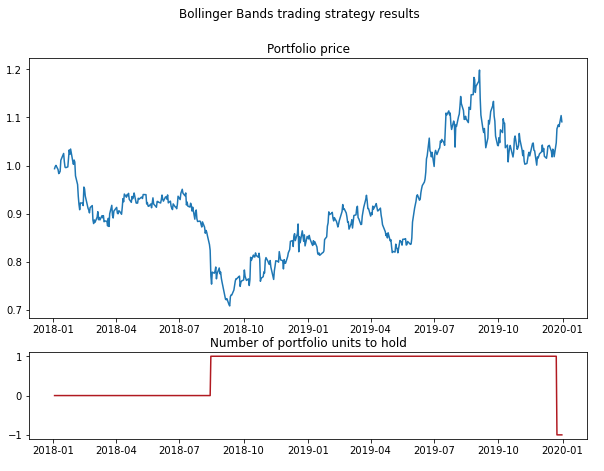

.. _cointegration_approach-trading_strategies:

==================
Trading Strategies
==================

The following are some strategies for trading the spread.These descriptions closely follow the book by Ernest P. Chan: `Algorithmic Trading: Winning Strategies and Their Rationale <https://www.wiley.com/en-us/Algorithmic+Trading%3A+Winning+Strategies+and+Their+Rationale-p-9781118460146>`__.

Linear Trading Strategy
#######################

Using a mean-reverting portfolio obtained from the Johansen test, a linear mean-reverting trading strategy
can be constructed.

The idea is to own a number of units of a portfolio proportional to their negative normalized deviation
from its moving average (the Z-score). A unit portfolio is the one with shares of its elements determined
by the eigenvector of the :math:`\Lambda` matrix from the Johansen test.

So the number of portfolio units to hold (:math:`N_t`) is calculated as:

.. math::

    N_{t} = \frac{P_{t} - MA(P_{t}, T_{MA})}{std(P_{t}, T_{std})}

Where:

- :math:`P_{t}` is the price of a portfolio.

- :math:`MA(P_{t}, T_{MA})` is the moving average of the portfolio price calculated
  using a backward-looking :math:`T_{MA}` window.

- :math:`std(P_{t}, T_{std})` is the rolling standard deviation of the portfolio price
  calculated using a backward-looking :math:`T_{std}` window.

Linear strategy in this case means that the number of invested units is proportional to the Z-Score
and not that the market value of our investment is proportional.

For this basic strategy, the maximum required capital is unknown, therefore it's not a very practical
one in its simplest version.

The upside however is that this strategy has no parameters to optimize (the windows for moving average
and the rolling standard deviation taken equal to the half-life period) and is useful for backtesting
the properties of a mean-reverting price series.

With an input of portfolio price series, a backward-looking window for a simple moving average, and a
window for rolling st. deviation, the function will output a dataframe with portfolio price series
alongside with the Z-Scores and target quantities of the unit portfolio to hold.

.. figure:: images/linear_trading_results.png
    :scale: 100 %
    :align: center

    A visualised output of the Linear trading strategy function.

Implementation
**************
.. py:currentmodule:: arbitragelab.cointegration_approach.signals

.. autofunction:: linear_trading_strategy

Examples
********

.. code-block::

   # Importing the function
   from arbitragelab.cointegration_approach.signals import linear_trading_strategy

   # Applying the Linear trading strategy
   trading_results = linear_trading_strategy(portfolio_price)

   # Getting the target quantity of unit portfolios to hold
   target_quantity = trading_results.iloc[:,2]

Bollinger Bands Trading Strategy
################################

This is a more practical strategy in comparison to the Linear Trading strategy mentioned in this module,
as it deals with the issues present in the linear strategy: infinitesimal portfolio rebalances and no
predefined buying power (as the costs needed to be allocated to the strategy are dependant on the Z-score).

By using the Bollinger bands on the Z-scores from the linear mean-reversion trading strategy, we can
construct a more practical trading strategy. The idea is to enter a position only when the price
deviates by more than *entryZscore* standard deviations from the mean. This parameter can be optimized
in a training set.

Also, the look-back windows for calculating the mean and the standard deviation are the parameters that
can be optimized. We can later exit the strategy when the price reverts to the *exitZscore* standard
deviations from the mean (*exitZscore* :math:`<` *entryZscore*).

If *exitZscore* :math:`= -` *entryZscore*, we will exit when the price moves beyond the opposite band,
also triggering a trading signal of the opposite sign. At either time we can have either zero or one
unit (long or short) invested, so capital allocation is easy.

If the look-back window is short and we set a small *entryZscore* and *exitZscore*, the holding period
will be shorter and we get more round trip trades and generally higher profits.

With an input of portfolio price series, a window for a simple moving average, a window for
simple moving st. deviation, and entry and exit label Z-Scores, the function will output a dataframe
with portfolio price series alongside with the Z-Scores and target quantities of the unit portfolio to
buy or sell.

    A visualised output of the Bollinger Band trading strategy function.

Implementation
**************

.. autofunction:: bollinger_bands_trading_strategy

Examples
********

.. code-block::

   # Importing the function
   from arbitragelab.cointegration_approach.signals import bollinger_bands_trading_strategy

   # Applying the Bollinger Bands trading strategy
   trading_results = bollinger_bands_trading_strategy(portfolio_price)

   # Getting the target quantity of unit portfolios to hold
   target_quantity = trading_results.iloc[:,2]

Research Notebooks
##################

The following research notebook can be used to better understand the mean-reverting tools described above.

* `Mean Reversion`_

.. _`Mean Reversion`: https://github.com/Hudson-and-Thames-Clients/arbitrage_research/blob/master/Cointegration%20Approach/mean_reversion.ipynb

References
##########

* `Chan, E., 2013. Algorithmic trading: winning strategies and their rationale (Vol. 625). John Wiley & Sons. <https://www.amazon.co.uk/Algorithmic-Trading-Winning-Strategies-Rationale/dp/1118460146>`_
* `Bilgili, F., 1998. Stationarity and cointegration tests: Comparison of Engle-Granger and Johansen methodologies. <https://mpra.ub.uni-muenchen.de/75967/1/MPRA_paper_75967.pdf>`_
