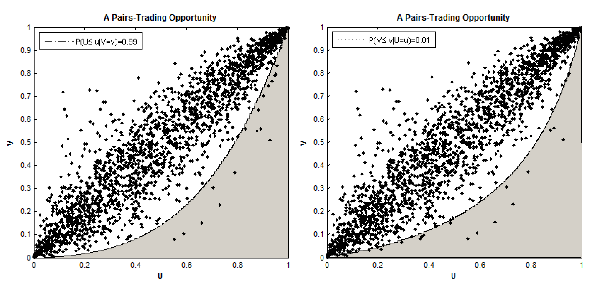
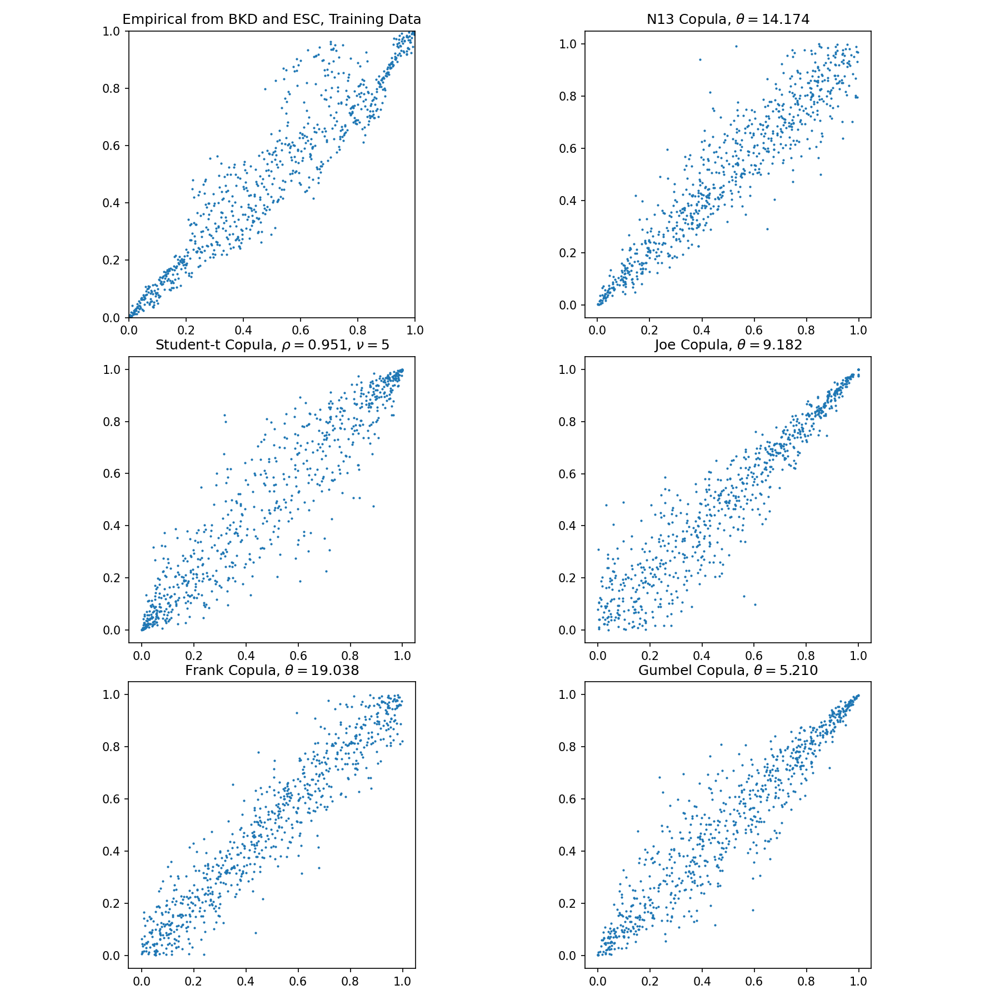

.. _copula_approach-basic_trading_strategy:

======================
Basic Trading Strategy
======================

.. Note::
    The following strategy closely follows the implementations:

    `Pairs trading: a copula approach. (2013) <https://link.springer.com/article/10.1057/jdhf.2013.1>`__ by Liew, Rong Qi, and Yuan Wu.

    `Trading strategies with copulas. (2013) <https://www.researchgate.net/publication/318054326>`__ by Stander, Yolanda, Daniël Marais, and Ilse Botha.

The trading strategy using copula is implemented as a long-short pairs trading scheme, and uses rules from the general
long-short pairs trading framework.

    (Figure and Caption from Botha et al. 2013.) An illustration of the areas where the values of U and V respectively 
    are considered extreme when using a 99% confidence level and the N14 copula dependence structure.

Conditional Probabilities
#########################

We start with a pair of stocks of interest :math:`S_1` and :math:`S_2`, which can be selected by various methods.
For example, using the Engle-Granger test for cointegration.
By consensus, we define the spread as :math:`S_1` in relation to :math:`S_2`.
e.g. Short the spread means buying :math:`S_1` and/or selling :math:`S_2`.

Use **prices** data of the stocks during the training/formation period, we proceed with a pseudo-MLE
fit to establish a copula that reflects the relation of the two stocks during the training/formation period.

Then we can calculate the **conditional probabilities** using trading/testing period data:

.. math::
    \begin{align}
    P(U_1\le u_1 | U_2 = u_2), \\
    P(U_2\le u_2 | U_1 = u_1).
    \end{align}

- :math:`u_i \in [0, 1]` is the quantile of trading period data mapped by a CDF formed in the training period.

- When :math:`P(U_1\le u_1 | U_2 = u_2) < 0.5`, then stock 1 is considered under-valued.

- When :math:`P(U_1\le u_1 | U_2 = u_2) > 0.5`, then stock 1 is considered over-valued.

Trading Logic
#############

Now we define an upper threshold :math:`b_{up}` (e.g. 0.95) and a lower threshold :math:`b_{lo}` (e.g. 0.05),
then the logic is as follows:

- If :math:`P(U_1\le u_1 | U_2 = u_2) \le b_{lo}` and :math:`P(U_2\le u_2 | U_1 = u_1) \ge b_{up}`, then stock 1 is
  undervalued, and stock 2 is overvalued. Hence we long the spread. ( :math:`1` in position)

- If :math:`P(U_2\le u_2 | U_1 = u_1) \le b_{lo}` and :math:`P(U_1\le u_1 | U_2 = u_2) \ge b_{up}`, then stock 2 is
  undervalued, and stock 1 is overvalued. Hence we short the spread. ( :math:`-1` in position)

- If both/either conditional probabilities cross the boundary of :math:`0.5`, then we exit the position, as we consider
  the position no longer valid. ( :math:`0` in position)

Ambiguities and Comments
************************

The authors did not specify what will happen if the followings occur:

1. When there is an open signal and an exit signal.
    
2. When there is an open signal and currently there is a position.
    
3. When there is a long and short signal together.

Here is our take:

1. Exit signal overrides open signal.

2. Flip the position to the signal's suggestion. For example, originally have a short position, and receives a long
   signal, then the position becomes long.
   
3. Technically this should never happen with the default trading logic. However, if it did happen for whatever
   reason, long + short signal will lead to no opening signal and the positions will not change, unless there is
   an exit signal and that resets the position to 0.

For exiting a position, the authors proposed using **'and'** logic: Both conditional probabilities need to cross :math:`0.5`.
However, we found this too strict and sometimes fails to exit a position when it should. Therefore we also provide the
**'or'** logic: At least one of the conditional probabilities cross :math:`0.5`.

.. figure:: images/positions_log_prices.png
    :scale: 50 %
    :align: center

    A visualised output of using a Student-t and N13 copula. The stock pair considered is BKD and ESC. 
    The thresholds are 0.95 and 0.05.
	

    Sampling from the various fitted copulas, and plot the empirical density from training data
    from BKD and ESC.

Implementation
##############

.. Warning::
    The original :code:`CopulaStrategy` class is still available in Arbitrage Lab but is considered a legacy module.
    One can keep using it if it is already in use, but we highly recommend new users to use :code:`BasicCopulaStrategy`
    exclusively for more flexibility, better consistency with other copula modules, and full support of :code:`pandas`.

.. automodule:: arbitragelab.copula_approach.copula_strategy_basic
        
    .. autoclass:: BasicCopulaStrategy
	:members: __init__, fit_copula, get_positions, to_quantile, get_info_criterion, get_condi_probs, get_cur_position

Example
*******

.. code-block::

   # Importing the module and other libraries
   from arbitragelab.copula_approach.copula_strategy_basic import BasicCopulaStrategy
   import matplotlib.pyplot as plt
   import pandas as pd

   # Instantiating the module
   BCS = BasicCopulaStrategy()

   # Loading the data
   pair_prices = pd.read_csv('PRICE_DATA.csv', index_col='Dates', parse_dates=True)

   # Split data into train and test sets
   prices_train = pair_prices.iloc[:int(len(s1_price)*0.7)]
   prices_test = pair_prices.iloc[int(len(s1_price)*0.7):]

   # Fitting to a Student-t copula
   result_dict, copula, s1_cdf, s2_cdf = BCS.fit_copula(data=prices_train,
                                                        copula_name='Student')
													   
   # Printing fit scores (AIC, SIC, HQIC, log-likelihood)
   print(result_dict)

   # Forming position series using trading period data, assuming holding no position initially.
   # Also changing lower and upper bound to 0.1 and 0.9 respectively.
   # 'AND' exit logic:
   positions_and = BCS.get_positions(data=prices_test, cdf1=s1_cdf, cdf2=s2_cdf,
                                     init_pos=0, open_thresholds=(0.1, 0.9))

   # 'OR' exit logic:
   positions_or = BCS.get_positions(data=prices_test, cdf1=s1_cdf, cdf2=s2_cdf,
                                    init_pos=0, open_thresholds=(0.1, 0.9), exit_rule='or')
   
   # Graph from the fitted copula
   ax = plt.subplot()
   copula.plot(num=1000, ax=ax)
   plt.show()
   
   # Sample 2000 times from the fitted copula
   samples = copula.generate_pairs(num=2000)

Research Notebooks
##################

The following research notebook can be used to better understand the copula strategy described above.

* `Basic Copula Strategy`_

.. _`Basic Copula Strategy`: https://github.com/Hudson-and-Thames-Clients/arbitrage_research/blob/master/Copula%20Approach/Copula_Strategy_Basic.ipynb

References
##########

* `Liew, R.Q. and Wu, Y., 2013. Pairs trading: A copula approach. Journal of Derivatives & Hedge Funds, 19(1), pp.12-30. <https://link.springer.com/article/10.1057/jdhf.2013.1>`__
* `Stander, Y., Marais, D. and Botha, I., 2013. Trading strategies with copulas. Journal of Economic and Financial Sciences, 6(1), pp.83-107. <https://www.researchgate.net/publication/318054326>`__
