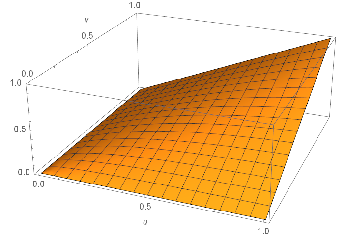
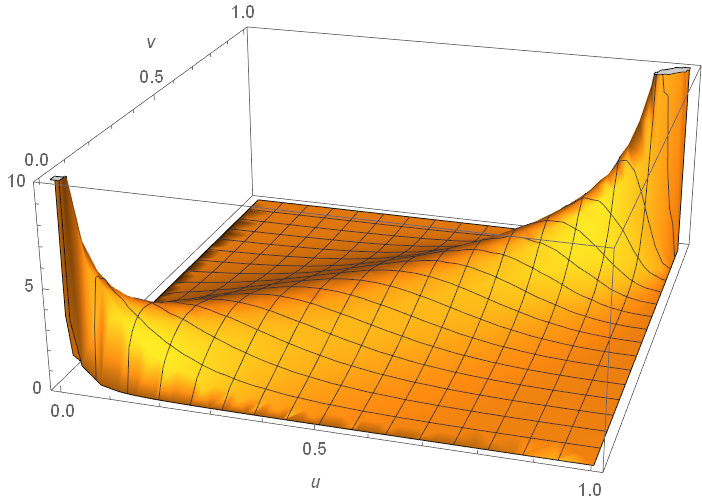
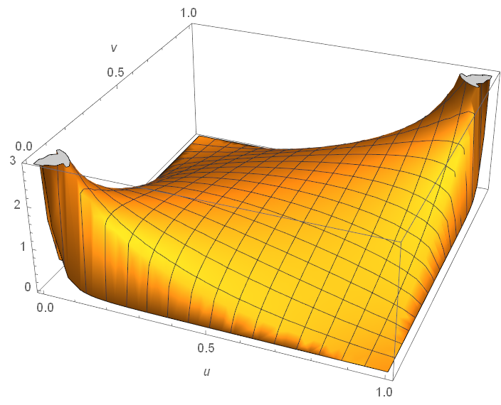
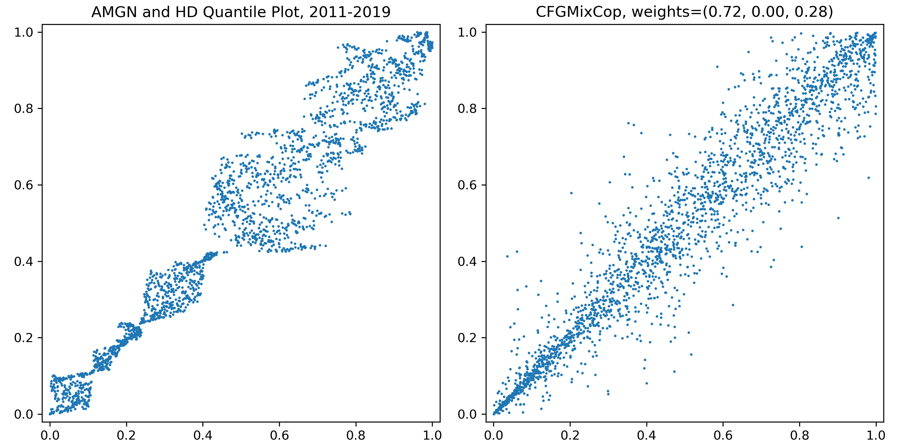

.. _copula_approach-copula_deeper_intro:

.. note::
   This document was greatly inspired by:

    1. Nelsen, Roger B. `An introduction to copulas <https://www.springer.com/gp/book/9780387286594>`__.
       Springer Science & Business Media, 2007.
    2. Nelsen, Roger B. `"Properties and applications of copulas: A brief survey." <http://w4.stern.nyu.edu/ioms/docs/sg/seminars/nelsen.pdf>`__
       Proceedings of the first brazilian conference on statistical modeling in insurance and finance.
       University Press USP Sao Paulo, 2003.
    3. Chang, Bo. `Copula: A Very Short Introduction <https://bochang.me/blog/posts/copula/>`__.
    4. Andy Jones. `SCAD penalty <https://andrewcharlesjones.github.io/posts/2020/03/scad/>`__.

=========================
A Deeper Intro to Copulas
=========================

For people who are more interested in knowing more about copulas, where they come from, computation challenges,
and the mathematical intuition behind it, this is the document to read.
We advise the reader to go through *A Practical Introduction to Copula* at first for basic concepts that will
be assumed in this document.

**Definition** (Formal definition of bivariate copula)
A two-dimensional copula is a function :math:`C: \mathbf{I}^2 \rightarrow \mathbf{I}` where :math:`\mathbf{I} = [0, 1]`
such that 

- (C1) :math:`C(0, x) = C(x, 0) = 0` and :math:`C(1, x) = C(x, 1) = x` for all :math:`x \in \mathbf{I}`;

- (C2) :math:`C` is 2-increasing, i.e., for :math:`a, b, c, d \in \mathbf{I}` with :math:`a \le b` and :math:`c \le d`:
    
    .. math::

        V_c \left( [a,b]\times[c,d] \right) := C(b, d) - C(a, d) - C(b, c) + C(a, c) \ge 0.

Keep in mind that the definition of copula :math:`C` is just the joint cumulative density on quantiles of each marginal
random variable (r.v.).
i.e.,

.. math::

    C(u_1, u_2) = \mathbb{P}(U_1 \le u_1, U_2 \le u_2).

And (C1)(C2) naturally comes from joint CDF: (C1) is quite obvious, and (C2) is just the definition of

.. math::
    
    \mathbb{P}(a \le U_1 \le b, c \le U_2 \le d).

    
    Plot of :math:`C(u,v)` for an N13 copula.

A Few Useful Things
###################

Before we begin, let us make it clear that this documentation is not meant to be purely theoretical, and we are treating
copulas from an applied probability theory point of view with a focus on trading.
To achieve this, we need to introduce a few useful concepts that will for sure help.
To avoid getting lost in symbols, we only discuss bivariate copulas here.

Tail Dependence
***************

**Definition** (Coefficients of lower and upper tail dependence)
The lower and upper tail dependence are defined respectively as:

.. math::
    
    \lambda_l := \lim_{q \rightarrow 0^+} \mathbb{P}(U_2 \le q \mid U_1 \le q),
    
.. math::
    
    \lambda_u := \lim_{q \rightarrow 1^-} \mathbb{P}(U_2 > q \mid U_1 > q).

And those can be derived from the copula:

.. math::
    
    \lambda_l = \lim_{q \rightarrow 0^+} \frac{\mathbb{P}(U_2 \le q, U_1 \le q)}{\mathbb{P}(U_1 \le q)} 
        = \lim_{q \rightarrow 0^+} \frac{C(q,q)}{q},
    
.. math::
    
    \lambda_u = \lim_{q \rightarrow 1^-} \frac{\mathbb{P}(U_2 > q, U_1 > q)}{\mathbb{P}(U_1 > q)}
        = \lim_{q \rightarrow 1^-} \frac{\hat{C}(q,q)}{q},

where :math:`\hat{C}(u_1, u_2) = u_1 + u_2 - 1 + C(1 - u_1, 1 - u_2)` is the **reflected copula**. 
If :math:`\lambda_l > 0` then there is lower tail dependence.
If :math:`\lambda_u > 0` then there is upper tail dependence.
Note that one should actually calculate the limit for each copula, and it is not obvious from the plot usually.

For example, as plotted below, it is not difficult to show that for a Gumbel copula, :math:`\lambda_l=0` and
:math:`\lambda_u=1`.

    
    Plot of :math:`c(u,v)` for a Gumbel copula. It has upper tail dependence but no lower tail dependence.

Fréchet–Hoeffding Bounds
************************
Here is a handy theorem that holds true for all copulas, and is quite useful in analysis:

**Theorem** (Fréchet–Hoeffding Bounds for bivariate copulas) Consider a bivariate copula :math:`C(u_1, u_2)`, then for
:math:`u_j \in \mathbf{I}`:

.. math::
    
    \max \{ u_1 + u_2 - 1 \} \le C(u_1, u_2) \le \min\{u_1, u_2\}.
    
The lower bound comes from the **counter-monotonicity copulas** whereas the upper bound comes from the
**co-monotonicity copulas**.
co-monotone means the two marginal random variables are perfectly positively dependent, for instance, :math:`X_2 = 3 X_1`.
In this case their quantiles are identical and we have:

.. math::

    \begin{align}
    C(u_1, u_2) &= \mathbb{P}(U_1 \le u_1, U_2 \le u_2) \\
        &= \mathbb{P}(U_1 \le u_1, U_1 \le u_2) \\
        &= \mathbb{P}(U_1 \le \min\{u_1, u_2\}).
    \end{align}
   
Similarly, counter-monotone means the two random variables are perfectly negatively dependent, for instance,
:math:`X_2 = -5 X_1`.
  
Empirical Copula
****************

At first, a copula always exists for two continuous random variables (to avoid ties in percentile) :math:`X_1`, :math:`X_2`,
guaranteed by Sklar's theorem.
Once we have enough observations from :math:`X_1` and :math:`X_2`, we define the implied bivaraite empirical copula as follows:

.. math::
    
    \tilde{C}_n(\frac{i}{n}, \frac{j}{n}) = \frac{1}{n}
    ||\{ (X_1, X_2) \mid X_1 \le X_1(i), X_2 \le X_2(j) \}||,
    
where :math:`X_1(i)` is the :math:`i`-th largest element for :math:`X_1`; same applies for :math:`X_2(j)`;
:math:`|| \cdot ||` is the cardinality, or the number of elements in the set for a finite set.
The definition may look more complicated than what it is.
To calculate :math:`\tilde{C}_n(\frac{i}{n}, \frac{j}{n})`, one just need to count the number of cases in the whole observation
that are not greater than the :math:`i`-th and :math:`j`-th rank for their own marginal r.v. respectively.

The empirical can also be defined parametrically by finding each margincal CDF :math:`F_1`, :math:`F_2`.
In that case, the empirical copula becomes:

.. math::

    \tilde{C}_n(u_1, u_2) = \frac{1}{n}
    ||\{ (X_1, X_2) \mid F_1^{-1}(X_1) \le u_1, F_2^{-1}(X_2) \le u_2 \}||,

If one uses empirical CDFs, then it is identical to our first definition.

.. Note::

    Implicitly, copula is used to model independent draws from multiple time-invariant r.v.'s and analyze their dependency
    structure without influence from the specific marginal distributions.
    When applying copula to time series, obviously each draw is not independent, and the dependency between securities are
    likely to change as time progresses.
    Therefore, using an empirical copula may not be a good idea.
    
    Also, using a non-parametric empirical copula for trading may "downscale" the strategy into its simpler counterparts
    that one may aim to improve upon in the beginning.
    For example, since most copula-based trading strategies uses conditional probabilities to signal thresholds.
    If one directly uses an empirical copula, then it technically becomes a rank-based distance method: Simply look at the
    history and see how unlikely such mispricing events happens.
    If they are really mispriced based on ranks then open a position.
    This rather common strategy may already be overused and not generate enough alpha.
    Plus, one will lose the ability to carefully model the tail dependencies at their own desire.
    

"Pure" Copulas
###################

.. Note::
    "Pure" copula is not an official name.
    It is used here for convenience, in contrast to mixed copulas, to represent Archimedean and elliptical copulas.

    
    Plot of :math:`c(u,v)` for the infamous Gaussian copula. It is often not obvious to decide from the plot that whether 
    a copula has tail dependencies.

For practical purposes, at least for the implemented trading strategies in this module, it is enough to understand
tail dependency for each copula and what structure are they generally modeling, because sometimes the nuances only
come into play for a (math) analyst.
Here are a few key results:

1. Upper tail dependency means the two random variables are likely to have large values together. For instance, when working
   with returns series, upper tail dependency implies that the two stocks are likely to have large gains together.
   
2. Lower tail dependency means the two random variables are likely to have small values together. This is much stronger
   in general compared to upper tail dependency, because stocks are more likely to go down together than going up together.
   
3. Frank and Gaussian copula do not have tail dependencies at all. And Gaussian copula infamously contributed to the 2008
   financial crisis by pricing CDOs exactly for this reason.
   Frank copula has a stronger dependence in the center compared to Gaussian.
   
4. For fitting prices and returns data, usually Student-t comes top score.
   Also it does not give probabilities far away from an empirical copula.
   
5. For Value-at-Risk calculations, Gaussian copula is overly optimistic and Gumbel is too pessimistic.

6. Copulas with upper tail dependency: Gumbel, Joe, N13, N14, Student-t.

7. Copulas with lower tail dependency: Clayton, N14 (weaker), Student-t.

8. Copulas with no tail dependency: Gaussian, Frank.

Since a Student-t copula will converge to a Gaussian copula as the degrees of freedom increases, it makes sense to quantify
the change of tail dependence (the upper and lower tail dependency is the same value thanks to symmetry for Student-t copula).
It is tabled below from [Demarta, McNeil, The t Copula and Related Copulas, 2005]:

.. list-table:: Tail Dependency for Bivariate Student-t Copula
   :widths: 20 20 20 20 20 20
   :align: center
   :header-rows: 1

   * - :math:`\nu \downarrow, \rho \rightarrow`
     - -0.5
     - 0
     - 0.5
     - 0.9
     - 1
   * - 2
     - 0.06
     - 0.18
     - 0.39
     - 0.72
     - 1
   * - 4
     - 0.01
     - 0.08
     - 0.25
     - 0.63
     - 1
   * - 10
     - 0
     - 0.01
     - 0.08
     - 0.46
     - 1
   * - :math:`\infty`
     - 0
     - 0
     - 0
     - 0
     - 1

Implementation
**************

.. Note::
    
    All copula classes share the basic public methods in this module.
    Hence here we only demonstrate one of them for example.
    
.. automodule:: arbitragelab.copula_approach.copula_generate
        
    .. autoclass:: Gumbel
	:members: __init__, get_cop_density, get_cop_eval, get_condi_prob, generate_pairs, plot, describe
    

Mixed Copulas
#############

In this `copula_approach` module, we support two mixed copula classes: :code:`CFGMixCop` for Clayton-Frank-Gumbel mix and
:code:`CTGMixCop` for Clayton-Student-Gumbel mix, inspired by [da Silva et al. 2017].

It is pretty intuitive to understand, for example, for a CFG mixed copula, one needs to specify the :math:`\theta`'s,
the dependency parameter for each copula component, and their **weights** that sums to :math:`1`.
In total there are :math:`5` parameters for CFG.
The weights should be understood in the sense of **Markov**, i.e., it describes the probability of an observation coming from
each component.

For example, we present the Clayton-Frank-Gumbel mixed copula as below:

.. math::
    
    C_{mix}(u_1, u_2; \boldsymbol{\theta}, \mathbf{w}) := 
    w_C C_C(u_1, u_2; \theta_C) + w_F C_F(u_1, u_2; \theta_F) + w_G C_G(u_1, u_2; \theta_G)

Why Mixed Copulas
*****************

Archimedean copulas and elliptical copulas, though powerful by themselves to capture nonlinear relations for two random
variables, may suffer from the degree to which they can be calibrated to data.
While using a pure empirical copula may subject to overfit, a mixed copula that can calibrate the upper and lower tail dependency
usually describes the dependency structure really well for its flexibility.

    
    Plot of quantiles for prices of Amgen and Home Depot in 2011-2019, and sample plots from a fitted CFG copula.
    Mixed copulas calibrate the tail dependencies better than "pure" copulas. 
    

But this flexibility comes at a price: fitting it to data is not trivial.
Although one can wrap an optimization function for finding the individual weights and copula parameters using max likelihood,
realistically this is a bad practice for the following reasons:

1. The outcome is highly unstable, and is heavily subject to the choice of the maximization algorithm.

2. An maximization algorithm fitting :math:`5` parameters for CFG or :math:`6` parameters for CTG usually tends to settle to
   a bad result that does not yield a comparable advantage to even its component copula.
   For example, sometimes the fit score for CTG is worse than a direct pseudo-max likelihood fit for Student-t copula.
   
3. Sometimes there is no result for the fit, since the algorithm does not converge.

4. Some maximization algorithms use Jacobian or Hessian matrix, and for some copulas the derivative computation does not
   numerically stay stable.
   
5. Often the weight of a copula component is way too small to be reasonable.
   For example, when an algorithm says there is :math:`0.1 \%` Gumbel copula weight in a dataset of :math:`1000`
   observations, then there is on average :math:`1` observation that comes from Gumbel copula.
   It is bad modeling in every sense.

EM Fitting Algorithm
********************

Instead, we adopt a two-step expectation-maximization (EM) algorithm for fitting mixed copulas, adapted from [Cai, Wang 2014].
This algorithm addresses all the above disadvantages of a generic maximization optimizer.
The only downside is that, the CTG copula may take a while to converge to a solution for certain data sets.

Suppose we are working on a three-component mixed copula of bivariate Archimedeans and ellipticals.
We aim to maximize over the objective function for copula parameters :math:`\boldsymbol{\theta}` and weights :math:`\mathbf{w}`.

.. math::
    
    Q(\boldsymbol{\theta}, \mathbf{w}) = \sum_{t=1}^T \log
    \left[ \sum_{k=1}^3 w_k c_k(u_{1,t}, u_{2,t}; \theta_k) \right]
    - T \sum_{k=1}^3 p_{\gamma, a}(w_k) 
    + \delta \left( \sum_{k=1}^s w_k - 1 \right),

where :math:`T` is the length of the training set, or the size of the observations;
:math:`k` is the dummy variable for each copula component;
:math:`p_{\gamma, a}(\cdot)` is the smoothly clipped absolute deviation (SCAD) penalty term with tuning parameters
:math:`\gamma`and :math:`a` and it is the term that drives small copula components to :math:`0`; and last but not least
:math:`\delta` the Lagrange multiplier term that will be used for the E-step is:

.. math::
  
    \delta = T p'_{\gamma, a}(w_k) - \sum_{t=1}^T \frac{c_k(u_{1,t}, u_{2,t}; \theta_k)}
    {\sum_{j=1}^3 w_{j} c_{j}(u_{1,t}, u_{2,t}; \theta_{j})}

**E-step**

Iteratively calculate the following using the old :math:`\boldsymbol{\theta}` and :math:`\mathbf{w}` until
it converges:

.. math::

    w_k^{new} = \left[ w_k p'_{\gamma, a}(w_k)
    - \frac{1}{T} \sum_{t=1}^T \frac{c_k(u_{1,t}, u_{2,t}; \theta_k)}
    {\sum_{j=1}^3 w_{j} c_{j}(u_{1,t}, u_{2,t}; \theta_{j})} \right]
    \times \left[ \sum_{j=1}^3 w_{j} p'_{\gamma, a}(w_{j}) \right]^{-1}

**M-step**

Use the updated weights to find new :math:`\boldsymbol{\theta}`, such that :math:`Q` is maximized.
One can use truncated Newton or Newton-Raphson for this step.
This step, though still a wrapper around some optimization function, is much better than estimating the weights
and copula parameters all together.

We then iterate the two steps until it converges.
It is tested that the EM algorithm is *oracle* and *sparse*.
Loosely speaking, the former means it has good asymptotic properties, and the latter says it will trim small
weights off.

.. Note::

    The EM algorithm is still not mathematically perfect, and has the following issues:
    
    1. It is slow for some data sets.
       Also the CTG is slow due to the bottleneck from Student-t copula.
    
    2. If the copulas mixture have similar components, for instance, Gaussian and Frank, then it cannot pick the correct
       component weights well.
       Luckily for fitting data, usually the differences are minimal.
       
    3. The SCAD parameters :math:`\gamma` and :math:`a` may require some tuning, depending on the data set it fits.
       Some authors suggest using cross validation to find a good pair of values.
       We did not implement this in the package because it takes really long for the calculation to a point it becomes
       unrealistic to run it (about 1 hour in some cases).
       We did run some CV while coding it, so that the default values of :math:`\gamma` and :math:`a` are good choices.
    
    4. Sometimes the algorithm throws warnings, because the optimization algorithm underneath does not strictly follow
       the prescribed bounds.
       Usually this is not an issue that will compromise the result.
       And some minor tuning on SCAD parameters can solve this issue.

Implementation
**************

.. Note::
    
    All mixed copula classes share the basic public methods in this module.
    Hence here we only demonstrate one of them for example.
    Mixed copulas have their own dedicated fitting method, compared to "pure" copulas.
    
.. automodule:: arbitragelab.copula_approach.copula_generate_mixedcopula
        
    .. autoclass:: CTGMixCop
	:members: __init__, get_cop_density, get_cop_eval, get_condi_prob, generate_pairs, plot, describe, fit

Interesting Open Problems
#########################

1. Parametrically fit a Student-t and mixed copula.

2. Existence of statistical properties that justify two random variables to have an Archimedean copula (like one
   can justify a random variable is normal).

3. Take advantage of copula's ability to capture nonlinear dependencies but also adjust it for time series, so that
   the sequence of data coming in makes a difference.

4. Analysis on copulas when it is used on time series instead of independent draws. (For example, how different it is
   when working with the average :math:`\mu` on time series, compared to the average :math:`\mu` on a random variable?)

5. Adjust copulas so it can model when dependency structure changes with time.

6. All copulas we mentioned so far, "pure" or mixed, assume symmetry. It would be nice to see analysis on asymmetric pairs modeled
   by copula.

References
##########

* `Liew, R.Q. and Wu, Y., 2013. Pairs trading: A copula approach. Journal of Derivatives & Hedge Funds, 19(1), pp.12-30. <https://link.springer.com/article/10.1057/jdhf.2013.1>`__
* `Stander, Y., Marais, D. and Botha, I., 2013. Trading strategies with copulas. Journal of Economic and Financial Sciences, 6(1), pp.83-107. <https://www.researchgate.net/publication/318054326_Trading_strategies_with_copulas>`__
* `Schmid, F., Schmidt, R., Blumentritt, T., Gaißer, S. and Ruppert, M., 2010. Copula-based measures of multivariate association. In Copula theory and its applications (pp. 209-236). Springer, Berlin, Heidelberg. <https://www.researchgate.net/publication/225898324_Copula-Based_Measures_of_Multivariate_Association>`__
* `Huard, D., Évin, G. and Favre, A.C., 2006. Bayesian copula selection. Computational Statistics & Data Analysis, 51(2), pp.809-822. <http://www.academia.edu/download/43927781/Bayesian_copula_selection20160320-19907-11r1q20.pdf>`__
* `Kole, E., Koedijk, K. and Verbeek, M., 2007. Selecting copulas for risk management. Journal of Banking & Finance, 31(8), pp.2405-2423. <https://repub.eur.nl/pub/12668/SelectingCopulas_2005.pdf>`__
* `Nelsen, R.B., 2003, September. Properties and applications of copulas: A brief survey. In Proceedings of the first brazilian conference on statistical modeling in insurance and finance (pp. 10-28). University Press USP Sao Paulo. <http://w4.stern.nyu.edu/ioms/docs/sg/seminars/nelsen.pdf>`__
* `Cai, Z. and Wang, X., 2014. Selection of mixed copula model via penalized likelihood. Journal of the American Statistical Association, 109(506), pp.788-801. <https://www.tandfonline.com/doi/pdf/10.1080/01621459.2013.873366?casa_token=e4kOD3APdtUAAAAA:DnBnxkvcOtfPw3gDYoO66db8GzJiGS5M2G5rMK3ERfAvejk5022dhjAe2X26dk7eTf9kWmYfMg6Mkg>`__
* `Liu, B.Y., Ji, Q. and Fan, Y., 2017. A new time-varying optimal copula model identifying the dependence across markets. Quantitative Finance, 17(3), pp.437-453. <https://www.tandfonline.com/doi/pdf/10.1080/14697688.2016.1205208?casa_token=Chu53l2q9SAAAAAA:MBAM-Zr3EL04IA0fcTJut0AQj5hPOvJjwVJUnxY9ZoB9wBRhGlfLjotX8aaITasXGWXXTr4wh9Td7A>`__
* `Demarta, S. and McNeil, A.J., 2005. The t copula and related copulas. International statistical review, 73(1), pp.111-129. <https://www.risknet.de/fileadmin/eLibrary/t-Copula-Demarta-ETH.pdf>`__

