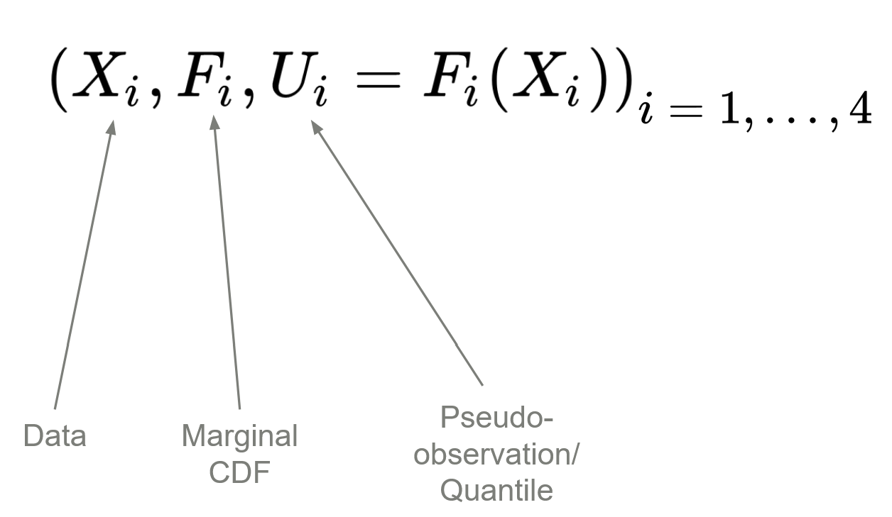
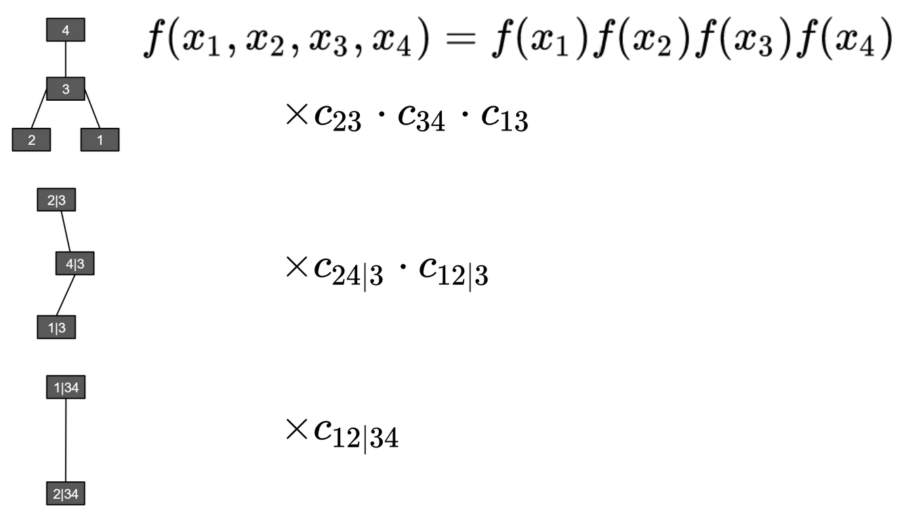
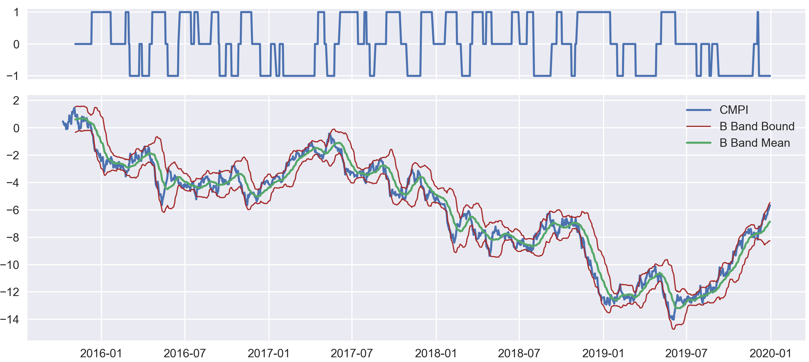
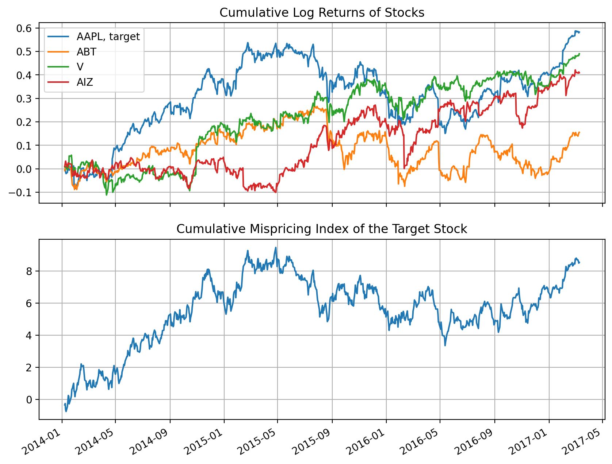
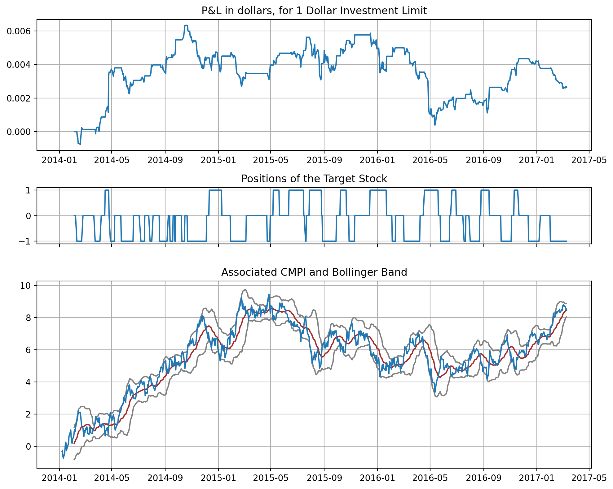

.. _copula_approach-cvine_copula_strategy:

.. note::
    This document is an implementation of:

    Stübinger, J., Mangold, B. and Krauss, C. `Statistical arbitrage with vine copulas. <https://www.tandfonline.com/doi/pdf/10.1080/14697688.2018.1438642?casa_token=olPBPI2bc3IAAAAA:8QViZfM9C0pbxGrarr-BU-yO2Or_wkCF_Pvk4dJFppjNtFzWjfM7W14_oc_ztl_1csHe4gFfloEWyA>`__
    Quantitative Finance, 2018. 

======================
C-vine Copula Strategy
======================

With the power of vine copula, we are able to model the relation among several random variables. Speficifally
we aim to trade based on the information generated from the vine copula model.
Similar to traditional bivariate approaches, we use the conditional (cumulative) probability to gauge whether
the target stock is underpriced or overpriced against other stocks, and generate trading signal based on them
from a mean-reversion bet.

We aim to cover the following topics:

    1. Idea and typical workflow of the C-vine copula approach
    2. Strategy details
    3. Comments for this approach

Overview of the C-vine Stategy
##############################

At first, vine copula is a very flexible model for dealing with multi-variate dependencies. It decomposes
joint probability density into bivariate copula densities and marginal densities in a tree structure.
R-vine is the most generic structure that is shared by all vine copulas, and in application people use C-vine
and D-vine more often as special cases of a generic R-vine. 

.. Note::

    With :math:`N` random variables, there are :math:`N(N − 1)(N − 2)! 2^{(N − 2)(N − 3)/2}/2` many possible
    structures for R-vines. Therefore numerically fitting an R-vine structure directly from data becomes a
    burden, and even if such a method exists and can be calculated in a reasonable time, it is likely subject to
    overfit using financial market data.
    In contrast, for a C-vine there are "only" :math:`N!` possible structures, and it has much better interpretability.
    
Since C-vine has the star-like structure at each level of the tree, it is ideal for modeling dependencies where one
specific random variable is key.
Hence, although we are squeezing statistical arbitrage from an :math:`N` stocks cohort, we are using the "*1-vs-the rest*"
type of framework.
The D-vine or more general R-vine strategy handling mispricings all together, that dynamically trades every stock
based on the mispricing info, to the best of our knowlegde, is not yet developed, at least not available in literature.

We have the workflow as follows:

    1. Get data
    2. Figure out the C-vine structure
    3. Calculate probability density
    4. Calculate the conditional probability
    5. Generate signals and trade

We will dive into the details for each part of the workflow.

C-vine Copula Strategy Workflow
###############################

For ease of demontration, assuming we are trading 4 stocks.

Step 1: Get data
****************

We work with stocks' **daily returns data** exclusively.

.. Note::

    Selecting trading candidates is a serious topic, and can largely determine if a strategy is profitable or
    not.
    There are 4 methods proposed in [Stübinger et al. 2018]:

    * pairwise Spearman's rho,
    * multi-dimensional Spearman's rho,
    * sum of distance in quantile plots to hyper-diagonal
    * copula-chi-square test for dependence.

    Loosely speaking, the goal is to find stocks cohorts that are heavily dependent, such that a mean-reversion bet
    on relative mispricings is profitable.
    For more details in implementation, please refer to :ref:`Vine Copula Partner Selection<copula_approach-partner_selection>`.
    

Suppose we have chosen a few cohorts and in each cohort it has a key stock element. We then need to turn the translate
the stocks' returns data into its quantiles (pseudo-observations) using empirical CDFs (ECDFs).
We denote the pseudo-observations as :math:`u_i`'s, and they are all uniform in :math:`[0, 1]`.

    
    Fig 1: Generate pseudo-observations or quantiles and marginal ECDFs from returns data.

Step 2: Figure out the C-vine Structure
***************************************

To start with, there are :math:`4! = 24` many possible C-vine structures. Without loss of generality assuming the stock 1
is our target stock. In the end, we aim to come up with this conditional density that indicates relative mispricing for
stock 1 against 3 other stocks in this cohort:

.. math::
    
        h(u_1 | u_2, u_3, u_4)
        =  \mathbb{P}(U_1 \le u_1 | U_2=u_2, U_3=u_3, U_4=u_4)
        
If :math:`h(u_1 | u_2, u_3, u_4) < 0.5` then that day's return for stock 1 is considered lower than the mean of what the
history tells and vice versa, similar to the "traditional" copula approaches with Mispricing Index.

In [Stübinger et al. 2018], the authors claimed that in order to calculate :math:`h(u_1 | u_2, u_3, u_4)`, stock 1 must never be
at the center of every level of the tree.
Remember that C-vine can be fully characterized by an ordered tuple :math:`(c_4, c_3, c_2, c_1)` where :math:`c_1` is the
center for the level-1 tree, :math:`c_2` for level-2 and so on.
Therefore, to make stock 1 never at the center (except at the tree root), it is equivalent to check each possibility generated by
:math:`(1, c_3, c_2, c_1)`, where :math:`(c_3, c_2, c_1)` is a permutation of :math:`\{2, 3, 4\}`. Obviously there are :math:`3! = 6` many ways available.

.. Note::

    Disclaimer: I do not fully agree with the authors' argument here, because **all** vine copula allows one to calculate
    the joint probability density :math:`f(u_1, u_2, u_3, u_4)`, for any given quantities :math:`(u_1, u_2, u_3, u_4)` in
    order to calculate :math:`h` for any target stock, simply integrate along that marginal variable and then normalize by a
    full integration in that direction. For example:
    
    .. math::
        
        h(u_1 | u_2, u_3, u_4)
        = \left( \int_0^{u_1} f(u, u_2, u_3, u_4) du \right) / \left( \int_0^{1} f(u, u_2, u_3, u_4) du \right)

    Moreover, I think if we treat stock 1 as the key stock, it should be **at the center of every level of the tree**, because
    it makes intuitive sense to model all other stocks' and their bivariate copula densities relation given the stock 1's information.
    Stock 1 is the object of interest, and therefore should be the governing quantity here.
    C-vine structure intrinsically orders the marginal variables by their importance of interdependencies from its ordered tuple representation,
    and the target stock should be the most important (therefore at the end of the tuple).
    It is strange to argue that the least important stock in terms of interdependencies should become the target stock.
    I.e., 1 should be put at the end of the tuple, not at the beginning, and there are still 6 many possible structures for
    4 stocks.
    
    Currently we provide the implementation in [Stübinger et al. 2018] and the alternative method that puts the target stock at the center.
    
After chosen the 6 possible vine structures, we then fit everyone of them and calculate the associated AIC value. We choose
the final C-vine structure among candidates with the lowest AIC value.
It is equivalent in this case to directly comparing the log-likelihood and choose the one that constitutes the largest 
log-likelihood value.
The exact fitting includes figuring out what type of (parametric) bivariate copula to use for every node, and the parameter(s)
value that fits best the data.

.. figure:: images/workflow_select_structure.png
    :scale: 60 %
    :align: center
    
    Fig 2: Determine the C-vine structure by AIC or maximum likelihood. Picture from [Stübinger et al. 2018].

Step 3: Probability Density
***************************

We aim to calculate :math:`f(u_1, u_2, u_3, u_4)`.
This is straightforward once we fit the C-vine to training data. Now we are working on the trading priod data. At first
we should map them into quantiles using the ECDFs trained in the training period. Then we can calculate directly the probability
density for pseudo-observations, say :math:`(u_1, u_2, u_3, u_4)`, by calculating every node at every level of the tree.
Note that each node constitues a probability density, either marginal density (top of the tree) or the copula density (not
top of the tree). And the final probability density is their product.

    
    Fig 3: Determine the joint density :math:`f(u_1, u_2, u_3, u_4)` from the vine copula. Here the notation
    :math:`f(x_1, x_2, x_3, x_4)` is okay since we start from the beginning only using quantiles data, so :math:`u_i = x_i`.

Step 4: Conditional Probability
*******************************

We aim to calculate :math:`h(u_1| u_2, u_3, u_4)`, given that stock 1 is the target stock. Similarly we can compute for
other stocks if they are the target.
Here we use numerical integration for this value:

.. math::
    
    \begin{align}
        h(u_1 | u_2, u_3, u_4)
        &=  \mathbb{P}(U_1 \le u_1 | U_2=u_2, U_3=u_3, U_4=u_4) \\
        &= \left( \int_0^{u_1} f(u, u_2, u_3, u_4) du \right) / \left( \int_0^{1} f(u, u_2, u_3, u_4) du \right)
    \end{align}

Keep in mind that this value is model dependent: it depends on which vine structure we are using, and the types of bivariate
copulas and their parameters in each node. Some people denote the conditional probability as :math:`h_C` to indicate that it
depends on a copula.

.. Note::

    Here we computed :math:`h` from the "bottom up" by marginal integration. The authors suggested computing from "top down" 
    by taking partial differentiations from the copula definition :math:`C(u_1, u_2, u_3, u_4)` (cumulative density):
    
    .. math::
    
        h(u_1 | u_2, u_3, u_4) := \frac{\partial^3 C(u_1, u_2, u_3, u_4)}{\partial u_1 \partial u_2 \partial u_3}
    
    I do not agree with the author's approach for the following reason:
    Mathematically speaking it is the same. However vine copula only allows one to compute the joint density :math:`f`, and
    unlike "traditional" copula models where :math:`C` is defined by definition. For vine copula :math:`C` is found by
    Monte-Carlo integrations from :math:`f`.
    Also even if :math:`C` can be found analytically, taking 3 numerical partial
    differentiations will likely yield more issues compared to numerically integrating just along 1 marginal variable.
    

Step 5: Generate Signals and Trade
**********************************

For simplificaition say we have 2 cohorts after the stocks selection, each cohort has a target stock.
And we have fitted 2 C-vine copulas respectively for the 2 cohorts with their own target stock.
Without loss of generality, let us fix stock 1 for each cohort as its target stock.
For conditional probability :math:`h`:

    1. If :math:`h > 0.5`, stock 1's return that day is higher than the historical average compared to other 3 stocks
       in the cohort.
    2. If :math:`h < 0.5`, stock 1's return that day is higher than the historical average compared to other 3 stocks
       in the cohort.
       
Therefore, we adopt the cumulative mispricing index framework. For each cohort we calculate the **de-meaned** cumulative sum
of :math:`h` as :math:`CMPI`, and formulate the trading signal using a Bollinger band:
Denote the running average of :math:`CMPI` in the fixed-length, moving time window as :math:`\hat{\mu}(t)`, the running
standard deviation in the time window as :math:`\hat{\sigma}(t)`, and some positive constant :math:`k` to control the
Bollinger band's width.

    1. Short signal: When :math:`CMPI > \hat{\mu}(t) + k \hat{\sigma}(t)`.
    2. Long signal: When :math:`CMPI < \hat{\mu}(t) - k \hat{\sigma}(t)`. 
    3. Exit signal: When :math:`CMPI` crosses with :math:`\hat{\mu}(t)`.
    4. Do nothing: Else.

    
    Fig 4: Positions of the target stock and the associated Bollinger Band.

Now we total net positions for each key stock in each cohort. Then we formulate our dollar-neutral strategy by trading
against a cheap broad-based market index such as SPY, similar to the method used in [Avellaneda and Lee, 2010].

.. Note::
    
    It is totally possible that different cohorts can share the same key stock. The cohort and key stock information
    is generated from the stocks cohort selection methods.
    
It is no surprise that :math:`CMPI` looks reasonably similar to cumulative log-returns of the target stock. This can be
used as a sanity check on whether our vine copula model is off.

    
    Fig 5: CMPI and cumulative log returns of the target stock. Their shape looks very similar.

Comments
########

Vine copula provides a very flexible approach in modeling multi-variate dependencies. The C-vine structure specifically
highlights a dominant component at every level of the tree, ideal for our "1-vs-the rest" trading strategy for capturing
statistical arbitrage among multiple stocks, which non-quant strategies often omit or are still primative.

As promising as it looks, just like any other methods it inevitably bears the some drawbacks:

    1. High start-up cost: to understand this method, the user needs to understand copula modeling from scratch, and
       also how to interprete vine copula models from end to end.

    2. High computation cost: For a cohort of 4 stocks and 3 years of daily training data + 1 year of test data, it takes about
       30 seconds to fit and generate positions. This can hardly be optimized further since the fitting algorithm is already
       written in an optimized C++ library. And the compuation time should scale up in :math:`O(N!)`. This is just for fitting and
       generating positions without factoring into the time for stocks selection.
       
    3. Interpretability: Since the exact fitting algorithms are quite complicated, the interpretability may suffer in
       back tracking possible fitting issues and how to evaluate each fits. Also the high dimension makes it difficult
       to produce an intuitive plot just to visually check if the model is correct, unlike bivariate copulas.

    
    (Fig 6: Equity curve for just 1 cohort with 4 stocks.)

Implementation
##############

.. automodule:: arbitragelab.copula_approach.vinecop_strategy
        
    .. autoclass:: CVineCopStrat
        :members: __init__, calc_mpi, get_positions_bollinger, get_cur_signal_bollinger, get_cur_pos_bollinger, positions_to_units_against_index

Example
#######

.. code-block::

    # Importing the module and other libraries
    import pandas as pd
    import numpy as np

    from arbitragelab.copula_approach.vinecop_generate import CVineCop
    from arbitragelab.copula_approach.vinecop_strategy import CVineCopStrat
    from arbitragelab.copula_approach.copula_calculation import to_quantile

    # Loading stocks data. Use 1 cohort for example: suppose stocks 'AAPL', 'MSFT', 'AMZN', 'FB'
    # form the cohort, and 'AAPL' is the target stock.
    sp500_returns = pd.read_csv('all_sp500_returns.csv', index_col='Dates', parse_dates=True)
    returns_train = sp500_returns[['AAPL', 'MSFT', 'AMZN', 'FB']][:800]
    returns_test = sp500_returns[['AAPL', 'MSFT', 'AMZN', 'FB']][800:1100]

    prices_aapl_spy = pd.read_csv('all_sp500_prices.csv',
                                  index_col='Dates', parse_dates=True)[['AAPL', 'SPY']][800:1100]

    rts_train_quantiles, cdfs = to_quantile(returns_train)
    rts_test_quantiles, _ = to_quantile(returns_train)

    # Instantiate a CVineCop (C-vine copula) class to fit
    cvinecop = CVineCop()

    # Fit C-vine automatically, 'AAPL' is the target stock
    # Note that pv_target_idx is indexed from 1
    vinecop_structure = cvinecop.fit_auto(data=rts_train_quantiles, pv_target_idx=1, if_renew=True)
    # Print the vine copula structure as a sanity check. You can directly fit internally by just
    # using cvinecop.fit_auto(data=rts_train_quantiles, pv_target_idx=1, if_renew=True) if you
    # do not want to print structures.
    print(vinecop_structure)

    # Instantiate a CVineCopStrat (trading) class from the fitted C-vine copula
    cvstrat = CVineCopStrat(cvinecop)

    # Generate positions over the test data, return the Bollinger band for sanity check
    # Note that the cdfs should be from the training set.
    positions, bband = cvstrat.get_positions_bollinger(returns=returns_test, cdfs=cdfs,
                                                       if_return_bollinger_band=True)
    positions = positions.shift(1)  # Avoid look-back bias

    # Formulate units from the positions against the SPY index, with 100,000 dollar investment
    units = cvstrat.positions_to_units_against_index(target_stock_prices=prices_aapl_spy['AAPL'],
                                                     index_prices=prices_aapl_spy['SPY'],
                                                     positions=positions,
                                                     multiplier=100000)

Research Notebooks
##################

The following research notebook can be used to better understand the C-Vine copula strategy.

* `C-Vine Copula Strategy`_

.. _`C-Vine Copula Strategy`: https://github.com/Hudson-and-Thames-Clients/arbitrage_research/blob/master/Copula%20Approach/CVine_Copula_Strategy.ipynb

References
##########

* `Stübinger, J., Mangold, B. and Krauss, C., 2018. Statistical arbitrage with vine copulas. Quantitative Finance, 18(11), pp.1831-1849. <https://www.tandfonline.com/doi/pdf/10.1080/14697688.2018.1438642?casa_token=olPBPI2bc3IAAAAA:8QViZfM9C0pbxGrarr-BU-yO2Or_wkCF_Pvk4dJFppjNtFzWjfM7W14_oc_ztl_1csHe4gFfloEWyA>`__
* `Joe, H. and Kurowicka, D. eds., 2011. Dependence modeling: vine copula handbook. World Scientific. <https://www.worldscientific.com/worldscibooks/10.1142/7699>`__
* `Yu, R., Yang, R., Zhang, C., Špoljar, M., Kuczyńska-Kippen, N. and Sang, G., 2020. A Vine Copula-Based Modeling for Identification of Multivariate Water Pollution Risk in an Interconnected River System Network. Water, 12(10), p.2741. <https://www.mdpi.com/2073-4441/12/10/2741/pdf>`__
* `Dissmann, J., Brechmann, E.C., Czado, C. and Kurowicka, D., 2013. Selecting and estimating regular vine copulae and application to financial returns. Computational Statistics & Data Analysis, 59, pp.52-69. <https://arxiv.org/pdf/1202.2002>`__
* `Avellaneda, M. and Lee, J.H., 2010. Statistical arbitrage in the US equities market. Quantitative Finance, 10(7), pp.761-782. <https://www.tandfonline.com/doi/pdf/10.1080/14697680903124632?casa_token=K_vV53eoimwAAAAA:D6gJqwOAZrmjp3mzyIl7BAFazKfj1GZZE8N9pzmMoqVxkH-t69HO4sNORfqE0dNPJo_otEQZz0fB7g>`__
