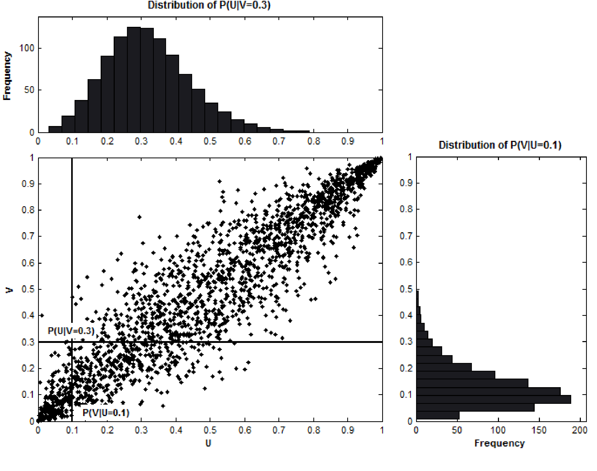

.. _copula_approach-introduction:

.. Note::

    These descriptions closely follow the following two papers:
        * Liew, Rong Qi, and Yuan Wu. "Pairs trading: a copula approach." (2013).
        * Stander, Yolanda, Daniël Marais, and Ilse Botha. "Trading strategies with copulas." Journal of Economic and Financial Sciences 6.1 (2013): 83-107.

============
Introduction
============

Copula is a relatively new analysis tool for pairs trading, compared to more traditional approaches such
as distance and cointegration. Since pairs trading can be considered one of the long/short equity strategies,
copula enables a more nuanced and detailed understanding of the traded pair when compared to, say, Euclidean distance
approaches, thereby generating more reasonable trading opportunities for capturing relative mispricing.

Consider having a pair of cointegrated stocks. By analyzing their time series, one can calculate their standardized
price gap as part of a distance approach, or project their long-run mean as in a cointegrated system as part of a
cointegration approach. However, none of the two methods are built with the distributions from their time series.
The copula model naturally incorporates their marginal distributions, together with other interesting properties from
each copula, e.g., tail dependency for capturing rare and/or extreme moments like large, cointegrated swings in the
market.

Briefly speaking, copula is a tool to capture details of how two random variables are "correlated". By having a more
detailed modeling framework, we expect the pairs trading strategy followed to be more realistic and robust.

    An illustration of the conditional distribution function of V for a given value of U and the conditional
    distribution function of U for a given value of V using the N14 copula dependence structure.
    An example from
    "Trading strategies with copulas."
    by Stander, Yolanda, Daniël Marais, and Ilse Botha.

Tools presented in this module enable the user to transform and fit pair's price data to a given type of copula,
sample and plot from a given copula, and generate trading positions given the pair's data using a copula.
There are 8 commonly used ones that are now available: Gumbel, Frank, Clayton, Joe, N13, N14, Gaussian and Student-t.

The user may choose to fit the pair's data to all provided copulas, then compare the information criterion scores (AIC,
SIC, HQIC) to decide the best copula. One can further use the fitted copula to generate trading positions by giving
thresholds from data.
