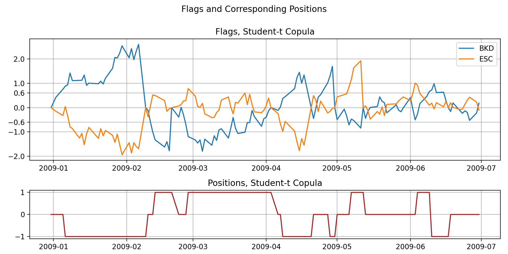
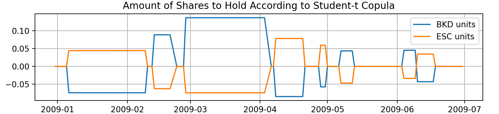

.. _copula_approach-mispricing_index_strategy:

=================================
Mispricing Index Trading Strategy
=================================

.. Note::
    The following strategy closely follow the implementations:

    `Pairs trading with copulas. (2016) <https://efmaefm.org/0efmameetings/EFMA%20ANNUAL%20MEETINGS/2014-Rome/papers/EFMA2014_0222_FullPaper.pdf>`__ by Xie, W., Liew, R.Q., Wu, Y. and Zou, X.

.. Warning::
    The authors claimed a relatively robust 8-10% returns from this strategy in the formation period (6 mo).
    We are pretty positive that the rules proposed in the paper were implemented correctly in the :code:`CopulaStrategyMPI`
    module with thorough unit testing on every possible case, and thus there is very unlikely to have mistakes.
    However the P&L is very sensitive to the opening and exiting parameters value, input data and copula choice,
    and it cannot lead to the claimed returns, after trying all the possible interpretations of ambiguities.
    
    We still implement this module for people who intend to explore possibilities with copula, however the user should be
    aware of the nature of the proposed framework.
    Interested reader may read through the *Possible Issues* part and see where this strategy can be improved.
    
Introduction to the Strategy Concepts
#####################################
For convenience, the **mispricing index** implemented in the strategy will be referred as **MPI** when no ambiguity arises.

A Quick Review of the Basic Copula Strategy
*******************************************

Before we introduce the MPI strategy, let's recall the basic copula strategy and understand its pros and cons.

The basic copula strategy proposed by [Liew et al. 2013] works with price series (or log-price series, which 
has identical suggested trading signals under the copula framework) and looks at conditional probabilities.
For example, if :math:`P(X \le x_t | Y = y_t)` is small for stock pair :math:`(X, Y)` with prices :math:`(x_t, y_t)`,
then stock :math:`X` is considered undervalued given the current price of :math:`Y`.
Then we derive long/short positions regarding the spread based on this conditional probability.
This conditional probability is calculated from some copula fitted to the training data, and generally other 
models cannot produce this value.

Although this approach is in general reasonably sound, it has one critical drawback, that
**the price series is not in general stationary**.
For example, if one adopt the assumption that stocks move in a lognormal 
(One may also argue that such assumption can be quite situational. We won't get into the details here.) fashion,
then almost surely the price will reach any given level with enough time.

This implies that, if the basic copula framework was working on two stocks that has an upward(or downward) drift
in the trading period, it may go out of range of the training period, and the conditional probabilities calculated
from which will always be extreme values as :math:`0` and :math:`1`, bringing in nonsense trading signals.
One possible way to overcome this inconvenience is to keep the training set up to date so it is less likely to
have new prices out of range.
Another way is to work with a more likely stationary time series, for example, returns.

How is the MPI Strategy Constructed?
************************************

At first glance, the MPI strategy documented in [Xie et al. 2016] looks quite bizarre.
However it is reasonably consistant when one goes through the logic of its construction:
In order to use returns to generate trading signals, one needs to be creative about utilizing the information.
It is one thing to know the dependence structure of a pair of stocks, it is another thing to trade based on it
because intrinsically stocks are traded on prices, not returns.

If one regard using conditional probabilities as a distance measure, then it is natural to think about how far
the returns have cumulatively driven the prices apart (or together), thereby introducing trading opportunities.

Hence we introduce the following concepts for the strategy framework:

Mispricing Index
****************

**MPI** is defined as the conditional probability of returns, i.e., 

.. math::
    MI_t^{X\mid Y} = P(R_t^X < r_t^X \mid R_t^Y = r_t^Y)

.. math::
    MI_t^{Y\mid X} = P(R_t^Y < r_t^Y \mid R_t^X = r_t^X)

for stocks :math:`(X, Y)` with returns random variable at day :math:`t`: :math:`(R_t^X, R_t^Y)` and returns value at
day :math:`t`: :math:`(r_t^X, r_t^Y)`.
Those two values determines how mispriced each stock is, based on that day's return.
Note that so far only one day's return information contributes, and we want to add it up to cumulatively use
returns to gauge how mispriced the stocks are.
Therefore we introduce the **flag** series:

Flag and Raw Flag
*****************

A more descriptive name than flag in my opinion would be **cumulative mispricing index**.
The **raw flag** series (with a star) is the cumulative sum of daily MPIs minus 0.5, i.e.,

.. math::
    FlagX^*(t) = FlagX^*(t-1) + (MI_t^{X\mid Y} - 0.5), \quad FlagX^*(0) = 0.

.. math::
    FlagY^*(t) = FlagY^*(t-1) + (MI_t^{Y\mid X} - 0.5), \quad FlagY^*(0) = 0.

Or equivalently

.. math::
    FlagX^*(t) = \sum_{s=0}^t (MI_s^{X\mid Y} - 0.5)

.. math::
    FlagY^*(t) = \sum_{s=0}^t (MI_s^{Y\mid X} - 0.5)

If one plots the raw flags series, they look quite similar to cumulative returns from their price series,
which is what they were designed to do:
Accumulate information from daily returns to reflect information on prices.
Therefore, you may consider it as a fancy way to represent the returns series.

However, the **real flag** series (without a star, :math:`FlagX(t)`, :math:`FlagY(t)`) **will be reset to :math:`0`**
whenever there is an exiting signal, which brings us to the trading logic.

Trading Logic
#############

Opening and Exiting Rules
*************************

The authors proposes a **dollar-neutral** trade scheme worded as follows:

Suppose stock :math:`X`, :math:`Y` are associated with :math:`FlagX`, :math:`FlagY` respectively.

Opening rules: (:math:`D = 0.6` in the paper)

- When :math:`FlagX` reaches :math:`D`,
  short :math:`X` and buy :math:`Y` in **equal amounts**. (:math:`-1` Position)

- When :math:`FlagX` reaches :math:`-D`,
  short :math:`Y` and buy :math:`X` in **equal amounts**. (:math:`1` Position)
  
- When :math:`FlagY` reaches :math:`D`,
  short :math:`Y` and buy :math:`X` in **equal amounts**. (:math:`1` Position)

- When :math:`FlagY` reaches :math:`-D`,
  short :math:`X` and buy :math:`Y` in **equal amounts**. (:math:`-1` Position)

Exiting rules: (:math:`S = 2` in the paper)

- If trades are opened based on :math:`FlagX`, then they are closed if :math:`FlagX` returns to zero or reaches stop-loss
  position :math:`S` or :math:`-S`.

- If trades are opened based on :math:`FlagY`, then they are closed if :math:`FlagY` returns to zero or reaches stop-loss
  position :math:`S` or :math:`-S`.

- After trades are closed, both :math:`FlagX` and :math:`FlagY` are reset to :math:`0`.

The rationale behind the dollar-neutral choice might be that (the authors did not mention this), because the signals are generated by returns, it makes sense to "reset" returns when entering into a long/short position.

Ambiguities
***********

The authors did not specify what will happen if the following occurs:

1. When :math:`FlagX`reaches :math:`D` (or :math:`-D`) and :math:`FlagY` reaches :math:`D` (or :math:`-D`) together.
2. When in a long(or short) position, receives a short(or long) trigger.
3. When receiving a opening and exiting signal together.
4. When the position was open based on :math:`FlagX` (or :math:`FlagY`), :math:`FlagY` (or :math:`FlagX`) reaches
   :math:`S` or :math:`-S`.

Here is our take on the above issues:

1. Do nothing.
2. Change to the trigger position. For example, long position with a short trigger will go short.
3. Go for the exiting signal.
4. Do nothing.

.. figure:: images/returns_and_samples.png
    :scale: 40 %
    :align: center

    Sampling from the various fitted copulas, and plot the empirical density from training data
    from BKD and ESC.

.. figure:: images/mpi_normalized_prices.png
    :scale: 40 %
    :align: center
    

    

    A visualised output of flags, positions and units to hold using a Student-t copula. The stock pair considered 
    is BKD and ESC. 

Implementation
##############

.. automodule:: arbitragelab.copula_approach.copula_strategy_mpi
        
    .. autoclass:: CopulaStrategyMPI
	:members: __init__, to_returns, calc_mpi, fit_copula, positions_to_units_dollar_neutral, get_positions_and_flags

Example
*******

.. code-block::

   # Importing the module and other libraries
   from arbitragelab.copula_approach.copula_strategy_mpi import CopulaStrategyMPI
   import matplotlib.pyplot as plt
   import pandas as pd

   # Instantiating the module
   CSMPI = CopulaStrategyMPI()

   # Loading the data in prices of stock X and stock Y
   prices = pd.read_csv('FILE_PATH' + 'stock_X_Y_prices.csv').set_index('Date').dropna()
   
   # Convert prices to returns
   returns = CSMPI.to_returns(prices)

   # Split data into train and test sets
   training_len = int(len(prices) * 0.7)
   returns_train = returns.iloc[:training_len, :]
   returns_test = returns.iloc[training_len:, :]
   prices_train = prices.iloc[:training_len, :]
   prices_test = prices.iloc[training_len:, :]

   # Fitting to a N14 copula
   result_dict, copula, s1_cdf, s2_cdf = CSMPI.fit_copula(returns=returns_train,
                                                          copula_name='N14')
													   
   # Printing fit scores in AIC, SIC, HQIC
   print(result_dict)

   # Forming positions and flags using trading period data, assuming holding no position initially.
   positions, flags = CSMPI.get_positions_and_flags(returns=returns_test,
                                                    cdf1=s1_cdf,
                                                    cdf2=s2_cdf)
   
   # Changing the positions series to units to hold for a dollar-neutral strategy for $10000 investment
   units = CSMPI.positions_to_units_dollar_neutral(prices_df=prices_test, positions=positions,
                                                   multiplier=10000)
   
   # Graph from the fitted copula
   ax = plt.subplot()
   CSMPI.graph_copula(copula_name='N14', ax=ax, theta=copula.theta)
   plt.show()
   
   # Sample 2000 times from the fitted copula
   samples = copula.generate_pairs(num=2000)

Possible Issues
###############

1. The strategy's outcome is quite sensitive to the values of opening and exiting triggers to the point that
   a well-fitted copula with a not good sets of parameters can actually lose money.

2. The trading signal is generated from the flags series, and the flags series will be calculated from the
   copula that we use to model.
   Therefore the explanability suffers.
   Also it is based on the model in second order, and therefore the flag series and the suggested positions
   will be quite different across different copulas, making it not stable and not directly comparable mutually.

3. The way the flags series are defined does not handle well when both stocks are underpriced/overpriced concurrently.

4. Because of flags will be reset to 0 once there is an exiting signal, it implicitly models the returns as
   martingales that do not depend on the current price level of the stock itself and the other stock.
   Such an assumption may be situational, and the user should be aware. (White noise returns do not imply that
   the prices are well cointegrated.)
   
5. The strategy is betting the flags series having dominating mean-reversion behaviors, for a pair of cointegrated stocks.
   It is not mathematically clear what justifies the rationale.
   
6. If accumulating mispricing index is basically using returns to reflect prices, and the raw flags look
   basically the same as normalized prices, why not just directly use normalized prices instead?

Research Notebooks
##################

The following research notebook can be used to better understand the copula strategy described above.

* `Mispricing Index Copula Strategy`_

.. _`Mispricing Index Copula Strategy`: https://github.com/hudson-and-thames/arbitrage_research/blob/copula_approach/Copula%20Approach/Copula_Strategy_Mispricing_Index.ipynb

References
##########

* `Xie, W., Liew, R.Q., Wu, Y. and Zou, X., 2016. Pairs trading with copulas. The Journal of Trading, 11(3), pp.41-52. <https://efmaefm.org/0efmameetings/EFMA%20ANNUAL%20MEETINGS/2014-Rome/papers/EFMA2014_0222_FullPaper.pdf>`__
* `Liew, R.Q. and Wu, Y., 2013. Pairs trading: A copula approach. Journal of Derivatives & Hedge Funds, 19(1), pp.12-30. <https://link.springer.com/article/10.1057/jdhf.2013.1>`__

