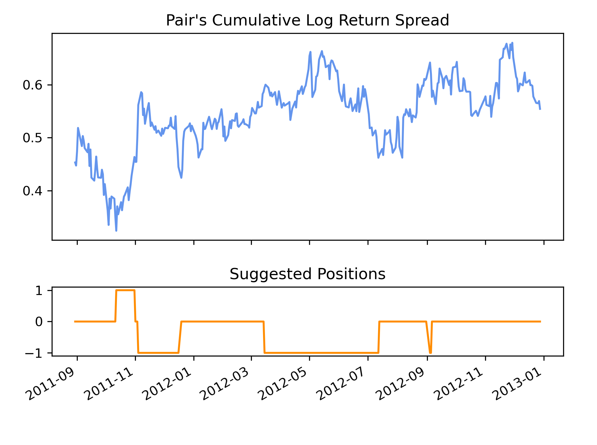
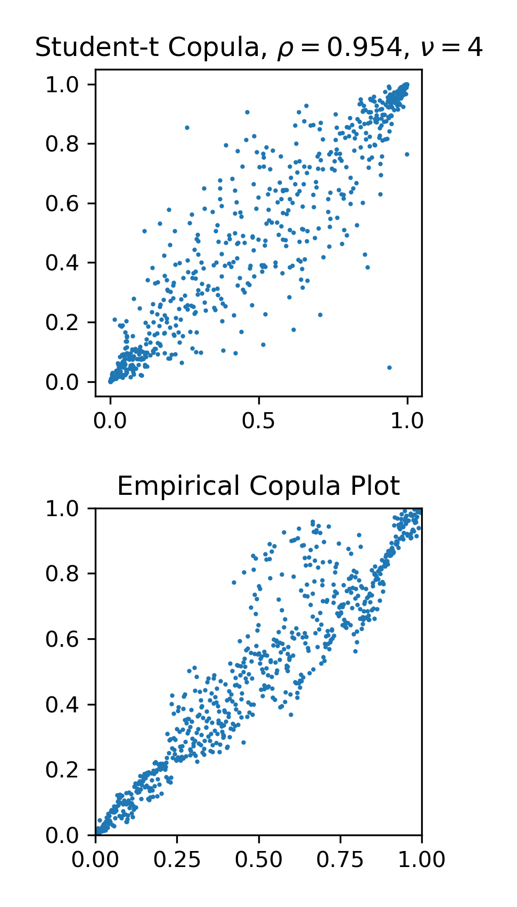

.. _cointegration_approach-trading_strategies:

==================
Trading Strategy
==================

.. Note::
    The following strategy closely follow the implementations:

        * Liew, Rong Qi, and Yuan Wu. "Pairs trading: a copula approach." (2013).
        * Stander, Yolanda, Daniël Marais, and Ilse Botha. "Trading strategies with copulas." (2013).

The trading strategy using copula is implemented as a long-short pairs trading scheme, and uses rules from general
long-short pairs trading framework.

.. figure:: images/trading_opportunities.png
    :scale: 30 %
    :align: center

    (Figure and Caption from Botha et al. 2013.) An illustration of the areas where the values of U and V respectively 
    are considered extreme when using a 99% confidence level and the N14 copula dependence structure.

Probability Threshold Strategy
##############################
We start with a pair of stocks of interest :math:`S_1` and :math:`S_2`, which can be selected by various methods.
For example, using Engle-Granger test for cointegration.
By consensus, we define the spread as :math:`S_1` in relation to :math:`S_2`.
e.g. Short the spread means buying :math:`S_1` and/or selling :math:`S_2`.

Use **cumulative log return** data of the stocks during the training/formation period, we proceed a pseudo-MLE
fit to establish a copula that reflects the relation of the two stocks during training/formation period.

Then we can calculate the **marginal cumulative probabilities** using trading/testing period data:

.. math::
    \begin{align}
    P(U_1\le u_1 | U_2 = u_2), \\
    P(U_2\le u_2 | U_1 = u_1).
    \end{align}

- :math:`u_i \in [0, 1]` is the quantile of trading period data mapped by a CDF formed in the training period.

- When :math:`P(U_1\le u_1 | U_2 = u_2) < 0.5`, then stock 1 is considered under-valued.

- When :math:`P(U_1\le u_1 | U_2 = u_2) > 0.5`, then stock 1 is considered over-valued.

Now we define an upper threshold :math:`b_{up}` (e.g. 0.95) and a lower threshold :math:`b_{lo}` (e.g. 0.05),
then the logic is as follows:

- If :math:`P(U_1\le u_1 | U_2 = u_2) < b_{lo}` and :math:`P(U_2\le u_2 | U_1 = u_1) > b_{up}`, then stock 1 is
  undervalued, and stock 2 is overvalued. Hence we long the spread.

- If :math:`P(U_2\le u_2 | U_1 = u_1) < b_{lo}` and :math:`P(U_1\le u_1 | U_2 = u_2) > b_{up}`, then stock 2 is
  undervalued, and stock 1 is overvalued. Hence we short the spread.

- If one of the conditional probabilities cross the boundary of :math:`0.5` in relation to its previous time step,
  then we exit the position, as we consider the position is no longer valid.

With an input of portfolio price series, a backward-looking window for a simple moving average, and a
window for rolling st. deviation, the function will output a dataframe with portfolio price series
alongside with the Z-Scores and target quantities of the unit portfolio to hold.

    A visualised output of using a Student-t copula with :math:`\nu=4`. The stock pair considered is BKD and ESC. 
    The thresholds are 0.88 and 0.12.
	

    Sampling from the fitted Student-t copula with :math:`\nu=4`, and plot the empirical density from training data
    from BKD and ESC.

Implementation
**************
.. py:currentmodule:: arbitragelab.copula_approach.copula_strategy
.. autoclass:: CopulaStrategy

    .. automethod:: cum_log_return
    .. automethod:: fit_copula
    .. automethod:: analyze_time_series
    .. automethod:: graph_copula

Example
*******

.. code-block::

   # Importing the module and other libraries
   from arbitragelab.copula_approach.copula_strategy import CopulaStrategy
   import matplotlib.pyplot as plt
   import numpy as np

   # Instantiating the module
   CS = CopulaStrategy()

   # Converting price data to cumulative log returns
   s1_clr_train = CS.cum_log_return(s1_price_train)
   s2_clr_train = CS.cum_log_return(s2_price_train)
   s1_clr_test = CS.cum_log_return(s1_price_test, start=s1_price_train[0])
   s2_clr_test = CS.cum_log_return(s2_price_test, start=s2_price_train[0])

   # Fitting to a Student-t copula with nu(DOF)=3
   result_dict, copula, s1_cdf, s2_cdf = CS.fit_copula(s1_series=s1_clr_train,
                                                       s2_series=s2_clr_train,
                                                       copula_name='Student',
                                                       nu=3)
													   
   # Printing fit scores (AIC, SIC, HQIC)
   print(result_dict)

   # Forming position series using trading period data, assuming holding no position initially.
   # Also changing upper and lower bound to 0.9 and 0.1 respectively.
   positions = CS.analyze_time_series(s1_series=s1_clr_test,
                                      s2_series=s2_clr_test,
                                      cdf1=s1_cdf,
                                      cdf2=s2_cdf,
                                      start_position=0,
                                      lower_threshold=0.10,
                                      upper_threshold=0.90)
   
   # Graph from the fitted copula
   fig, ax = plt.subplot()
   CS.graph_copula(copula_name='Student', ax=ax, cov=copula.cov, nu=copula.nu)
   plt.show()
   
   # Sample 2000 times from the fitted copula
   samples = copula.generate_pairs(num=2000)

Research Notebooks
##################

The following research notebook can be used to better understand the mean-reverting tools described above.

* `To be added`_

.. _`To be added`: https://github.com/Hudson-and-Thames-Clients/arbitrage_research/blob/master/Cointegration%20Approach/mean_reversion.ipynb
