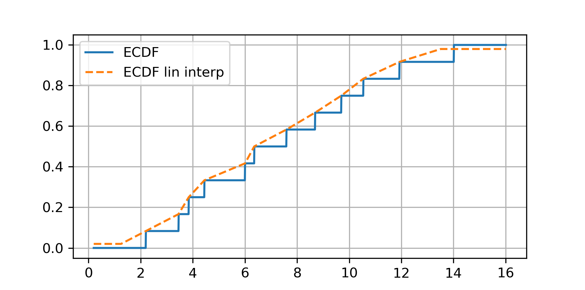
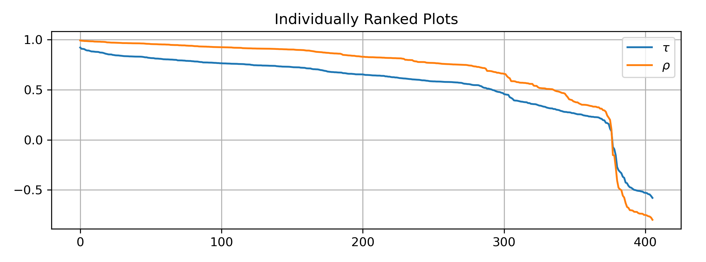
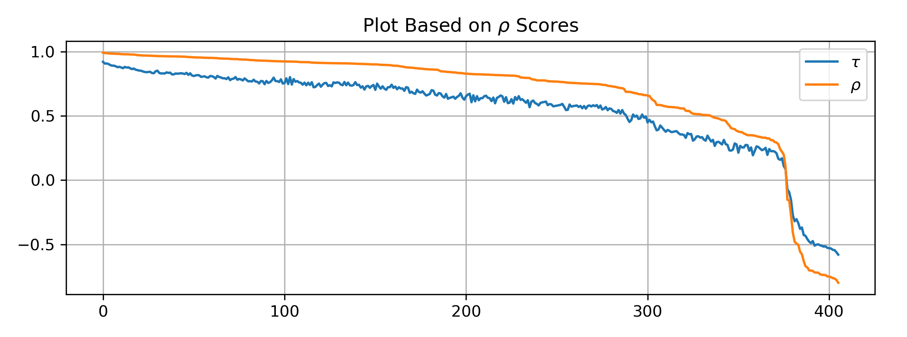
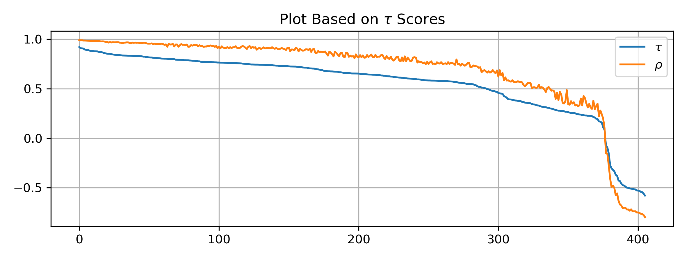
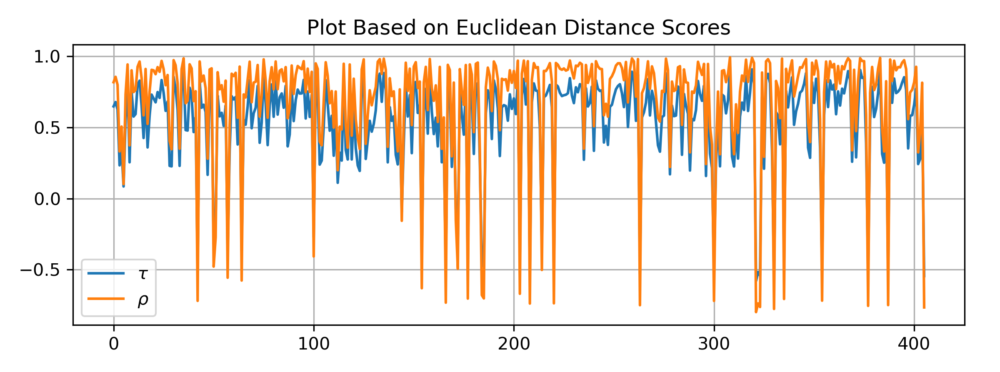
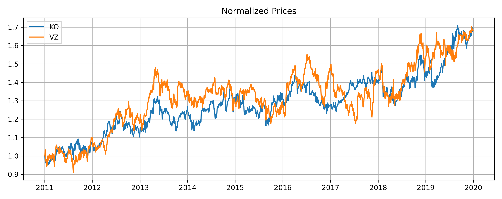
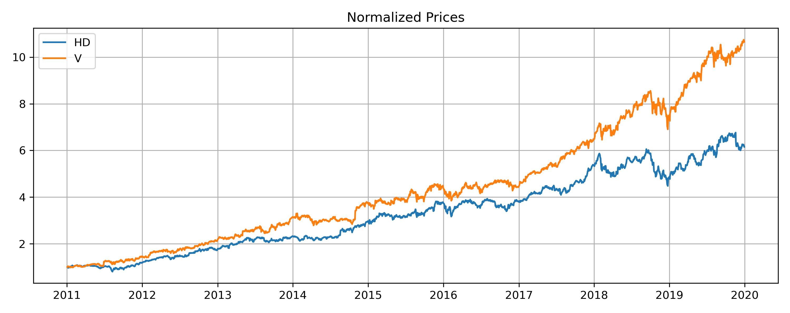
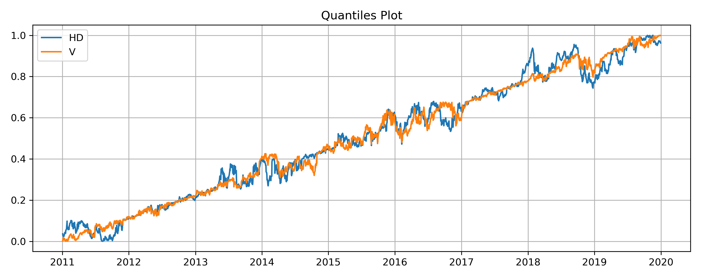

.. _copula_approach-utility_functions:

===============
Utility Modules
===============

We also included a few functionalities that are often used for copula-based trading strategies in the :code:`copula_approach`
module listed below:

1. Empirical cumulative distribution function (ECDF) with linear interpolation.

2. Quick pairs selection using Kendall's :math:`\tau`, Spearman's :math:`\rho` and Euclidean distance (for normalized prices).

ECDF
####

ECDF by its name, is a non-parametric estimation on a random variables cumulative distribution function.
CDF maps a datapoint to its quantile in :math:`[0, 1]`.
If a CDF is chosen correctly, the data after mapping should be distributed uniformly in :math:`[0, 1]`.

In literatures the ECDF is generally constructed from a dataset :math:`\mathbf{x} = (x_1, x_2, \dots x_n)` as

.. math::

    \hat{F^{-1}}(t) := \frac{1}{n} ||\{ x_i: x_i \le t \}||, \quad t \in \mathbb{R},

where :math:`|| \cdot ||` is the cardinality, or the number of elements in the set for a finite set.

This is implemented already in :func:`ECDF` from :code:`statsmodels.distributions.empirical_distribution`.

Comments
********

Note that the approach above is a **step function**.
Suppose we train an ECDF on some training data, for example :math:`\mathbf{x}_{train} = (0, 1, 3, 2, 4)`, then
:math:`\hat{F^{-1}}(0) = \hat{F^{-1}}(0.99) = 0.2`, and :math:`\hat{F^{-1}}(-0.01) = 0`.
This might cause issues if the data set is not large enough, and particularly troublesome where there is not enough datapoints
at certain regions of the distribution.
When working with copula-based strategies one essentially aims to capture relative mispricings, which is sparse in nature.
Moreover, the original ECDF may yield 0 and/or 1, which will be considered edge cases for some copula calculations and we 
generally want to avoid it by mapping :math:`[0, 1]` back to :math:`[\varepsilon, 1-\varepsilon]` for some small positive
number :math:`\varepsilon`.

.. Note::

    No, we are not being lazy here.
    Yes, we can technically adjust the calculations to allow infinities, but what if the infinity
    shows up when one uses a max likelihood fit?
    With real world data this happens more often than one might expect.

Therefore, we built our own ECDF to address the above concerns, and for all places in the module we use our own ECDF
constructed by :func:`copula_calculation.construct_ecdf_lin`.

    
    The plot of ECDF vs. our ecdf.
    The max on the training data is :math:`14`, the min is :math:`2.2`.
    We made the :math:`\varepsilon` for upper and lower bound much larger on our ecdf for visual effect. 

Implementation
**************

.. automodule:: arbitragelab.copula_approach.copula_calculation
        
    .. autofunction:: construct_ecdf_lin
    
Example
*******

.. code-block::

    # Importing libratries and data
    from arbitragelab.copula_approach.copula_calculation import construct_ecdf_lin
    import pandas as pd
    
    prices = pd.read_csv('FILE_PATH' + 'AAPL_MSFT_prices.csv').set_index('Date').dropna()
    
    # Training and testing split
    training_len = int(len(prices) * 0.7)
    prices_train = prices.iloc[:training_len, :]
    prices_test = prices.iloc[training_len:, :]
    
    # Construct ECDF on training set
    ecdf_aapl = construct_ecdf_lin(prices_train['AAPL'])
    
    # Apply the trained ECDF on testing set
    quantile_aapl = prices_test['AAPL'].map(ecdf_aapl)
    

Quick Pairs Selection
#####################

We build the class :class:`PairsSelector` that selects potential pairs for copula-based trading strategies. 
Methods include Spearman's rho, Kendall's tau and Euclidean distance on normalized prices.
Those methods are relatively quick to perform and are widely used in literature for copula-based pairs trading framework.
For more sophisticated ML-based pairs selection methods, please refer to :code:`arbitragelab.ml_approach`.

Comments
********

Kendall's tau and Spearman's rho are rank-based values.
Thus they are non-parametric.
Kendall's tau's computation complexity is :math:`O(N^2)` and Spearman's rho is :math:`O(N \log N)`.
The pairs selected by :math:`\tau` and :math:`\rho` generally do not differ much.
However, Kendall's tau is more stable, and suffers less from outliers.

Euclidean distance is also used commonly in literatures.
The pairs selected in general do not coincide with the pairs selected by :math:`\tau` and :math:`\rho`.
However, we found it not coping with copula-based strategies very well based on our backtests.

Pearson's correlation is not included here due to its parametric approach, and assumption on normality of the underlyings.

To illustrate their differences further, here we conduct a quick run on adjusted closing prices on Dow stocks from beginning of 
2011 to end of 2019:

    
    The plots are :math:`\tau` and :math:`\rho` scores individually for all available pairs.
    Value-wise, :math:`\tau` is smaller than :math:`\rho` in terms of absolute value.
    

    
    We plot :math:`\tau` and :math:`\rho` for all pairs, but the sequence is based on :math:`\rho`.

    
    We plot :math:`\tau` and :math:`\rho` for all pairs, but the sequence is based on :math:`\tau`.
    We can see that :math:`\rho` is a bit less stable, with slightly larger jumps.

    
    Now we plot :math:`\tau` and :math:`\rho` for all pairs, but the sequence is based on Euclidean distance.
    We can see that the Euclidean distance result do not agree with :math:`\tau` and :math:`\rho`,
    also :math:`\tau` is a bit more stable than :math:`\rho`.

Below are the top pairs normalized prices plot (cumulative return) selected by Euclidean distance and Kendall's tau respectively.
They clearly demonstrate what each method aims to capture.

It might make more sense to look at the quantile plot for the HD-V pair selected by Kendall's tau.

    
    
Implementation
**************

.. automodule:: arbitragelab.copula_approach.pairs_selection
        
    .. autoclass:: PairsSelector
	:members: rank_pairs
    
Example
*******

.. code-block::

    # Importing libratries and data
    from arbitragelab.copula_approach.pairs_selection import PairsSelector
    import pandas as pd
    
    stocks_universe = pd.read_csv('FILE_PATH' + 'SP500_2010_2018.csv').set_index('Date').dropna()
    
    # Training and testing split
    training_len = int(len(stocks_universe) * 0.7)
    prices_train = stocks_universe.iloc[:training_len, :]
    prices_test = stocks_universe.iloc[training_len:, :]
    
    # Rank pairs from training set
    PS = PairsSelector()
    scores_tau = PS.rank_pairs(prices_train, method='kendall tau', keep_num_pairs=1000)
    scores_rho = PS.rank_pairs(prices_train, method='spearman rho', keep_num_pairs=1000)
    scores_dis = PS.rank_pairs(prices_train, method='euc distance', keep_num_pairs=1000)

