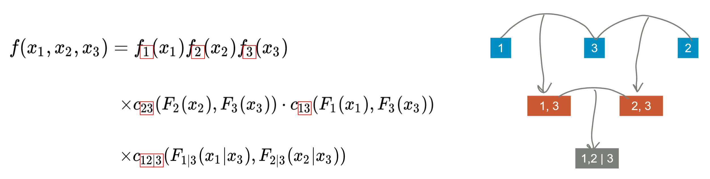
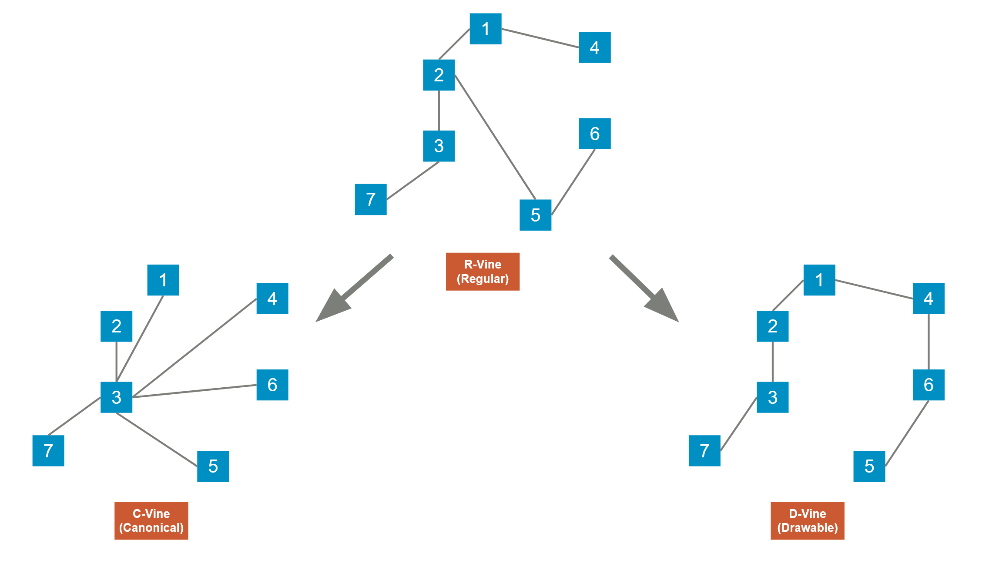
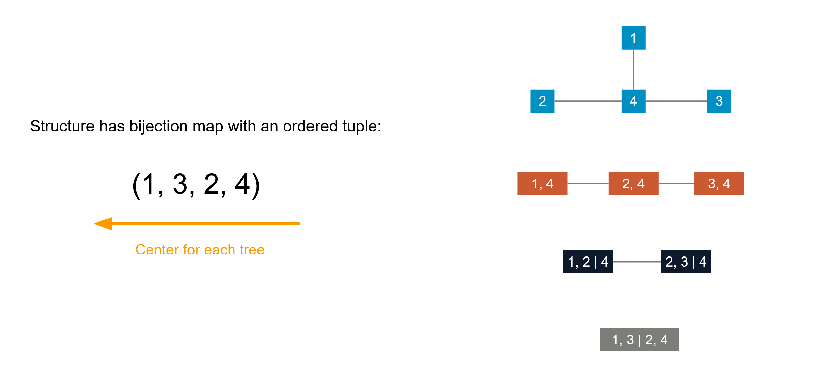
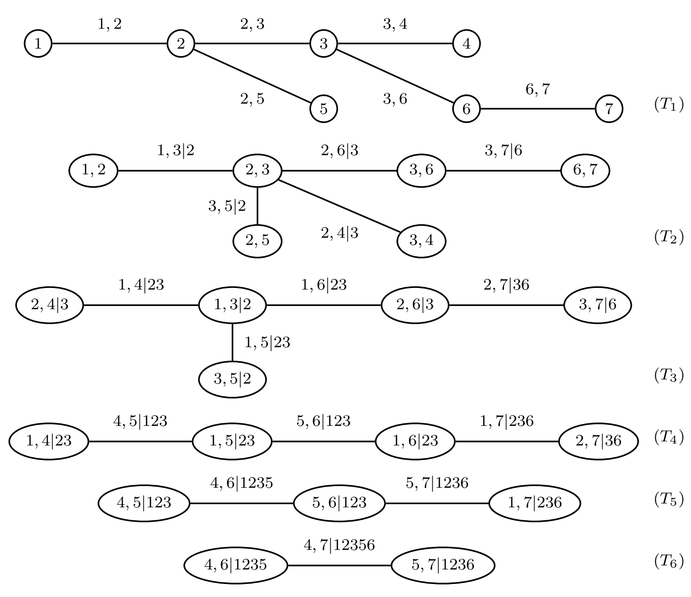
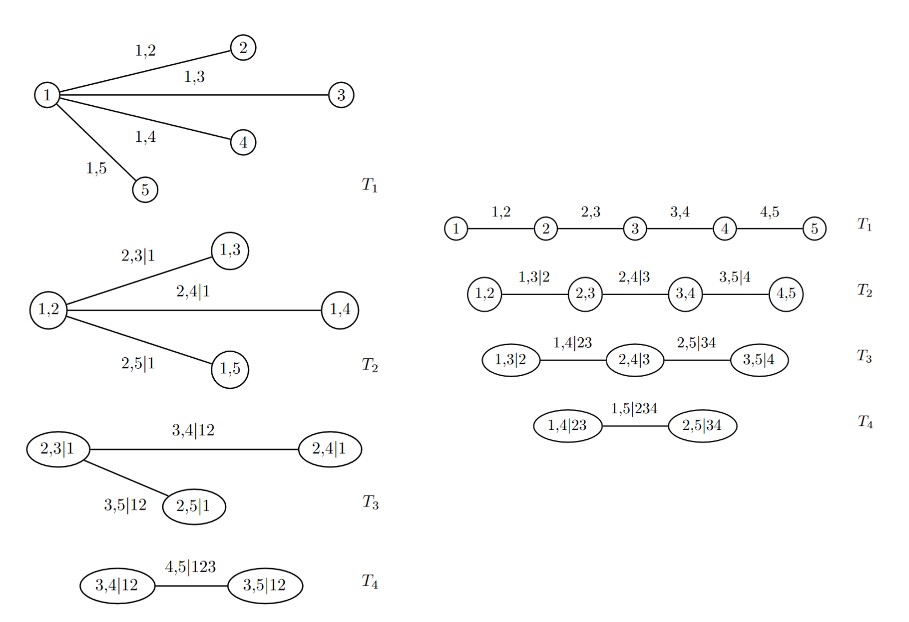

.. _copula_approach-vine_copula_intro:

.. Note::

    We only implemented the C-vine structure, since it is the only vine structure that has curated trading strategies to the best
    of our knowledge. For general R-vine, though one can still calculate conditional probabilities and generate signals, how
    the R-vine structure is determined becomes less interpretable.
    But this documentation is written as a general introduction that is not limited to C-vine, in the hope that the reader
    can achieve a more thorough picture on vine copula modeling.

=======================================
A Practical Introduction to Vine Copula
=======================================

.. raw:: html

    

        <iframe src="https://www.youtube.com/embed/FB6tNgCZSbo"
                frameborder="0"
                allowfullscreen
                style="position: absolute;
                       top: 0;
                       left: 0;
                       width: 100%;
                       height: 100%;">
        </iframe>
         
    

|

Copula is a great statistical tool to study the relation among multiple random variables: By focusing on the joint
cumulative density of quantiles of marginals, we can bypass the idiosyncratic features of marginal distributions and
directly look at how they are "related".
Indeed, traders and analysts have been using copula to exploit statistical arbitrage under the pairs trading framework
for some time, and we have implemented some of the most popular methods in :code:`ArbitrageLab`.
However, it is natural to expand beyond dealing with just a pair of stocks: There already exist a great amount of competing
stat arb methods alongside copula, thinning the potential alpha. It is also intuitive for human to think about relative
pricing among 2 stocks, where as for higher dimensions it is not so easy, and left great chances for quantitative approaches.

Copula itself is not limited to just 2 dimensions. You can expand it to arbitrarily large dimensions as you wish.
The disadvantage comes from the practicality side: originally when probabilists created copula, in order to do further analysis
theoretically they focus on a very small subset of copulas that have strict assumptions about their mathematical form.
In reality, when there are only 2 dimensions, under most cases you can still model a pair of random variables reasonably well
with the existing bivariate copulas. However when it goes to higher dimensions, the copula model becomes quite rigid and loses
a lot of details in the model.

Therefore, vine copula is invented exactly to address this high dimensional probabilistic modeling problem. Instead of using an
N-dimensional copula directly, it decomposes the probability density into conditional probabilities, and further decomposes
conditional probabilities into bivariate copulas. To sum up, 
**the idea is that we decompose the high dimensional pdf into bivariate copulas and marginal densities**.

Let's start with the conditional density.

Simple Examples
###############

Conditional Density and Bivariate Copula
****************************************

Suppose we have continuous random variables :math:`X_1, X_2` and their realizations :math:`x_1, x_2`.
They have CDFs respectively as :math:`F_1, F_2`, and PDFs respectively as :math:`f_1(x) = \frac{\partial F_1(x)}{\partial x}`,
:math:`f_2(x) = \frac{\partial F_2(x)}{\partial x}`. We can find their joint probability
density function from conditional probability:

.. math::

    \mathbb{P}(x_1, x_2) = \mathbb{P}(x_1 | x_2) \mathbb{P}(x_2) = \mathbb{P}(x_2 | x_1) \mathbb{P}(x_1)

Equivalently we can use :math:`f` to denote probability density as follows:

.. math::

    f(x_1, x_2) = f_{1|2} (x_1 | x_2) f_2(x_2) = f_{2|1} (x_2 | x_1) f_1(x_1)

Now we focus on :math:`f_{1|2} (x_1 | x_2)`. Notice that

.. math::
    
    f_{1|2}(x_1 | x_2) = \frac{f(x_1, x_2)}{f_2 (x_2)}
    
.. math::

    \begin{align}
    f(x_1, x_2) &= \frac{\partial^2 C_{1,2}(F_1(x_1), F_2(x_2))}{\partial x_1 \partial x_2}\\
    &= c_{1,2}(F_1(x_1), F_2(x_2)) f_1(x_1) f_2(x_2)
    \end{align}

Therefore we arrive at the key relation we will use over and over:

.. math::

    \begin{align}
    f_{1|2}(x_1 | x_2) &= \frac{f(x_1, x_2)}{f_2 (x_2)} \\
    &= c_{1,2}(F_1(x_1), F_2(x_2)) f_1(x_1)
    \end{align}
    
Trivially if we consider the probability subspace conditioned on some random variable :math:`X_3`:

.. math::

    \begin{align}
    f_{1|2}(x_1 | x_2, x_3) &= \frac{f(x_1, x_2 | x_3)}{f_{2|3} (x_2 | x_3)} \\
    &= c_{1,2|3}(F_{1|3}(x_1|x_3), F_{2|3}(x_2|x_3)) f_{1|3}(x_1|x_3)
    \end{align}

where :math:`F_{1|3} := \mathbb{P}(X_1 \le x_1 | X_3 = x_3)`, and :math:`c_{1,2|3}` is a bivariate copula density but
the two legs of random variables are conditioned on :math:`X_3=x_3` (i.e., think about :math:`X_3` as the background
information.)
Remember the goal is to decompose probability density into bivariate copula and marginal densities.
The example above is trivial in the sense that it has only 2 dimensions. 

3D Decomposition
****************

Now if we go to 3 dimension
for :math:`f(x_1, x_2, x_3)`, there are 6 ways to decompose using conditional probabilities:

.. math::

    \begin{align}
    f(x_1, x_2, x_3)
    &= f_{1|2,3}(x_1 | x_2, x_3) f_{2|3}(x_2 | x_3) f_3(x_3) \\
    &= f_{1|2,3}(x_1 | x_2, x_3) f_{3|2}(x_3 | x_2) f_2(x_2) \\
    &= f_{2|1,3}(x_2 | x_1, x_3) f_{1|3}(x_1 | x_3) f_1(x_1) \\
    &= f_{2|1,3}(x_2 | x_1, x_3) f_{3|1}(x_3 | x_1) f_3(x_3) \\
    &= f_{3|1,2}(x_3 | x_1, x_2) f_{1|2}(x_1 | x_2) f_1(x_1) \\
    &= f_{3|1,2}(x_3 | x_1, x_2) f_{2|1}(x_2 | x_1) f_2(x_2)
    \end{align}

We will not bore you with all the tedious expansions, and let's focus on the specific decomposition
:math:`f_{1|2,3}(x_1 | x_2, x_3) f_{2|3}(x_2 | x_3) f_3(x_3)` to write it in terms of bivariate copula and
marginal pdf:

.. math::

    f_{2|3}(x_2 | x_3) = c_{2,3}(F_2(x_2), F_3(x_3)) f_2(x_2)

.. math::
    
    f_{1|2,3}(x_1 | x_2, x_3) = c_{1,2|3}(F_{1|3}(x_1 | x_3), F_{2|3}(x_2 | x_3)) f_{1|3}(x_1 | x_3)

Here :math:`f_{1|3}(x_1 | x_3)` can be further decomposed as

.. math::

    f_{1|3}(x_1 | x_3) = c_{1,3}(F_1(x_1), F_3(x_3)) f_1(x_1)

Collect all the above together and clean it up we have the following nice structure

.. math::

    \begin{align}
    f(x_1, x_2, x_3) &=
    f_1(x_1) f_2(x_2) f_3(x_3) \\
    &\times c_{2,3}(F_2(x_2), F_3(x_3)) c_{1,3}(F_1(x_1), F_3(x_3)) \\
    &\times c_{1,2|3}(F_{1|3}(x_1 | x_3), F_{2|3}(x_2 | x_3))
    \end{align}

It turns out that this decomposition can be visualized in a graph structure as follows

    
    Fig 1: A vine copula tree structure for 3 random variables.

Here every node stands for either joint density or marginal density, and bivariate copulas are used to
connect the nodes. You can visualize them as trees and the leaves are on the top. All the leaves stand
for marginal density of each random variable. This relation stays true for an arbitrary amount of random
variables. Here we have 3 layers of the tree. This is vine copula itself.

Formal Definitions
##################

Vine Copula Types
*****************
Every vine copula has a Regular Vine structure (R-vine). And there are 2 specific subgenres of R-vine called
Canonical Vine and Drawable Vine. Those structure hold true for every layer of the tree.
They can be visualized as follows:

    
    Fig 2: R-vine, C-vine and D-vine.

For an R-vine, for each level of the tree, it needs to satisfy the following conditions:

    1. Each layer of the tree must have :math:`N-1` edges for :math:`N` nodes, and all the nodes in this layer must be
    connected (i.e., you can travel from any node to any other node via edges in finite steps).

    2. Proximity condition: Every edge will contribute to a joint density in the next layer. For example in Fig 1, at
    layer 1, node 1 and node 3 makes a (1,3) node in layer 2.

For a C-vine, it must be an R-vine at first, but for every layer of the tree there is a center component. This structure
makes it possible to represent the C-vine structure using an ordered tuple: reading backwards, each number represents
the centered component at each level of the tree.

For a D-vine, each tree is a *path*: there is one road that goes through all the nodes.

    
    Fig 3: C-vine and its tuple representation.

The representation of a generic R-vine is slightly more complicated, and requires a lower triangular matrix (some places
uses an upper triangular matrix for representation, and they are indeed identical).
Let's look at the following R-vine with 7 random variables for example:

    
    Fig 4: An R-vine tree. Picture from Dissmann, J., Brechmann, E.C., Czado, C. and Kurowicka, D., 2013. Selecting and
    estimating regular vine copulae and application to financial returns. Computational Statistics & Data Analysis, 59,
    pp.52-69.

The R-vine tree in Fig 4 can be represented by the following matrix:

.. math::
    M = 
    \begin{bmatrix}
    7 \\
    4 & 4 \\
    5 & 6 & 6 \\
    1 & 5 & 5 & 5 \\
    2 & 1 & 1 & 1 & 1 \\
    3 & 2 & 2 & 3 & 3 & 3 \\
    6 & 3 & 3 & 2 & 2 & 2 & 2
    \end{bmatrix}

The R-vine structure is mapped to the matrix as follows:

    1. Find a diagonal term :math:`a`. For example :math:`M_{2, 2} = 4`.
    
    2. Follow that column downwards and stop somewhere :math:`b`, say we stop at :math:`M_{4, 2} = 1`.
    
    3. The leftover terms below :math:`b` in that column are then conditions :math:`\{c_1, c_2, \cdots\}`. In this example
       we have :math:`\{2, 3\}` left.
    
    4. The node :math:`(a, b | c_1, c_2, \cdots)` is in the R-vine. In this example, :math:`(1, 4 | 2, 3)`
       is at :math:`(T_4)`.

Working from the top of the tree you can also map the matrix back to a full R-vine. (Left as an exercise to
the reader.)
Sometimes in literature you will see the same structure represented by the triangular matrix below:

.. math::

    M = 
    \begin{bmatrix}
    6 & 3 & 3 & 2 & 2 & 2 & 2 \\
    3 & 2 & 2 & 3 & 3 & 3 \\
    2 & 1 & 1 & 1 & 1 \\
    1 & 5 & 5 & 5 \\
    5 & 6 & 6 \\
    4 & 4 \\
    7
    \end{bmatrix}

Vine Copula Type Features
*************************

For :math:`n` many variables, it can be shown that there are :math:`n(n − 1)(n − 2)! 2^{(n − 2)(n − 3)/2}/2`
many ways to construct an R-vine, which is a very large number for large :math:`n`.
For application purposes, due to the sheer amount of possible R-vine structures it makes sense to further
impose some structures for model interpretability.

    
    Fig 5: C_vine and D-vine tree. Picture from Brechmann, E. and Schepsmeier, U., 2013. Cdvine:
    Modeling dependence with c-and d-vine copulas in r. Journal of statistical software, 52(3), pp.1-27.

C-vine and D-vine are the most commonly used ones in practice for dependence modeling.
C-vine due to its star-like structure, is useful when we have a key variable that largely governs the variable interactions
in the data. This is the case when we trade, say 3 stocks against 1 key stock, as described in [Stübinger et al., 2018].
D-vine may be more beneficial when we do not wish to have a key node that controls the dependencies.

Calculating Important Quantities
################################

For ease of demonstration, we assume the number of random variables :math:`N = 4`.

.. Note::
    No matter what specific R-vine structure we assume, we can always calculate the probability density
    :math:`f(x_1, \cdots, x_N)`. And therefore we can derive the conditional (cumulative) density and the
    overall cumulative density from the probability density by integrations.

Probability Density
*******************

The probability density :math:`f(x_1, x_2, x_3, x_4)` can be directly derived from the vine copula
structure by walking through the tree, since all the bivariate copulae and the marginal densities are known.
This quantity is the building block for other important quantities.

Also, the density calculated often is in regard to the variables' quantiles (pseudo-observations) and it is
denoted as 

.. math::

    f(u_1, u_2, u_3, u_4)
    
This is okay since when we fit the vine copulas in practice, we were using pseudo-observations, and therefore the marginals
are all uniform in :math:`[0, 1]` anyway.

Conditional Probability
***********************

This quantity needs to be calculated numerically by integrating the target variable:

.. math::
    
    \begin{align}
        h(u_1 | u_2, u_3, u_4)
        &=  \mathbb{P}(U_1 \le u_1 | U_2=u_2, U_3=u_3, U_4=u_4) \\
        &= \left( \int_0^{u_1} f(u, u_2, u_3, u_4) du \right) / \left( \int_0^{1} f(u, u_2, u_3, u_4) du \right)
    \end{align}

This quantity is key for trading, since it indicates whether a stock is overpriced or underpriced historically,
compared to other stocks in this cohort. In "traditional" copula models, this quantity is computed from top down,
taking partial differentiation from cumulative densities. Here it is computed from bottom up, taking numerical
integration from the probability density.

Cumulative Density
******************

When dealing with "traditional" copula models, this is from the definition, and is thus usually the easiest one to be computed.
In vine copula models this is the hardest one in contrast, because vine copula starts from probability densities, not from
cumulative densities. Hence this quantity needs to be numerically integrated across the hypercube :math:`[0, 1]^4`. Often people
use Monte-Carlo integration for this computation. This quantity is not used as often in trading applications.

Sample and Fitting
******************

Those are very interesting topics but are beyond our scope here. Interested readers can refer to [Dißmann et al. 2012] for more
details. This is an active research field and involves a lot of heavy lifting. Luckily, a lot of great algorithms are already nicely
blackboxed, handled automatically by software. Specifically, sample generation is a pretty much solved problem, whereas determine
the best R-vine structure given data and determine all copula types and parameters are still under discussion, but some algorithms are available.
Thus, sampling is very fast, and fitting can be slow.

.. Note::
    
    1. When working with copula models, whether it is a "traditional" copula model or vine copula, we always fit the
    pseudo-observations, i.e., quantiles data, instead of the real data.
    
    2. For fitting a vine copula, we need to determine the best tree structure that reflects the data, along with specifying
    the type of bivariate copulas and their parameters. The amount of calculation is huge.

For data specific evaluations, we can always calculate the log-likelihood, and consequently AIC, BIC, and compare those results.

Comments
########

Vine copula grants great flexibility in dependence modeling among multiple random variables. Specifically for trading, it provides
one way to capture higher dimensional statistical arbitrage, which are harder to come up with by non-quant traders. It also has
other applications especially in risk management. Once one can wrap the head around the concepts, vine copula is a model with great
interpretability.

Implementation
##############

.. automodule:: arbitragelab.copula_approach.vinecop_generate
        
    .. autoclass:: CVineCop
        :members: __init__, fit_auto, get_condi_probs, get_cop_densities, get_cop_evals, simulate, aic, bic, loglik

Example
#######

.. code-block::

    # Importing the module and other libraries
    import pandas as pd
    import numpy as np

    from arbitragelab.copula_approach.vinecop_generate import CVineCop
    from arbitragelab.copula_approach.copula_calculation import to_quantile

    # Loading stocks data
    sp500_returns = pd.read_csv('all_sp500_returns.csv', index_col='Dates', parse_dates=True)
    subsample_returns = sp500_returns[['AAPL', 'MSFT', 'AMZN', 'FB']]
    subsample_rts_quantiles, _ = to_quantile(subsample_returns)
    quantiles_example = pd.DataFrame([[0.1, 0.2, 0.3, 0.8],
                                      [0.5, 0.1, 0.9, 0.2]])
   
    # Instantiate a CVineCop class
    cvinecop = CVineCop()
   
    # Fit C-vine automatically, assuming AAPL is the target stock
    # Note that pv_target_idx is indexed from 1
    cvinecop.fit_auto(data=subsample_rts_quantiles, pv_target_idx=1, if_renew=True)
   
    # Calculate probability densities
    prob_densities = cvinecop.get_cop_densities(u=quantiles_example)
   
    # Calculate conditional (cumulative) densities, assuming AAPL is the target stock
    condi_probs = cvinecop.get_condi_probs(u=quantiles_example, pv_target_idx=1)
   
    # Calculate cumulative density (copula evaluation by definition)
    cop_evals = cvinecop.get_cop_evals(u=quantiles_example)
   
    # Simulate n=1000 samples
    samples_df = cvinecop.simulate(n=1000)
   
    # Calculate AIC, BIC and Log-Likelihood
    aic = cvinecop.aic(u=subsample_rts_quantiles)
    bic = cvinecop.bic(u=subsample_rts_quantiles)
    loglik = cvinecop.loglik(u=subsample_rts_quantiles)
   
Research Notebooks
##################

The following research notebook can be used to better understand the vine copula approach.

* `C-Vine Copula Strategy`_

.. _`C-Vine Copula Strategy`: https://hudsonthames.org/notebooks/arblab/CVine_Copula_Strategy.html

.. raw:: html

    <a href="https://hudsonthames.org/notebooks_zip/arblab/CVine_Copula_Strategy.zip"><button style="margin: 20px; margin-top: 0px">Download Notebook</button></a>
    <a href="https://hudsonthames.org/notebooks_zip/arblab/Sample-Data.zip"><button style="margin: 20px; margin-top: 0px">Download Sample Data</button></a>

Presentation Slides
###################

.. raw:: html

    

        <iframe src="https://docs.google.com/presentation/d/e/2PACX-1vRAQXxFYdceY5B9sUmsLLrNKt1VOMChE-McmPz0-1APa3EJ0fvoO4ulXYCAageW-yB66uDhOz89fNKA/embed?start=false&loop=false&delayms=3000"
                frameborder="0"
                allowfullscreen
                style="position: absolute;
                       top: 0;
                       left: 0;
                       width: 100%;
                       height: 100%;">
        </iframe>
    

|

References
##########

* `Stübinger, J., Mangold, B. and Krauss, C., 2018. Statistical arbitrage with vine copulas. Quantitative Finance, 18(11), pp.1831-1849. <https://www.tandfonline.com/doi/pdf/10.1080/14697688.2018.1438642?casa_token=olPBPI2bc3IAAAAA:8QViZfM9C0pbxGrarr-BU-yO2Or_wkCF_Pvk4dJFppjNtFzWjfM7W14_oc_ztl_1csHe4gFfloEWyA>`__
* `Joe, H. and Kurowicka, D. eds., 2011. Dependence modeling: vine copula handbook. World Scientific. <https://www.worldscientific.com/worldscibooks/10.1142/7699>`__
* `Yu, R., Yang, R., Zhang, C., Špoljar, M., Kuczyńska-Kippen, N. and Sang, G., 2020. A Vine Copula-Based Modeling for Identification of Multivariate Water Pollution Risk in an Interconnected River System Network. Water, 12(10), p.2741. <https://www.mdpi.com/2073-4441/12/10/2741/pdf>`__
* `Dissmann, J., Brechmann, E.C., Czado, C. and Kurowicka, D., 2013. Selecting and estimating regular vine copulae and application to financial returns. Computational Statistics & Data Analysis, 59, pp.52-69. <https://arxiv.org/pdf/1202.2002>`__
