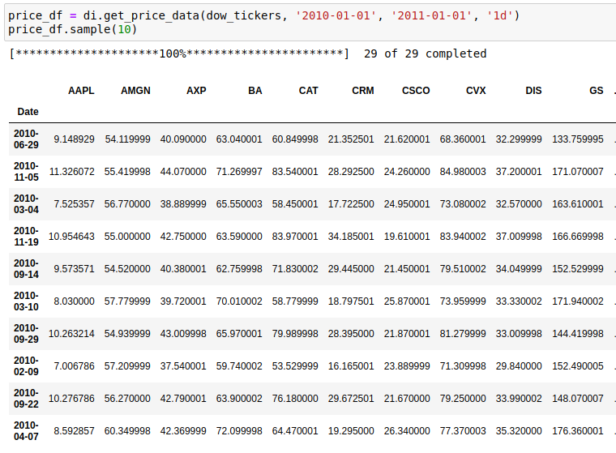
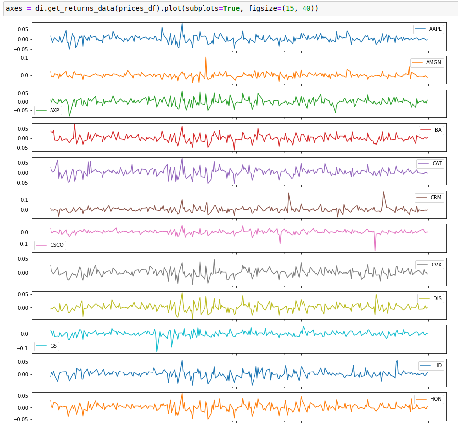

.. _utils-data_importer:

=============
Data Importer
=============

This module features helpers to fetch pricing data commonly used by the quant community to benchmark algorithms on data that comes from the ‘real world’.

Asset Universes
###############

Get ticker collections of a specific asset universe.

.. figure:: images/ticker_collection.png
    :align: center

    Example showing the pulling of all of the DOW component tickers.

.. automodule:: arbitragelab.util

.. autoclass:: DataImporter
   :members: __init__

.. automethod:: DataImporter.get_sp500_tickers
.. automethod:: DataImporter.get_dow_tickers

Price/Fundamental Data Fetcher
##############################

Pull data about a specific symbol/symbol list using the yfinance library.

    
    Example showing the requested asset prices.

.. automethod:: DataImporter.get_price_data
.. automethod:: DataImporter.get_ticker_sector_info

Pre/Post Processing Pricing Data
################################

After pulling/loading the pricing data, it has to be processed before being used in models.

    
    Example showing plotted returns.
    

.. automethod:: DataImporter.get_returns_data
.. automethod:: DataImporter.remove_nuns
