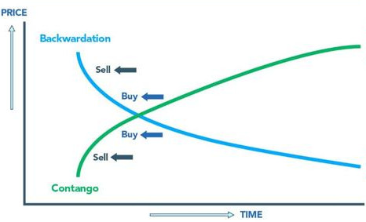
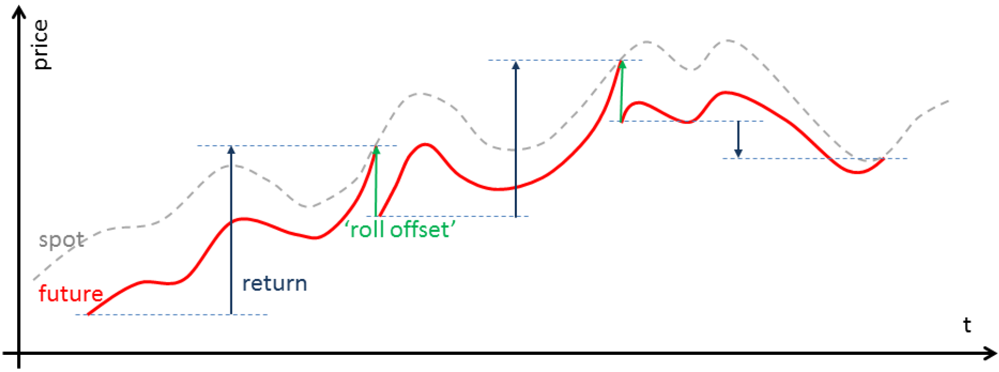

.. _data-futures_rollover:

================
Futures Rollover
================

Introduction to Futures
#######################

Futures are a form of a contract drawn up between two parties to purchase or sell a quantity of
an underlying asset at a specified date in the future. This date is known as the delivery or
expiration. When this date is reached, the buyer must deliver the physical underlying (or cash
equivalent) to the seller for the price agreed at the contract formation date.

In practice, futures are traded on exchanges for standardised quantities and qualities of the
underlying. The prices are marked to market every day. Futures are incredibly liquid and are
used heavily for speculative purposes. While futures were often utilised to hedge agricultural
or industrial goods' prices, a futures contract can be formed on any tangible or
intangible underlying such as stock indices, interest rates of foreign exchange values.

The main difference between a futures contract and equity ownership is the fact that a
futures contract has a limited window of availability by virtue of the expiration date.
At any one instant, there will be a variety of futures contracts on the same underlying
all with varying dates of expiry. The contract with the nearest date of expiry is known
as the near contract. 

Some basics about Futures trading
*********************************

    
    Contango vs Backwardation.

- For our purposes, we will refer to front and back contracts, where the front contract is the
  first Futures due for expiry, while the back contract matures later by a particular frequency
  (often one or three months after the front contract).

- In the context of comparing the prices between two subsequent Futures, a higher price in the back
  contract is referred to as contango, while we speak of backwardation in case of the opposite price relationship.

- Tick size refers to the smallest possible price movement, and the tick value is the loss or gain incurred
  by that movement.

So first of all, we have to ask, why there is a difference in the price in subsequent Futures contracts at all? 

One way to gain an understanding of this is to follow the close link between the
Futures contract and underlying, and at the same time acknowledge that, — given
an arbitrage free world — a holding, whether in the underlying or the Futures,
will yield exactly in the same payoffs for the investor. 

So more precisely, **the cost of holding the underlying** until the next respective
expiration date, determines the gap between two contracts. Depending on the market,
those influence factors can be repo rates, dividends, storage costs, etc.

The main difficulty with trying to generate a continuous contract from the underlying
contracts with varying deliveries is that the contracts do not often trade at the same
prices. Thus situations arise where they do not provide a smooth splice from one to the
next. This is due to contango and backwardation effects. There are various approaches
to tackling this problem, which we now discuss.

Forming a Continuous Futures Contract
#####################################

    
    Visual intuition of rolling procedure.

Unfortunately, there is no single "standard" method for joining futures contracts together
in the financial industry. Ultimately the method chosen will depend heavily upon the strategy
employing the contracts and the method of execution. Despite the fact that no single method
exists there are some common approaches:

Splicing contracts together with no adjustments
***********************************************

This is typically done already by market data providers like Bloomberg. We will (possibly) end up in
a price jump on the day when contracts are switched. In case trading signals 
are extracted from those series, we rely on a mix of inputs from both contracts 
potentially yielding a biased result as the price jump is inherited in the calculations.
We also receive a distorted picture with regards to backtesting the PnL of any strategy 
relying on such a time series.

Splicing contracts together with forward or backward adjustments ("Panama Adjustment")
**************************************************************************************

This method alleviates the "gap" across multiple contracts by shifting each contract such
that the individual deliveries join in a smooth manner to the adjacent contracts. Thus the
open/close across the prior contracts at expiry matches up.

The Panama method's key problem includes the introduction of a trend bias, which will
introduce a large drift to the prices. This can lead to negative data for sufficiently
historical contracts. In addition, there is a loss of the relative price differences due to
an absolute shift in values. This means that returns are complicated to calculate (or just
plain incorrect).

Proportional Adjustment
***********************

The Proportionality Adjustment approach is similar to the adjustment methodology of handling
stock splits in equities. Rather than taking an absolute shift in the successive contracts,
the ratio of the older settle (close) price to the newer open price is used to proportionally
adjust the prices of historical contracts. This allows a continuous stream without an
interruption of the calculation of percentage returns.

The main issue with the proportional adjustment is that any trading strategies reliant on an
absolute price level will also have to be similarly adjusted in order to execute the correct
signal. This is a problematic and error-prone process. Thus this type of continuous stream is
often only useful for summary statistical analysis, as opposed to direct backtesting research.

Continuously adjusting the contracts over time ("Perpetual Method")
*******************************************************************

The essence of this approach is to create a continuous contract of successive contracts by
taking a linearly weighted proportion of each contract over a number of days to ensure a
smoother transition between each. The problem with the rollover method is that it requires
trading on all five days, which can increase transaction costs.

Implementation
**************
.. py:currentmodule:: arbitragelab.util.base_futures_roller

.. autoclass:: BaseFuturesRoller
    :noindex:
    :members: __init__, fit, diagnostic_summary, transform
    
References
##########

- `Masteika, S., Rutkauskas, A.V. and Alexander, J.A., 2012, February. Continuous futures data series for back testing and technical analysis. In Conference proceedings, 3rd international conference on financial theory and engineering (Vol. 29, pp. 265-269). IACSIT Press. <http://www.ipedr.com/vol29/48-CEBMM2012-R00003.pdf>`__
- `Seykota, Ed 2003, Continuous Contracts, <https://www.seykota.com/tribe/TSP/Continuous/index.htm>`_
