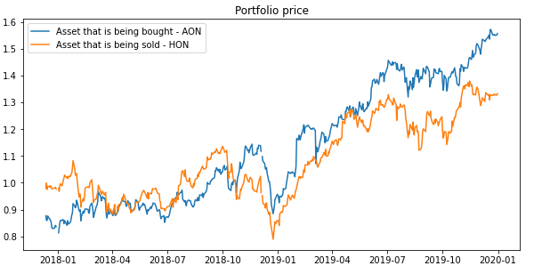
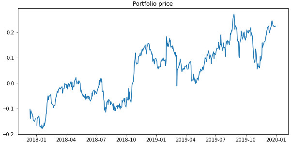
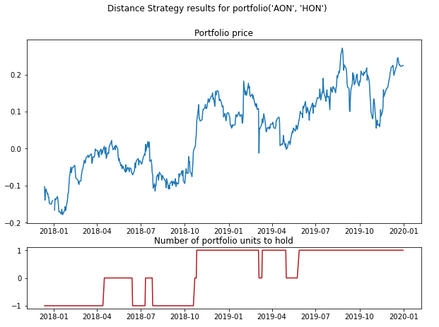

.. _distance_approach-distance_approach:

.. note::
   The following documentation closely follows a paper by Gatev et al. (2006):
   `Pairs trading: Performance of a relative-value arbitrage rule <https://papers.ssrn.com/sol3/papers.cfm?abstract_id=141615>`_.

   As well as a paper by Christopher Krauss (2015):
   `Statistical arbitrage pairs trading strategies: Review and outlook <https://www.econstor.eu/bitstream/10419/116783/1/833997289.pdf>`_.

=================
Distance Approach
=================

.. raw:: html

    

        <iframe src="https://www.youtube.com/embed/sKgDeqI39b4"
                frameborder="0"
                allowfullscreen
                style="position: absolute;
                       top: 0;
                       left: 0;
                       width: 100%;
                       height: 100%;">
        </iframe>
    

The distance approach was introduced in the paper by Gatev et al. (2006), and it is one of the most cited
pairs trading papers at the time of writing this documentation. The approach described in the paper is
the following: First, a historical period is defined, cumulative returns for assets in this period are
normalized. Second, using the Euclidean squared distance on the normalized price time series, :math:`n`
closest pairs of assets are picked. In the original work, the historical period used to quantify distances
between price series was set to 12 months, and 20 top pairs were chosen.

So no cointegration tests (as opposed to the mean reversion approach) are being performed in the distance
approach. As spotted in the work by Krauss (2015), dependencies found using this approach can be spurious.
This also leads to higher divergence risks, and as shown in the work by Do and Faff (2010), up to 32% of
pairs identified by this method are not converging.

After the pairs are formed, the trading period starts, and the trading signals are generated. The mechanism
behind this process if the following: If the difference between the price of elements in a pair diverged by
more than 2 standard deviations (calculated for each pair during the training period), the positions are
opened - long for the element with a lower price in a portfolio and short for an element with a
higher price in a portfolio. These positions are closed when the normalized prices cross or when the
trading period ends. Using this standard description, the distance approach is a parameter-free strategy.

There are, however, possible adjustments to this strategy, like choosing distances other from the
Euclidean square distance, adjusting the threshold to enter a trade for each pair, etc.

Pairs Formation
###############

This stage of the DistanceStrategy consists of the following steps:

1. **Normalization of the input data.**

To use the Euclidean square distance, the training price time series are being normalized using the following
formula:

.. math::

    P_{normalized} = \frac{P - min(P)}{max(P) - min(P)}

where :math:`P` is the training price series of an asset, :math:`min(P)` and :math:`max(P)` are the minimum
and maximum values from the price series.

2. **Finding pairs.**

Using the normalized price series, the distances between each pair of assets are calculated. These
distances are then sorted in the ascending order and the :math:`n` closest pairs are picked (our
function also allows skipping a number of first pairs, so one can choose pairs 10-15 to study).

The distances between elements (Euclidean square distance - SSD) are calculated as:

.. math::

    SSD = \sum^{N}_{t=1} (P^1_t - P^2_t)^{2}

where :math:`P^1_t` and :math:`P^2_t` are normalized prices at time :math:`t` for the first and
the second elements in a pair.

Using the prices of elements in a pair a portfolio is being constructed - the difference between
their normalized prices.

3. **Calculating historical volatility.**

For :math:`n` portfolios (differences between normalized price series of elements) calculated in the
previous step, their volatility is being calculated. Historical standard deviations of these portfolios
will later be used to generate trading signals.\

    An example of two normalized price series of assets that have low Euclidean square distance.
    These assets can be used to construct a portfolio.

    Portfolio value (difference of normalized price series), constructed from a pair of elements
    from the previous example.

Pair selection criteria
#######################

As basic pairs formation confirms declining profitability in pairs trading, some other refined pair
selection criteria have emerged. Here, we describe three different methods from the basic approach in
selecting pairs for trading.

First is only allowing for matching securities within the same industry group . The second is sorting
selected pairs based on the number of zero-crossings in the formation period and the third is sorting
selected pairs based on the historical standard deviation where pairs with high standard deviation are selected.
These selection methods are inspired by the work by Do and Faff (2010, 2012).

1. **Pairs within the same industry group**

In the pairs formation step above, one can add this method when finding pairs in order to match securities
within the same industry group.

With a dictionary containing the name/ticker of the securities and each corresponding industry group,
the securities are first separated into different industry groups. Then, by calculating the Euclidean
square distance for each of the pair within the same group, the :math:`n` closest pairs are selected(in default,
our function also allows skipping a number of first pairs, so one can choose pairs 10-15 to study). This pair
selection criterion can be used as default before adding other methods such as zero-crossings or variance if one
gives a dictionary of industry group as an input.

2. **Pairs with a higher number of zero-crossings**

The number of zero crossings in the formation period has a positive relation to the future spread
convergence according to the work by Do and Faff (2010).

After pairs were matched either within the same industry group or every industry, the top :math:`n` pairs
that had the highest number of zero crossings during the formation period are admitted to the
portfolio we select. This method incorporates the time-series dimension of the historical data in the
form of the number of zero crossings.

3. **Pairs with a higher historical standard deviation**

The historical standard deviation calculated in the formation period can also be a criterion to sort
selected pairs. According to the work of Do and Faff(2010), as having a small SSD decreases the variance
of the spread, this approach could increase the expected profitability of the method.

After pairs were matched, we can sort them based on their historical standard deviation in the formation period
to select top :math:`n` pairs with the highest variance of the spread.

Implementation
**************

.. automodule:: arbitragelab.distance_approach.basic_distance_approach

.. autoclass:: DistanceStrategy
   :members: __init__

.. automethod:: DistanceStrategy.form_pairs

Trading signals generation
##########################

After pairs were formed, we can proceed to the second stage of the DistanceStrategy - trading
signals generation. The input to this stage is a dataframe with testing price series for assets - not
used in the pairs formation stage.

This stage of the DistanceStrategy consists of the following steps:

1. **Normalization of the input data.**

Using the same approach as in the pairs formation stage, we normalize the input trading dataset using
the same maximum and minimum historical values from the training price series.

2. **Portfolios creation.**

In this step, the portfolios are being constructed based on the asset pairs chosen in the pairs
formation step. Portfolio values series are differences between normalized price series of elements
in a pair - as we're opening a long position for the first element in a pair and a short position for
the second element in a pair. A buy signal generated by the strategy means going long on the first
element and short on the second. A sell signal means the opposite - going short on the first element
and long on the second element.

3. **Generating signals.**

If the portfolio value exceeds two historical deviations, a sell signal is generated - we expect
the price of the first element to decrease and the price of the second element to increase. And if
the value of the portfolio is below minus two historical deviations, a buy signal is generated.

An open position is closed when the portfolio value crosses the zero mark - or when the prices of
elements in a pair cross. So at any given time, we have one (buy or sell) or none active positions
opened. This makes cost allocation for the strategy easier. Resulting trading signals are target
quantities of portfolios to hold for each pair (with values -1, 0, or +1).

    Portfolio value for a pair of assets and the corresponding target quantities to hold for
    each observation.

Implementation
**************

.. automethod:: DistanceStrategy.trade_pairs

Results output and plotting
###########################

The DistanceStrategy class contains multiple methods to get results in the desired form.

Functions that can be used to get data:

- **get_signals()** outputs generated trading signals for each pair.

- **get_portfolios()** outputs values series of each pair portfolios.

- **get_scaling_parameters()** outputs scaling parameters from the training dataset used to normalize data.

- **get_pairs()** outputs a list of tuples, containing chosen top pairs in the pairs formation step.

- **get_num_crossing()** outputs a list of tuples, containing chosen top pairs with its number of zero-crossings.

Functions that can be used to plot data:

- **plot_pair()** plots normalized price series for elements in a given pair and the corresponding
  trading signals for portfolio of these elements.

- **plot_portfolio()** plots portfolio value for a given pair and the corresponding trading signals.

Implementation
**************

.. automethod:: DistanceStrategy.get_signals

.. automethod:: DistanceStrategy.get_portfolios

.. automethod:: DistanceStrategy.get_scaling_parameters

.. automethod:: DistanceStrategy.get_pairs

.. automethod:: DistanceStrategy.get_num_crossing

.. automethod:: DistanceStrategy.plot_pair

.. automethod:: DistanceStrategy.plot_portfolio

Examples
########

Code Example
************

.. code-block::

   # Importing packages
   import pandas as pd
   from arbitragelab.distance_approach.basic_distance_approach import DistanceStrategy

   # Getting the dataframe with price time series for a set of assets
   data = pd.read_csv('X_FILE_PATH.csv', index_col=0, parse_dates = [0])

   # Dividing the dataset into two parts - the first one for pairs formation
   data_pairs_formation = data.loc[:'2019-01-01']

   # And the second one for signals generation
   data_signals_generation = data.loc['2019-01-01':]

   # Performing the pairs formation stage of the DistanceStrategy
   # Choosing pairs 5-25 from top pairs to construct portfolios
   strategy = DistanceStrategy()
   strategy.form_pairs(data_pairs_formation, num_top=20, skip_top=5)

   # Adding an industry-based selection criterion to The DistanceStrategy
   strategy_industry = DistanceStrategy()
   strategy_industry.form_pairs(data_pairs_formation, industry_dict=industry_dict,
                                num_top=20, skip_top=5)

   # Using the number of zero-crossing for pair selection after industry-based selection
   strategy_zero_crossing = DistanceStrategy()
   strategy_zero_crossing.form_pairs(data_pairs_formation, method='zero_crossing',
                                     industry_dict=industry_dict, num_top=20, skip_top=5)

   # Checking a list of pairs that were created
   pairs = strategy.get_pairs()

   # Checking a list of pairs with the number of zero crossings
   num_crossing = strategy.get_num_crossing()

   # Now generating signals for formed pairs, using (2 * st. variation) as a threshold
   # to enter a position
   strategy.trade_pairs(data_signals_generation, divergence=2)

   # Checking portfolio values for pairs and generated trading signals
   portfolios = strategy.get_portfolios()
   signals = strategy.get_signals()

   # Plotting price series for elements in the second pair (counting from zero)
   # and corresponding trading signals for the pair portfolio
   figure = strategy.plot_pair(1)

Research Notebooks
******************

The following research notebook can be used to better understand the distance approach described above.

* `Basic Distance Approach`_

* `Basic Distance Approach Comparison`_

.. _`Basic Distance Approach`: https://github.com/Hudson-and-Thames-Clients/arbitrage_research/blob/master/Distance%20Approach/basic_distance_approach.ipynb

.. _`Basic Distance Approach Comparison`: https://github.com/Hudson-and-Thames-Clients/arbitrage_research/blob/master/Distance%20Approach/basic_distance_approach_comparison.ipynb

References
##########

* `Do, B. and Faff, R., 2010. Does simple pairs trading still work?. Financial Analysts Journal, 66(4), pp.83-95. <https://www.jstor.org/stable/pdf/25741293.pdf?casa_token=nIfIcPq13NAAAAAA:Nfrg__C0Q1lcvoBi6Z8DwC_-6pA_cHDdLxxINYg7BPvuq-R5nNzbhVWra2PBL7t2hntj_WBxGH_vCezpp-ZN7NKYhKuZMoX97A7im7PREt7oh2mAew>`_
* `Do, B., and Faff, R. (2012). Are pairs trading profits robust to trading costs? Journal of Financial Research, 35(2):261–287. <https://papers.ssrn.com/sol3/papers.cfm?abstract_id=1707125>`_
* `Gatev, E., Goetzmann, W.N. and Rouwenhorst, K.G., 2006. Pairs trading: Performance of a relative-value arbitrage rule. The Review of Financial Studies, 19(3), pp.797-827. <https://www.nber.org/system/files/working_papers/w7032/w7032.pdf>`_
* `Krauss, C., 2017. Statistical arbitrage pairs trading strategies: Review and outlook. Journal of Economic Surveys, 31(2), pp.513-545. <https://www.econstor.eu/bitstream/10419/116783/1/833997289.pdf>`_
