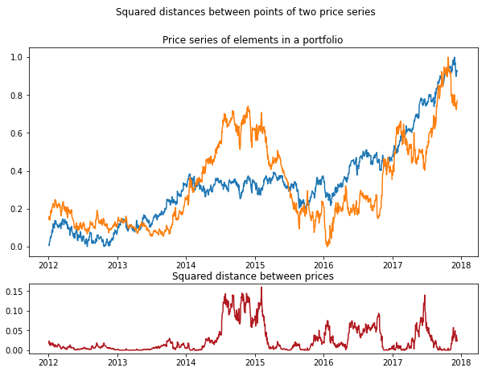

.. _distance_approach-introduction:

============
Introduction
============

Distance Approach
#################

This approach is based on picking two financial instruments whose price series moved together over a
set historical period. Then, during a testing period, if the difference (spread) in their prices is
surpassing a set threshold, we enter a long position for the asset with a lower price and a short
position for an asset with a higher price.

    An example showing square distances between points of two price series. The sum of these distances
    (or Sum of Square Differences) is used to determine pairs of assets that moved together in the
    original approach described by Gatev et al. (2006) in
    `Pairs trading: Performance of a relative-value arbitrage rule <https://papers.ssrn.com/sol3/papers.cfm?abstract_id=141615>`__.

Following this approach, we expect that after diverging, prices of chosen instruments will revert back
to levels previously observed. Our position can be closed once the prices of the instruments cross.

This approach can also be expanded to trading one element against a weighted portfolio of co-moving
elements (a quasi-multivariate framework) or trading one portfolio against the other portfolio
(a fully multivariate framework).

Each strategy that follows this approach can be split into two steps. In the first one, the historical
period is defined and the distance measures are used to identify the co-moving assets to form pairs.
In the second step, the threshold rules are defined and trading signals are generated for a testing
dataset.
