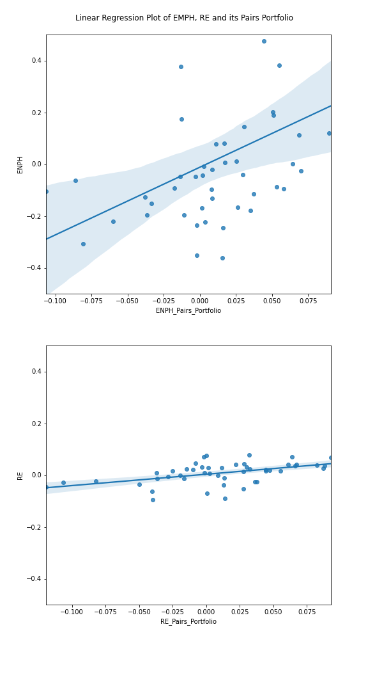

.. _distance_approach-pearson_approach:

.. note::
   The following documentation closely follows a paper by Chen et al. (2012):
   `Empirical investigation of an equity pairs trading strategy <http://www.pbcsf.tsinghua.edu.cn/research/chenzhuo/paper/Empirical%20Investigation%20of%20an%20Equity%20Pairs%20Trading%20Strategy.pdf>`_.

   As well as a paper by Perlin, M. S. (2009):
   `Evaluation of pairs-trading strategy at the Brazilian financial market <https://link.springer.com/article/10.1057/jdhf.2009.4>`_.

   And also a paper by Christopher Krauss (2015):
   `Statistical arbitrage pairs trading strategies: Review and outlook <https://www.econstor.eu/bitstream/10419/116783/1/833997289.pdf>`_.

================
Pearson Approach
================

After the distance approach was introduced in the paper by Gatev et al. (2006), a lot of research has been
conducted to further develop the original distance approach. One of the adjustments is the Pearson correlation
approach proposed by Chen et al.(2012). In this paper, the authors use the same data set and time frame as
in the work by Gatev et al.(2006) but they used Pearson correlation on return level for forming pairs.
In the formation period(5 years in the paper), pairwise return correlations for all pairs in the universe
are calculated based on monthly return data. Then the authors construct a new variable, Return Divergence
(:math:`D_{i j t}`), to capture the return divergence between a single stock’s return and its pairs-portfolio returns:

.. math::

    D_{i j t}=\beta\left(R_{i t}-R_{f}\right)-\left(R_{j t}-R_{f}\right)

where :math:`\beta` denotes the regression coefficient of stock's monthly return :math:`R_{i t}` on its
pairs-portfolio return :math:`R_{j t}` and :math:`R_{f}` is the risk-free rate

The hypothesis in this approach is that if a stock’s return deviates more from its pairs portfolio returns
than usual, this divergence should be reversed in the next month and expecting abnormally higher returns than
other stocks.

Therefore, after calculating the return divergence of all the stocks,  a long-short portfolio is constructed
where stocks with high return divergence have higher subsequent returns.

Pairs Portfolio Formation
#########################

This stage of PearsonStrategy consists of the following steps:

1. **Data preprocessing**

As the method has to compute all of the pairs’ correlation in the following steps, for :math:`m` stocks,
there are :math:`\frac{m*(m-1)}{2}` correlations to be computed in the formation period. As the number of
observations for the correlations grows exponentially with the number of stocks, the estimation is
computationally intensive.

Therefore, to reduce the computation burden, this method uses monthly stock returns data in the formation
period (ex. 60 monthly stock returns if the formation period is 5 years). For the given daily price data,
the method calculates the monthly returns before moving into the next steps.

2. **Finding pairs**

Using monthly stock returns data in the formation period, for each stock, the method finds :math:`n` stocks
with the highest correlations to the stock as its pairs. For each stock, to calculate the pairs portfolio’s
returns for creating :math:`beta` in the following step, the method uses two different weighting metrics in
calculating the returns.

The first is an equal-weighted portfolio. The method by default computes the pairs portfolio returns as the
equal-weighted average returns of the top n pairs of stocks. The second is a correlation-weighted portfolio.
If this metric is chosen, the method uses the stock’s correlation values to each of the pairs and forms a
portfolio weighted by these values and the weights are calculated by the formula:

.. math::

    w_{k}=\frac{\rho_{k}}{\sum_{i=1}^{n} \rho_{i}}

where :math:`w_{k}` is the weight of stock k in the portfolio and :math:`\rho_{i}` is a correlation of the stock
and one of its pairs.

3. **Calculating beta**

After pairs portfolio returns are calculated, the method derives beta from the monthly return of the stock and
its pairs portfolio. By using linear regression, setting stock return as independent variable and pairs portfolio
return as the dependent variable, the methods set beta as a regression coefficient. Then the beta is stored in a
dictionary for future uses in trading. Below is a figure showing two stocks with high beta(ENPH) and low beta(RE).

Implementation
**************

.. automodule:: arbitragelab.pearson_distance_approach

.. autoclass:: PearsonStrategy
   :members: __init__

.. automethod:: PearsonStrategy.form_portfolio

Trading Signal Generation
#########################
After calculating the betas for all of the stocks in the formation period, the next step is to generate trading
signals by calculating the return divergence for each of the stocks. In this method, test data is not necessarily
required if only a trading signal for the very next month of formation period is needed. However, if one wants to
see the backtesting results of the method and test with test data, a successive dataset after the formation period
is required to generate the proper trading signals. The steps are as follows:

1. **Data Preprocessing**

The same data preprocessing is done with the formation period as the data needs to be in the same format. As in
the formation period, risk free rate can be given in the form of either a float number of a series of data.

2. **Calculating the Return Divergence**

For every month of test data, starting from the very last month of the train data, return divergences are calculated
with the beta created in the formation period. The equation for calculating the return divergence is in the first section
of this documentation. Note that while the return divergence between a portfolio of :math:`n` most-highly correlated stocks
with stock i and stock :math:`i` is used as a sorting variable, only individual stock :math:`i` enters the portfolio
construction, not those :math:`n` stocks. The portfolio of those :math:`n` stocks only serves as a benchmark for portfolio sorting.

3. **Finding Trading Signals**

Then, all stocks are sorted in descending order based on their previous month's return divergence.  If the percentages
of long and short stocks are given, say :math:`p\%` and :math:`q\%`, the top :math:`p\%` of the sorted stocks are chosen
for the long stocks and the bottom :math:`q\%` of the sorted stocks are chosen for the short stocks. If a user wants to
construct a dollar-neutral portfolio, one should choose the same percentage for :math:`p` and :math:`q`. Finally,
a new dataframe is created with all of the trading signals: 1 if a stock is in a long position, -1 if it is in a short
position and 0 if it does not have any position.

Implementation
**************

.. automethod:: PearsonStrategy.trade_portfolio

Results output
##############

The PearsonStrategy class contains multiple methods to get results in the desired form.

Functions that can be used to get data:

- **get_trading_signal()** outputs trading signal in monthly basis. 1 for a long position, -1 for a short position and 0 for closed position.

- **get_beta_dict()** outputs beta, a regression coefficients for each stock, in the formation period.

- **get_pairs_dict()** outputs top n pairs selected during the formation period for each of the stock.

Implementation
**************

.. automethod:: PearsonStrategy.get_trading_signal

.. automethod:: PearsonStrategy.get_beta_dict

.. automethod:: PearsonStrategy.get_pairs_dict

Examples
########

Code Example
************

.. code-block::

   # Importing packages
   import pandas as pd
   from arbitragelab.distance_approach.pearson_distance_approach import PearsonStrategy

   # Getting the dataframe with price time series for a set of assets
   data = pd.read_csv('X_FILE_PATH.csv', index_col=0, parse_dates = [0])
   risk_free = pd.read_csv('Y_FILE_PATH.csv', index_col=0, parse_dates = [0])

   # Dividing the dataset into two parts - the first one for pairs formation
   train_data = data.loc[:'2019-01-01']
   risk_free_train = risk_free.loc[:'2019-01-01']

   # And the second one for signals generation
   test_data = data.loc['2019-01-01':]
   risk_free_test = risk_free.loc['2019-01-01':]

   # Performing the portfolio formation stage of the PearsonStrategy
   # Choosing top 50 pairs to calculate beta and set other parameters as default
   strategy = PearsonStrategy()
   strategy.form_portfolio(train_data, risk_free_train, num_pairs=50)

   # Checking a list of beta that were calculated
   beta_dict = strategy.get_beta_dict()

   # Checking a list of pairs in the formation period
   pairs = strategy.get_pairs_dict()

   # Now generating signals for formed pairs and beta
   strategy.trade_portfolio(test_data, risk_free_test)

   # Checking generated trading signals in the test period
   signals = strategy.get_trading_signal()

Research Notebooks
******************

The following research notebook can be used to better understand the pearson approach described above.

* `Pearson Distance Approach`_

.. _`Basic Distance Approach`: https://github.com/Hudson-and-Thames-Clients/arbitrage_research/blob/master/Distance%20Approach/basic_distance_approach.ipynb

References
##########

* `Empirical investigation of an equity pairs trading strategy <http://www.pbcsf.tsinghua.edu.cn/research/chenzhuo/paper/Empirical%20Investigation%20of%20an%20Equity%20Pairs%20Trading%20Strategy.pdf>`_
* `Evaluation of pairs-trading strategy at the Brazilian financial market <https://link.springer.com/article/10.1057/jdhf.2009.4>`_
* `Statistical arbitrage pairs trading strategies: Review and outlook <https://www.econstor.eu/bitstream/10419/116783/1/833997289.pdf>`_
