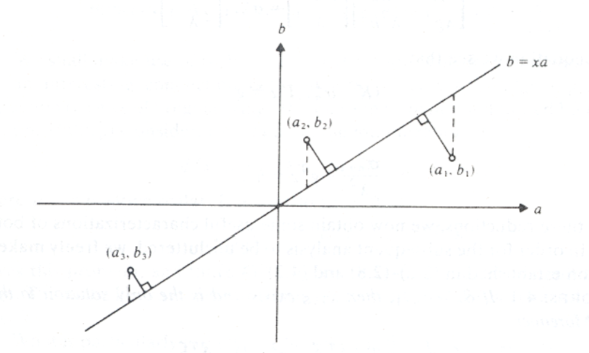

=======================
Equity Curve Convention
=======================

Why We Write This
#################

For every strategy, in the end we wish to see its performance on portfolios comprised of real world data.
However, there are very little well-organized resourses that are openly and readily available talking about how
the performance should be calculated.
And since essentially it is related to back-testings on a strategy, conventions are known to be scarce, if any.
Moreover, often it is not clear from the litertuares on their justification on choosing certain methodologies for
calculating returns.
For example, if a pair's trading strategy suggests a position like "long the spread", what is the hedging ratio? How many
units to purchase? How are the returns calculated if the strategy itself is self-financing? (i.e., you can cover the long
position cost from the short position.)
Those are fundamental questions for real world applications, and we created this page to address them.

Therefore, after going through well-regarded literatures, we looked carefully through the logic behind calculating the
equity curve for a portfolio with different common assumptions.
Moreover, in order to stay logically sound, the convention described in this document is used in research notebooks
for the :code:`arbitragelab` package.

There are some commonly sound approaches with regard to, loosely speaking, "calculating performance of the strategy on a
portfolio".
Obviously what one calculates depends on what the definition of "performance" is.
Listed below are some generally used methods:

1. The return, or the internal rate of return. Usually used for stocks on simple strategies.
2. Profit for unit position. Usually used for long-short strategies, e.g. pairs trading.
3. ROCC (Return on Committed Capital)
4. Fully invested Capital.

Forming A Portfolio For Pair's Trading
######################################
Before diving into calculating equity curves, we need to discuss how to form a reasonable portfolio for pair's trading.
A rule of thumb is that, the portfolio denpends on the strategy that one aims to implement, and a good portfolio should
hedge away unnecessary exposures to various kinds of risks, while emphasizing the real strength of the strategy.
Thus, there is no universally best way to form portfolios, as a terrible choice for one strategy may be almost optimal for
another.

To keep the discussion manageable and to the point, we limit our cases to a long-short pairs trading framework with
stocks underlying.
The ideas can be generalized easily to a multi-asset portfolio, which we may cover in detail in the future.

Suppose we have two stocks price series :math:`S_A`, :math:`S_B`.
In the portfolio we have :math:`X_A` units of :math:`A`, :math:`X_B` units of :math:`B`.
:math:`X_A, X_B` may or may not change with time.

.. Note::
    Often :math:`X_A` normalized to 1, but this is not a hard-and-fast rule.

Thus the portfolio price is

.. math::
    \Pi(t) = X_A S_A(t) + X_B S_B(t)

with revenue :math:`R` (**NOT** the return :math:`r(t) = \frac{S(t)}{S(0)} - 1`)

.. math::
    \begin{align}
    R(t) &= \Pi(t) - \Pi(0) \\ 
    &= X_A (S_A(t)-S_A(0)) + X_B (S_B(t)-S_B(0)) \\
    &= X_A (R_A(t)) + X_B (R_B(t))
    \end{align}

Below we discuss typical methods and their potential drawbacks from different typical approaches.

Benchmark Methods
*****************
Those methods are widely used, and are generally considered benchmarks for other methods to compare with.
Good examples would be *Ordinary Least Square (OLS)* and *Total least squares (TLS)*.

OLS
===

One can simply run an OLS on test data for two stocks' price time series :math:`S_A` and :math:`S_B` to get the hedge ratio.

The detail and justification is written below:

OLS is under the assumption that :math:`R_A` and :math:`R_B` are jointly normally distributed.
i.e., :math:`S_A` and :math:`S_B` follow simple (correlated) random walks.
We aim to find :math:`h` that minimizes the variance of the portfolio

.. math::
    \Pi_h = S_A - h S_B.

In this case,

.. math::
    \begin{align}
    Var(R_h) &= \mathbb{E}[R_A^2 - 2h R_A R_B + h^2 R_B^2] - 0\\
    &= \sigma_A^2 - 2h \sigma_{AB} + \sigma_{B}^2 h^2
    \end{align}

achieving min when

.. math::
    h = \frac{\sigma_{AB}}{\sigma_B^2}

In terms of implementation, one can calculate using the above formula, or note that

.. math::
    R_A = h R_B + R_h

where :math:`R_h` is normally distributed, independent from :math:`R_A`.
Thus it is the same as running an OLS on :math:`R_B` against :math:`R_A`, or equivalently running an OLS on
:math:`S_B` against :math:`S_A`:

.. math::
    S_A = h S_B + (R_h + S_A(0) - S_B(0))

.. Note::
    OLS may face the following possible issues:
    
    1. Modeling stock prices as random walks may be situational;
    2. The interdependencies between stock prices may not be modeled as a bivariate Gaussian, 
       especially when they are known to bear strong tail dependencies;
    3. OLS does not consider :math:`S_A` and :math:`S_B` as time series, but random variables.
       One can re-shuffle the order of :math:`(S_A(t), S_B(t))` in the training data and still get the same result, which 
       makes OLS subject to criticism for a potential loss of information.

TLS
===

Another commonly used method is total least squares (TLS).
When compared to OLS, it takes variances from both series into consideration.
In general the hedge ratios from TLS and OLS will not differ much from each other.

TLS finds the line that minimizes the Euclidean distance to all data points, whereas OLS only accounts for the distance
in the vertical direction.
See the picture below:

    Picture taken from [Golub and Van Loan, 1970]

.. Note::
    TLS may face the following possible issues:
    
    1. It has all the same assumptions on the stocks pairs as OLS, and therefore all concerns with OLS will apply to TLS.
    2. It is proved in [Golub and Van Loan, 1970] that the condition of TLS is always worse than that of OLS.
       Moreover, one can always apply a ridge regression for OLS to increase stability, TLS is the opposite and can be
       considered a "de-regularization", and is thus less stable.

Cointegration Methods
*********************

One may also consider using cointegration methods for time series, for example, the Johansen test and Engle-Granger test 
provided in the :code:`cointegration_approach` module for finding hedge ratios.
The math behind it is not our focus here.
For interested readers, please refer to the module's documentation.

Here, we just need to know that they provide hedge ratios for price series.

Dollar Neutral Portfolio
************************

In some cases one may consider the dollar-neutral approach.
For example, to hedge offset price movements of the two stocks as much as possible.
Also some strategies naturally calls for this trading method, due to their strong reliance on short term returns.

For this strategy, as the name suggests, one simply long and short one asset in equal dollar amounts.
The hedge may need to be adjusted often to stay close to being truly dollar-neutral.

.. Note::
    Dollar neutral is not the same as market neutral.
    To achieve market neutrality, one needs to know how to hedge away the ex-ante beta exposure.

Calculating Equity Curve
########################

Stocks and Index Funds
**********************
If the traded portfolio's value is **strictly positive**, for example, common stocks and index funds, then one can take
advantage of it to be able to calculate **the return** as follows:

1. Construct the portfolio (price or value series) :math:`\Pi(t)` with some hedge ratio.

    .. math::
        \Pi(t) = S_A(t) - h S_B(t)

2. Get portfolio's daily returns series.
   This step breaks down if the series is not strictly positive.

    .. math::
        r(t) = \frac{\Pi(t)}{\Pi(t-1)} - 1

    .. Warning::
        Returns of the portfolio is **NOT** the linear combination of returns from each component:
    
        .. math::
            r(t) = \frac{S_A(t) - h S_B(t)}{S_A(t-1) - h S_B(t-1)} - 1 \neq r_A(t) - h r_B(t) - 1

3. Get the positions :math:`P(t)` from some strategy.
4. Calculatethe daily returns :math:`r_s(t)` from our *strategy*. It is the pointwise multiplication

    .. math::
        r_s(t) = r(t)P(t), \ \text{for each} \ t

5. Then we use daily returns :math:`r_s(t)` to reconstruct our portfolio's **equity curve in return**:

    .. math::
        \mathcal{E}(t) = \left( \prod_{\tau=0}^t [r_s(\tau) + 1] \right) - 1

Notice the result series :math:`\mathcal{E}(t)` is constructed purely from the returns, and it holds no information about 
the portfolio's value.
Therefore the result is the return series from the strategy: :math:`0.2` means :math:`20` dollar profit for :math:`100`
dollar initial investment.

Spread for a Stock Pair
***********************
In this case we have to back up and derive everything by definition from daily P&L.
It makes no sense to even use traditional measures like return on capital.
For example, if a strategy tells you to long the spread when the spread is :math:`0`, and you have :math:`100,000` dollar
capital to invest, how many units can you buy?
(Hint: Infinity is not the answer.)
Moreover, because the spread can be positive or negative, it makes no sense to use returns for calculation as well.
Therefore, we calculate **the cumulative P&L for 1 unit of spread**, to account for generality.

1. Construct the portfolio (price series) :math:`\Pi(t)` with some hedge ratio.
 
    .. math::
        \Pi(t) = S_A(t) - h S_B(t)

2. Get portfolio's daily revenue (price difference, daily P&L for one unit) series.

    .. math::
        R(t) = \Pi(t) - \Pi(t-1)

3. Get the positions :math:`P(t)` from some strategy.
4. Calculatethe daily returns :math:`R_s(t)` from our *strategy*. It is the pointwise multiplication

    .. math::
        R_s(t) = R(t)P(t), \ \text{for each} \ t

5. Then we use daily P&L :math:`R_s(t)` to reconstruct our portfolio's **equity curve in cumulative P&L for 1 unit**
   as a cumulative sum of P&L:

    .. math::
        \mathcal{E}(t) = \sum_{\tau=0}^t R_s(\tau)

This approach does not directly lead to returns,
because we are trading one unit of the portfolio, and it is in a sense self-financing by the long-short behavior.

In some sense, the result can be converted to returns indeed.

1. In reality, one accounts for various types of risks and decide how much units to invest under a strategy,
   so the amount of dollars at risk can be the denominator to calculate returns.

2. One can also use return on assets (ROA) as follows by considering long position as equity and short as liability, although
   this is not as common under pair's trading framework in the literatures we looked at.
   For example, in a dollar neutral strategy, it makes sense to put a limit on how much money to invest on long positions 
   (therefore short as well).

    .. math::
        ROA = \frac{Profit}{Equity + Liability}

But those approaches are rather case dependent, hence we leave the choices to the user by providing P&L from :math:`1` unit.

ROCC and Fully-Invested Return
******************************
Now we consider trading with multiple pairs.

ROCC (Return on Committed Capital) is considered a conservative approach to calculate returns for multiple pairs.
It is easy to calculate: Simply scale each portfolio's payoff by the number of units used for trading, even if some pairs
did not open positions during the trading period, the cost of such a unit by whatever measure is still considered.
ROCC can be considered taking account of opportunity costs for this reason.

Fully invested return is calculated by dividing the profit at the end by the total amount of pairs that *actually opened positions*
during trading period.
Therefore it assumes perfect flexibility in terms of capital allocation, which may be situational. 

References
##########

* `Gatev, E., Goetzmann, W.N. and Rouwenhorst, K.G., 2006. Pairs trading: Performance of a relative-value arbitrage rule. The Review of Financial Studies, 19(3), pp.797-827. <http://www-stat.wharton.upenn.edu/~steele/Courses/434/434Context/PairsTrading/PairsTradingGGR.pdf>`__
* `Golub, G.H. and Van Loan, C.F., 1980. An analysis of the total least squares problem. SIAM journal on numerical analysis, 17(6), pp.883-893. <http://www.cs.cornell.edu/cv/ResearchPDF/Analysis.total.least.squares.prob.pdf>`__
* `Lee, C.F., Lin, F.L., Tu, H.C. and Chen, M.L., 2009. Alternative methods for estimating hedge ratio: Review, integration and empirical evidence. working article). Rutgers University. <http://www.centerforpbbefr.rutgers.edu/2007/Papers/135-Three%20Alternative%20Methods.doc>`__
