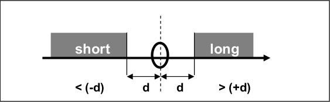
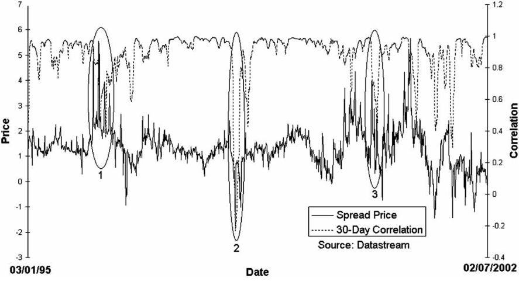
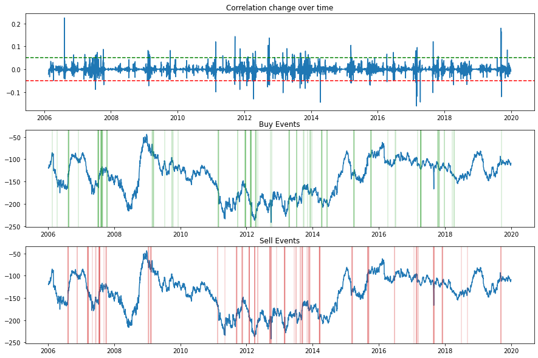
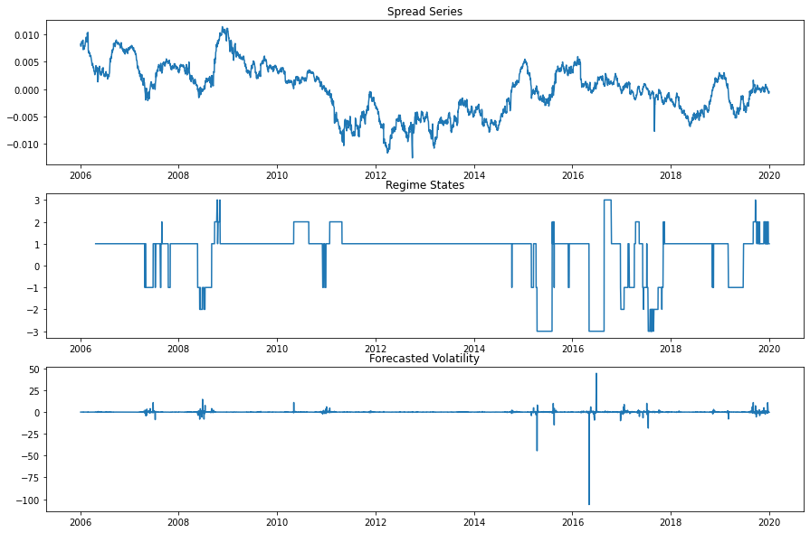

.. _ml_approach-filters:

.. warning::
   In order to use this module, you should additionally install *TensorFlow v2.2.1.* and *Keras v2.3.1.*
   For more details, please visit our :ref:`ArbitrageLab installation guide <getting_started-installation>`.

=======
Filters
=======

Introduction
############

The point made by `(Butterworth and Holmes 2002) <https://papers.ssrn.com/sol3/papers.cfm?abstract_id=2625061>`_ that ‘the overall profitability of the strategy is
seriously impaired by the difficulty, which traders face, in liquidating their positions’ indicates a definite
need for more discerning trade selection. This is achieved by using both a standard (threshold) filter
and a correlation filter to further refine the various models return/risk characteristics. More encouragingly, 
in most cases, the application of a filter improves the results of the model, in terms of
the out-of-sample Sharpe ratio.

Threshold Filter
################

    
    Visual intuition of the threshold filter method. `(Dunis et al. 2015) <https://www.tandfonline.com/doi/abs/10.1080/1351847X.2013.830140>`_

The standard filter mainly stays out of the market if the predicted change in the
spread is smaller in magnitude than X, X being the optimized filter level.

The threshold filter :math:`X` is as follows:

- if :math:`\Delta S_t > X` then go, or stay, long the spread;

- if :math:`\Delta S_t < X` then go, or stay, short the spread;

- if :math:`-X < \Delta S_t < X` then stay out of the spread.

where :math:`\Delta S_t` is the change in spread and :math:`X` is the level of the filter.

Implementation
**************

.. py:currentmodule:: arbitragelab.ml_approach.filters

.. autoclass:: ThresholdFilter
    :noindex:
    :members: __init__, fit, transform, fit_transform
    

Example
*******

.. code-block::

    # Importing packages
    import pandas as pd
    from arbitragelab.ml_approach.filters import ThresholdFilter

    # Getting the dataframe with time series of asset returns
    data = pd.read_csv('X_FILE_PATH.csv', index_col=0, parse_dates = [0])

    # Calculating spread returns and std dev.
    spread_series = data['spread']
    spread_diff_series = spread_series.diff()
    spread_diff_std = spread_diff_series.std()
    
    # Initializing ThresholdFilter with 2 std dev band for buying and selling triggers.
    thres_filter = ThresholdFilter(buy_threshold=-spread_diff_std*2,
                                   sell_threshold=spread_diff_std*2)

    std_events = thres_filter.fit_transform(spread_diff_series)

    # Plotting results
    thres_filter.plot()

Asymmetric Threshold Filter
###########################

The asymmetric threshold filter :math:`X` is as follows:

- if :math:`\Delta S_t > \vert p_1 \vert * X` then go, or stay, long the spread;

- if :math:`\Delta S_t < - \vert p_2 \vert * X` then go, or stay, short the spread;

- if :math:`- \vert p_2 \vert * X < \Delta S_t < \vert p_1 \vert * X` then stay out of the spread.

where :math:`\Delta S_t` is the change in spread, :math:`X` is the level of the filter and :math:`(p_1, p_2)`
being coefficients estimated from the TAR model.

Example
*******

.. code-block::

    # Importing packages
    import pandas as pd
    from arbitragelab.ml_approach.filters import ThresholdFilter

    # Getting the dataframe with time series of asset returns
    data = pd.read_csv('X_FILE_PATH.csv', index_col=0, parse_dates = [0])

    # Calculate spread returns and std dev.
    spread_series = data['spread']
    spread_diff_series = spread_series.diff()
    spread_diff_std = spread_diff_series.std()
    
    # Initialize the TAR asymmetry coefficients.
    p_1 = -0.012957
    p_2 = -0.038508

    buy_thresh = abs(p_1) * spread_diff_std*2
    sell_thresh = - abs(p_2) * spread_diff_std*2
    
    # Initialize ThresholdFilter with asymmetric buying and selling triggers.
    asym_thres_filter = ThresholdFilter(buy_threshold=buy_thresh,
                                        sell_threshold=sell_thresh)

    std_events = asym_thres_filter.fit_transform(spread_diff_series)

    # Plotting results
    asym_thres_filter.plot()

Correlation Filter
##################

    
    Side by side comparison of the legs correlation and the spread. (Dunis et al. 2015)

As well as the application of a standard filter, trades can also be filtered in terms of correlation. This is
presented as a new methodology to filter trading rule returns on spread markets. The idea is to enable the
trader to filter out periods of static spread movement (when the correlation between the underlying legs is
increasing) and retain periods of dynamic spread movement (when the correlation of the underlying
legs of the spread is decreasing).

By using this filter, it should also be possible to filter out initial moves away from the fair value, which are
generally harder to predict than moves back to fair value. Doing this also filters out periods when the
spread is stagnant.

Formally, the correlation filter :math:`X_c` can be written as:

- if :math:`\Delta C < X_c` then take the decision of the trading rule;

- if :math:`\Delta C > X_c` then stay out of the market.

where :math:`\Delta C` is the change in correlation and :math:`X_c` being the size of the correlation filter.

    
    Example plot from a fitted CorrelationFilter class.

Implementation
**************

.. autoclass:: CorrelationFilter
    :noindex:
    :members: __init__, fit, transform

Example
*******

.. code-block::

    # Importing packages
    import pandas as pd
    from arbitragelab.ml_approach.filters import CorrelationFilter

    # Getting the dataframe with time series of asset returns
    data = pd.read_csv('X_FILE_PATH.csv', index_col=0, parse_dates = [0])

    # Initialize CorrelationFilter with thresholds of -0.05 and 0.05.
    corr_filter = CorrelationFilter(buy_threshold=0.05, sell_threshold=-0.05, lookback=30)
    corr_filter.fit(data[['leg_1', 'leg_2']])
    corr_events = corr_filter.transform(data[['leg_1', 'leg_2']])

    # Plotting results
    corr_filter.plot()

Volatility Filter
#################

`(Dunis, Laws, and Middleton 2011) <https://www.tandfonline.com/doi/abs/10.1080/1351847X.2013.830140>`_, develop 
a refined volatility filter in order to offer a more sophisticated insight into market timing. 

The intuition of the method is to avoid trading when volatility is very high while at
the same time exploiting days when the volatility is relatively low. The significant
difference between market timing techniques as used in `(Dunis, Laws, and Middleton 2011) <https://www.tandfonline.com/doi/abs/10.1080/1351847X.2013.830140>`_
and time-varying leverage as implemented here is that leverage can be easily achieved by scaling
position sizes inversely to computed risk measures.

There are a number of different measurement techniques available to analysts when calculating
time-varying volatility. The most common method is the calculation of a moving average as used
by `(Dunis and Miao 2006) <https://link.springer.com/article/10.1057/palgrave.jam.2240212>`_ 
who estimate volatilities using a fixed window of time (number of days, weeks, months).
The same volatility regime classification technique was employed for the purpose of this research. 

The RiskMetrics volatility can be seen as a special case of the `(Bollerslev 1986)  <https://www.tandfonline.com/doi/abs/10.1080/07474938608800095>`_ GARCH model with pre-determined
decay parameters, and it is calculated using the following formula

.. math::
    
    \sigma^2_{(t+1, t)} = \mu*\sigma^2_{(t, t-1)} + (1 - \mu) * r^2_{(t)}

where :math:`\sigma^2` is the volatility forecast of a specific asset, :math:`r^2` is the squared return of
that asset, and :math:`\mu = 0.94` for daily data and :math:`0.97` for monthly data, as computed in `(Morgan 1994) <https://www.msci.com/documents/10199/5915b101-4206-4ba0-aee2-3449d5c7e95a>`_.

Following `(Morgan 1994) <https://www.msci.com/documents/10199/5915b101-4206-4ba0-aee2-3449d5c7e95a>`_, 
the estimation of volatility regimes is therefore based on a rolling historical average of RiskMetrics
volatility (:math:`\mu_{AVG}`) as well as the standard deviation of this volatility (:math:`\sigma`).
The latter is in essence ‘the volatility of the volatility’. For the purpose of this investigation,
both historical parameters :math:`\mu_{AVG}` and :math:`\sigma` are calculated on a three-month rolling
window. The average of both :math:`\mu_{AVG}` and :math:`\sigma` are then calculated based on these three-month historic
periods. 

For instance, the historical volatilities for our in-sample data are calculated over a total
16 periods with each spanning 3 months in duration. Thus, volatility regimes are then classified
based on both the average totals for :math:`\mu` and :math:`\sigma` over this time period.

Volatility regimes are categorised as 

- Lower High - (between :math:`\mu_{AVG}` and :math:`\mu_{AVG} + 2\sigma` ) 

- Medium High - (between :math:`\mu_{AVG} + 2\sigma` and :math:`\mu_{AVG} + 4\sigma` ) 

- Extremely High - (greater than :math:`\mu_{AVG} + 4\sigma` )

Similarly, periods of lower volatility are categorised as

- Higher Low - (between :math:`\mu_{AVG}` and :math:`\mu_{AVG} - 2\sigma` ) 

- Medium Low - (between :math:`\mu_{AVG} - 2\sigma` and :math:`\mu_{AVG} - 4\sigma` ) 

- Extremely Low - (less than :math:`\mu_{AVG} - 4\sigma` )

    
    Example plot from a fitted VolatilityFilter class.

Implementation
**************

.. autoclass:: VolatilityFilter
    :noindex:
    :members: __init__, fit, transform, fit_transform

Example
*******

.. code-block::

    # Importing packages
    import pandas as pd
    from arbitragelab.ml_approach.filters import VolatilityFilter

    # Getting the dataframe with time series of asset returns
    data = pd.read_csv('X_FILE_PATH.csv', index_col=0, parse_dates = [0])
    spread_series = data['spread']

    # Initialize VolatilityFilter a 30 period lookback parameter.
    vol_filter = VolatilityFilter(lookback=30)
    vol_events = vol_filter.fit_transform(spread_series)

    # Plotting results
    vol_filter.plot()

Presentation Slides
###################

.. raw:: html

    

        <iframe src="https://docs.google.com/presentation/d/e/2PACX-1vTQSpwcbKAQB84c8TgT2_4hWsZdazBNCJTdb1sdVBuUQ9Bt4_MkPpEk3DsJL4rl2iocJEYC2HZW54Ef/embed?start=false&loop=false&delayms=3000#slide=id.gba8c492c2b_0_10"
                frameborder="0"
                allowfullscreen
                style="position: absolute;
                       top: 0;
                       left: 0;
                       width: 100%;
                       height: 100%;">
        </iframe>
    

|

References
##########

* `Butterworth, D. and Holmes, P., 2005. The Hedging Effectiveness of UK Stock Index Futures Contracts Using an Extended Mean Gini Approach: Evidence for the FTSE 100 and FTSE Mid250 Contracts. Multinational Finance Journal, 9(3/4), pp.131-160. <https://papers.ssrn.com/sol3/papers.cfm?abstract_id=2625061>`_

* `Dunis, C.L., Laws, J., Middleton, P.W. and Karathanasopoulos, A., 2015. Trading and hedging the corn/ethanol crush spread using time-varying leverage and nonlinear models. The European Journal of Finance, 21(4), pp.352-375. <https://www.tandfonline.com/doi/abs/10.1080/1351847X.2013.830140>`_

* `Engle, R.F. and Bollerslev, T., 1986. Modelling the persistence of conditional variances. Econometric reviews, 5(1), pp.1-50. <https://www.tandfonline.com/doi/abs/10.1080/07474938608800095>`_

* `Dunis, C. and Miao, J., 2006. Volatility filters for asset management: An application to managed futures. Journal of Asset Management, 7(3-4), pp.179-189. <https://link.springer.com/article/10.1057/palgrave.jam.2240212>`_

* `JP Morgan (1994) RiskMetrics Technical Document, Morgan Guaranty Trust Company, New York. <https://www.msci.com/documents/10199/5915b101-4206-4ba0-aee2-3449d5c7e95a>`_
