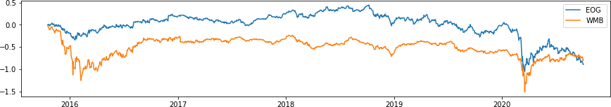

.. _ml_approach-introduction:

.. note::
   The following description closely follows the book by Simão Moraes Sarmento and Nuno Horta:
   `A Machine Learning based Pairs Trading Investment Strategy <https://www.springer.com/gp/book/9783030472504>`__.

.. warning::
   In order to use this module, you should additionally install *TensorFlow v2.2.1.* and *Keras v2.3.1.*
   For more details, please visit our :ref:`ArbitrageLab installation guide <getting_started-installation>`.

============
Introduction
============

.. raw:: html

    

        <iframe src="https://www.youtube.com/embed/R22JR4tqqqs"
                frameborder="0"
                allowfullscreen
                style="position: absolute;
                       top: 0;
                       left: 0;
                       width: 100%;
                       height: 100%;">
        </iframe>
         
    

The success of a Pairs Trading strategy highly depends on finding the right pairs.
But with the increasing availability of data, more traders manage to spot interesting 
pairs and quickly profit from the correction of price discrepancies, leaving no margin 
for the latecomers. 

To find opportunities the investor will employ methods that are either too restrictive,
like restricting the search to inter-sector relationships, or too open, like removing
any limit on the search space.

In this module, a Machine Learning based framework is applied to provide a balanced
solution to this problem. Firstly with the application of Unsupervised Learning to
define the search space. Secondly, in the grouping of relevant securities (not necessarily
from the same sector) in clusters, and finally in the detection of rewarding pairs within
them, that would otherwise be hard to identify, even for the experienced investor.

    An example pair found using the pair selector implemented in this module.

