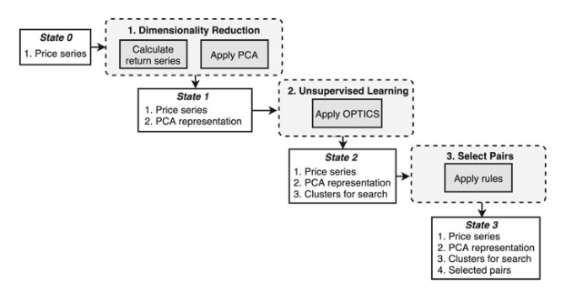
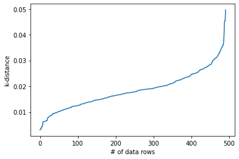
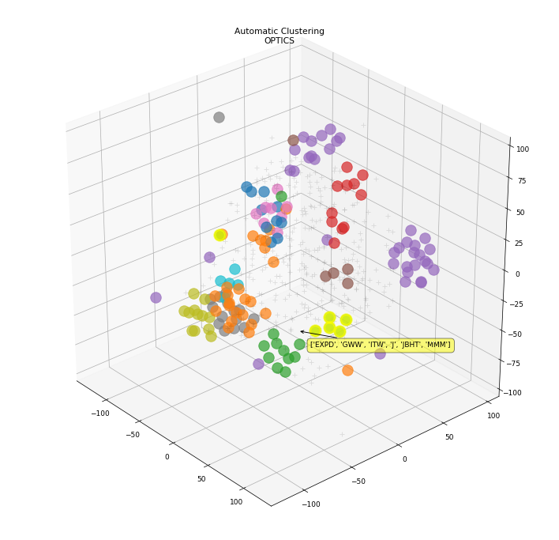
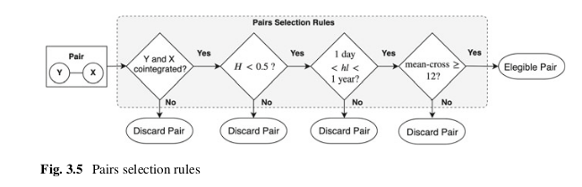

.. _ml_approach-ml_based_pairs_selection:

.. note::
   The following documentation closely follows a book by Simão Moraes Sarmento and Nuno Horta:
   `A Machine Learning based Pairs Trading Investment Strategy <https://www.springer.com/gp/book/9783030472504>`__.

.. warning::
   In order to use this module, you should additionally install *TensorFlow v2.2.1.* and *Keras v2.3.1.*
   For more details, please visit our :ref:`ArbitrageLab installation guide <getting_started-installation>`.

========================
ML Based Pairs Selection
========================

The success of a Pairs Trading strategy highly depends on finding the right pairs.
But with the increasing availability of data, more traders manage to spot interesting 
pairs and quickly profit from the correction of price discrepancies, leaving no margin 
for the latecomers. On the one hand, if the investor limits its search to securities 
within the same sector, as commonly executed, he is less likely to find pairs not yet 
being traded in large volumes. If on the other hand, the investor does not impose any 
limitation on the search space, he might have to explore an excessive number of combinations
and is more likely to find spurious relations. 

To solve this issue, this work proposes the application of Unsupervised Learning to define
the search space. It intends to group relevant securities (not necessarily from the same 
sector) in clusters, and detect rewarding pairs within them, that would otherwise be harder 
to identify, even for the experienced investor.

Proposed Pairs Selection Framework
##################################

    Framework diagram from `A Machine Learning based Pairs Trading Investment Strategy <http://premio-vidigal.inesc.pt/pdf/SimaoSarmentoMSc-resumo.pdf>`__.
    by Simão Moraes Sarmento and Nuno Horta.

Dimensionality Reduction 
########################
The main objectives in this step are:

- Extracting common underlying risk factors from securities returns
- Producing a compact representation for each security (stored in the variable 'feature_vector')

In this step the number of features, k, needs to be defined. A usual procedure consists of 
analyzing the proportion of the total variance explained by each principal component, and 
then using the number of components that explain a fixed percentage, as in `Avellaneda M, Lee JH (2010) <https://doi.org/10.1080/14697680903124632>`__. 
However, given that in this framework an Unsupervised Learning Algorithm is applied, the 
approach adopted took the data dimensionality problem as a major consideration. High data 
dimensionality presents a dual problem. 

- The first being that in the presence of more attributes, the likelihood of finding irrelevant features increases. 
- The second is the problem of the curse of dimensionality. 

This term is introduced by `Bellman (1966) <https://doi.org/10.1126/science.153.3731.34>`__ 
to describe the problem caused by the exponential increase in volume associated with adding 
extra dimensions to Euclidean space. This has a tremendous impact when measuring the distance 
between apparently similar data points that suddenly become all very distant from each other. 
Consequently, the clustering procedure becomes very ineffective. 

According to `Berkhin (2006) <https://doi.org/10.1007/3-540-28349-8_2>`__, the effect starts 
to be severe for dimensions greater than 15. Taking this into consideration, the number of PCA 
dimensions is upper bounded at this value and is chosen empirically.

.. warning::
    Usually the number of components for dimensionality reduction is chosen purely to maximize
    the amount of variance in the final lower dimensional representation. In this module's case,   
    there is a need to balance the amount of variance represented and at the same time have the
    final representation remain dense enough (in a euclidean geometrical sense) for the 
    clustering algorithm to detect any groupings. Thus as mentioned above the initial number
    of components is suggested to be 15 and slowly moved lower.

Implementation
**************

.. automodule:: arbitragelab.ml_approach

.. autoclass:: OPTICSDBSCANPairsClustering
   :members: __init__

.. automethod:: OPTICSDBSCANPairsClustering.dimensionality_reduction_by_components
.. automethod:: OPTICSDBSCANPairsClustering.plot_pca_matrix

Unsupervised Learning
#####################
The main objective in this step is to identify the optimal cluster structure from the compact 
representation previously generated, prioritizing the following constraints;

	- No need to specify the number of clusters in advance
	- No need to group all securities
	- No assumptions regarding the clusters’ shape.

The first method is to use the OPTICS clustering algorithm and letting the built-in automatic 
procedure to select the most suitable :math:`\epsilon` for each cluster.  

The second method is to use the DBSCAN clustering algorithm. This is to be used when the user 
has domain specific knowledge that can enhance the results given the algorithm's parameter 
sensitivity. A possible approach to finding :math:`\epsilon` described in `Rahmah N, Sitanggang S (2016) <https://doi.org/10.1088/1755-1315/31/1/012012>`__ is to inspect the knee plot and fix a 
suitable :math:`\epsilon` by observing the global curve turning point.

    An example plot of the k-distance 'knee' graph

    3D plot of the clustering result using the OPTICS method.

Implementation
**************

.. automethod:: OPTICSDBSCANPairsClustering.cluster_using_optics
.. automethod:: OPTICSDBSCANPairsClustering.cluster_using_dbscan
.. automethod:: OPTICSDBSCANPairsClustering.plot_clustering_info
.. automethod:: OPTICSDBSCANPairsClustering.plot_knee_plot
.. automethod:: OPTICSDBSCANPairsClustering.get_pairs_by_sector

Select Pairs 
############

The rules selection flow diagram from `A Machine Learning based Pairs Trading Investment Strategy <http://premio-vidigal.inesc.pt/pdf/SimaoSarmentoMSc-resumo.pdf>`__.
by Simão Moraes Sarmento and Nuno Horta.

The rules that each pair needs to pass are:

- The pair’s constituents are cointegrated. Literature suggests cointegration performs better than minimum distance and correlation approaches
- The pair’s spread Hurst exponent reveals a mean-reverting character. Extra layer of validation.
- The pair’s spread diverges and converges within convenient periods.
- The pair’s spread reverts to the mean with enough frequency.

To test for cointegration, the framework proposes the application of the Engle-Granger test, due 
to its simplicity. One critic `Armstrong (2001) <http://doi.org/10.1007/978-0-306-47630-3>`__ points 
at the Engle-Granger test sensitivity to the ordering of variables. It is a possibility that one of 
the relationships will be cointegrated, while the other will not. This is troublesome because we would 
expect that if the variables are truly cointegrated the two equations will yield the same conclusion. 

To mitigate this issue, the original paper proposes that the Engle-Granger test is run for the two 
possible selections of the dependent variable and that the combination that generated the lowest t-statistic 
is selected. Further work in `Hoel (2013) <https://core.ac.uk/download/pdf/52072275.pdf>`__ adds on, "the 
unsymmetrical coefficients imply that a hedge of long / short is not the opposite of long / short , i.e. 
the hedge ratios are inconsistent". 

A better solution is proposed and implemented, based on `Gregory et al. (2011) <http://dx.doi.org/10.2139/ssrn.1663703>`__ 
to use orthogonal regression – also referred to as Total Least Squares (TLS) – in which the residuals 
of both dependent and independent variables are taken into account. That way, we incorporate the volatility 
of both legs of the spread when estimating the relationship so that hedge ratios are consistent, and thus 
the cointegration estimates will be unaffected by the ordering of variables.

Hudson & Thames research team has also found out that optimal (in terms of cointegration tests statistics) hedge ratios
are obtained by minimizng spread's half-life of mean-reversion. As a result, the user may specify hedge ratio calculation
method: TLS, OLS or Minimum Half-Life.

Secondly, an additional validation step is also implemented to provide more confidence in the mean-reversion
character of the pairs’ spread. The condition imposed is that the Hurst exponent associated with the spread
of a given pair is enforced to be smaller than 0.5, assuring the process leans towards mean-reversion. 

In third place, the pair's spread movement is constrained using the half-life of the mean-reverting process. 
In the framework paper the strategy built on top of the selection framework is based on the medium term price
movements, so for this reason the spreads that either have very short (< 1 day) or very long mean-reversion (> 365 days)
periods were not suitable.  

Lastly, we enforce that every spread crosses its mean at least once per month, to provide enough liquidity and 
thus providing enough opportunities to exit a position.

.. note::
    In practice to calculate the spread of the pairs supplied by this module, it is important to also consider
    the hedge ratio as follows:
    
    :math:`S = leg1 - (hedgeratio) * leg2`

.. warning::
    The pairs selection function is very computationally heavy, so execution is going to be long and might slow down your system.

.. note::
    The user may specify thresholds for each pair selector rule from the framework described above. For example, Engle-Granger test 99%
    threshold may seem too strict in pair selection which can be decreased to either 95% or 90%. On the other hand,
    the user may impose more strict thresholds on half life of mean reversion.

Implementation
**************

.. automodule:: arbitragelab.pairs_selection.cointegration

.. autoclass:: CointegrationPairsSelector
   :members: __init__

.. automethod:: CointegrationPairsSelector.select_pairs
.. automethod:: CointegrationPairsSelector.plot_selected_pairs

Following methods describe the results of the selector in various ways.

.. automethod:: CointegrationPairsSelector.describe
.. automethod:: CointegrationPairsSelector.describe_extra
.. automethod:: CointegrationPairsSelector.describe_pairs_sectoral_info

.. note::
    In the original paper Pairs Selection module was a part of ML Pairs Trading approach. However, the user may want to use pairs selection
    rules without applying DBSCAN/OPTICS clustering. That is why, we decided to split pairs selection and clustering into different objects
    which can be used separately or together if the user wants to repeat results from the original paper.

Examples
########

.. code-block::

    # Importing packages
    import pandas as pd
    import numpy as np
    from arbitragelab.ml_approach import OPTICSDBSCANPairsClustering
    from arbitragelab.pairs_selection import CointegrationPairsSelector

    # Getting the dataframe with time series of asset returns
    data = pd.read_csv('X_FILE_PATH.csv', index_col=0, parse_dates = [0])

    pairs_clusterer = OPTICSDBSCANPairsClustering(data)

    # Price data is reduced to its component features using PCA
    pairs_clusterer.dimensionality_reduction_by_components(5)

    # Clustering is performed over feature vector
    clustered_pairs = pairs_clusterer.cluster_using_optics({'min_samples': 3})

    # Generated Pairs are processed through the rules mentioned above
    pairs_selector = CointegrationPairsSelector(prices_df=data, pairs_to_filter=clustered_pairs)
    filtered_pairs = pairs_selector.select_pairs()

    # Generate a Panel of information of the selected pairs
    final_pairs_info = pairs_selector.describe_extra()

    # Import the ticker sector info csv
    sectoral_info = pd.read_csv('X_FILE_PATH.csv')

    # Generate a sector/industry relationship Panel of each pair
    pairs_selector.describe_pairs_sectoral_info(final_pairs_info['leg_1'],
                                                final_pairs_info['leg_2'],
                                                sectoral_info)

Research Notebooks
##################

The following research notebook can be used to better understand the Pairs Selection framework described above.

* `ML based Pairs Selection`_

.. _`ML based Pairs Selection`: https://hudsonthames.org/notebooks/arblab/ml_based_pairs_selection.html

.. raw:: html

    <a href="https://hudthames.tech/3gFGwy8"><button style="margin: 20px; margin-top: 0px">Download Notebook</button></a>
    <a href="https://hudthames.tech/2S03R58"><button style="margin: 20px; margin-top: 0px">Download Sample Data</button></a>

References
##########

* `Sarmento, S.M. and Horta, N., A Machine Learning based Pairs Trading Investment Strategy. <https://www.springer.com/gp/book/9783030472504>`__

* `Avellaneda, M. and Lee, J.H., 2010. Statistical arbitrage in the US equities market. Quantitative Finance, 10(7), pp.761-782. <https://doi.org/10.1080/14697680903124632>`_

* `Bellman, R., 1966. Dynamic programming. Science, 153(3731), pp.34-37. <https://doi.org/10.1126/science.153.3731.34>`__

* `Berkhin, P., 2006. A survey of clustering data mining techniques. In Grouping multidimensional data (pp. 25-71). Springer, Berlin, Heidelberg. <https://doi.org/10.1007/3-540-28349-8_2>`__

* `Rahmah, N. and Sitanggang, I.S., 2016, January. Determination of optimal epsilon (eps) value on dbscan algorithm to clustering data on peatland hotspots in sumatra. In IOP Conference Series: Earth and Environmental Science (Vol. 31, No. 1, p. 012012). IOP Publishing. <https://doi.org/10.1088/1755-1315/31/1/012012>`__

* `Armstrong, J.S. ed., 2001. Principles of forecasting: a handbook for researchers and practitioners (Vol. 30). Springer Science & Business Media. <http://doi.org/10.1007/978-0-306-47630-3>`__

* `Hoel, C.H., 2013. Statistical arbitrage pairs: can cointegration capture market neutral profits? (Master's thesis). <https://core.ac.uk/download/pdf/52072275.pdf>`__

* `Gregory, I., Ewald, C.O. and Knox, P., 2010, November. Analytical pairs trading under different assumptions on the spread and ratio dynamics. In 23rd Australasian Finance and Banking Conference. <http://dx.doi.org/10.2139/ssrn.1663703>`__
