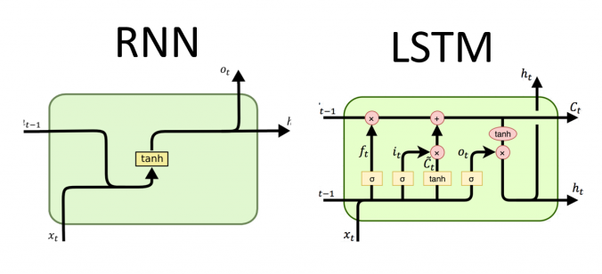
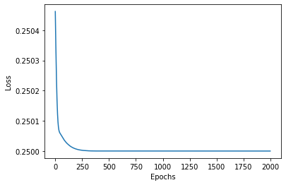
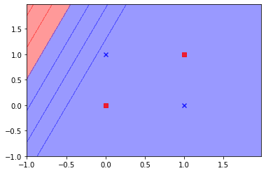
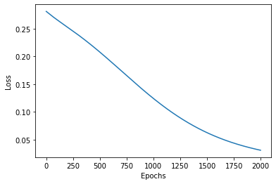
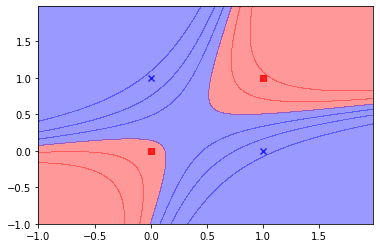
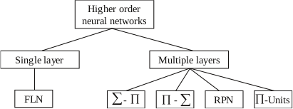
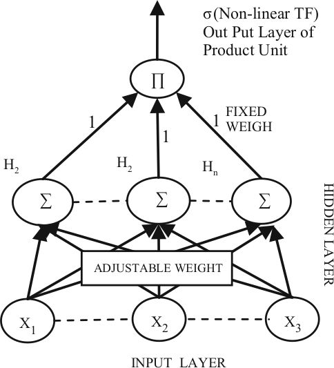

.. _ml_approach-neural_networks:

===============
Neural Networks
===============

Introduction
############

Neural networks exist in a variety of different architectures and have been 
implemented in numerous financial applications. However, the most widely used
architecture for the analysis of stock markets is known as the MLP neural network.

A generic neural network is built with at least three layers comprising an input,
hidden and output layer. The input layer structure is determined by the number
of explanatory variables depicted as nodes in the architecture. The hidden layer represents
the capacity of complexity in which the model can support or ‘fit’. Moreover, both
the input and hidden layers contain what is known as a bias node. The value attributed
to this node is a fixed value and is equal to one. Its purpose is similar to the
functionality of which the intercept serves in more traditional regression models.
The final and third layer of a standard neural network, the output layer, is governed 
by a structure of nodes corresponding to a number of response variables. Furthermore, 
each of these layers is linked via a node-to-node interconnecting system enabling a
functional network of ‘neurons’. 

On the whole, neural networks learn and identify relationships in data using neurons
similar to how the human brain works. They are a non-parametric tool and use a series
of waves and neurons to capture even very complex relationships between the predictor
inputs and the target variables. They can overcome messy data such as noise and
imprecision in the measurement system. Neural networks are appropriate for regression
as well as classification, time series analysis and clustering. 

Base Implementation
*******************

.. py:currentmodule:: arbitragelab.ml_approach.neural_networks

.. autoclass:: BaseNeuralNetwork
    :noindex:
    :members: __init__, fit, predict, plot_loss

Multi Layer Perceptron
######################

The MLP allows the user to select a set of activation functions to explore including
identity, logistic, hyperbolic tangent, negative exponential and sine. These activation
functions can be used for both hidden and output neurons. MLP also trains networks 
using a variety of algorithms such as gradient descent and conjugant descent.

.. autoclass:: MultiLayerPerceptron
    :noindex:
    :members: __init__, build
    
Example
*******

.. code-block::

    # Import package necessary for splitting the dataset.
    from sklearn.model_selection import train_test_split
    # Import package to generate a synthetic dataset.
    from sklearn.datasets import make_regression
    # Import package to quantify final prediction score.
    from sklearn.metrics import r2_score
    
    # Import the mlp implementation from arbitragelab.
    from arbitragelab.ml_approach.neural_networks import MultiLayerPerceptron
    
    # Generate 500 samples with 100 features, to be used as our dataset.
    X, y = make_regression(500)
    
    # Get number of samples to be given to the network.
    _, frame_size = X.shape

    # Initialize a basic regression neural network.
    regressor = MultiLayerPerceptron(frame_size, num_outputs=1, loss_fn="mean_squared_error", 
                                     optmizer="adam", metrics=[],
                                     hidden_layer_activation_function="relu",
                                     output_layer_act_func="linear")

    # This will compile the keras model structure implemented.
    regressor.build()

    # Will supply information about the structure of the model.
    regressor.summary()
    
    # Prepare dataset for training and testing.
    X_train, X_test, y_train, y_test = train_test_split(X, y, test_size=0.3, shuffle=False)

    # Fit compiled model with training data.
    regressor.fit(X_train, y_train,
                  batch_size=20, epochs=400,
                  verbose=1)

    # Plot loss vs epochs.
    regressor.plot_loss()
                    
    # Finally use the fitted model to predict test set.
    predictions = r2_score(y_test, regressor.predict(X_test))
    
Recurrent Neural Network (LSTM)
###############################

Recurrent neural networks (RNNs) are neural networks that leverage
backpropagation through time (BPTT) algorithm to determine the gradients. Through
this process, RNNs tend to run into two problems, known as exploding gradients and
vanishing gradients. These issues are defined by the size of the gradient, which is
the slope of the loss function along the error curve. When the gradient is too small,
it continues to become smaller, updating the weight parameters until they become
insignificant. When that occurs, the algorithm is no longer learning. Exploding 
gradients occur when the gradient is too large, creating an unstable model.

Long Short Term Memory (LSTM) was first introduced by `(Hochreiter and Schmidhuber 1997) <https://www.mitpressjournals.org/doi/abs/10.1162/neco.1997.9.8.1735>`_
as a solution to overcome error back-flow problems in RNN. An LSTM is capable of
retaining and propagating information through the dynamics of the LSTM memory cell,
hidden state, and gating mechanism.

   
   Visual interpretation of the internal structures of RNNs and LSTMs. `(Olah 2015) <http://colah.github.io/posts/2015-08-Understanding-LSTMs/>`_.

.. autoclass:: RecurrentNeuralNetwork
    :noindex:
    :members: __init__, build

.. code-block::
  
    # Import package necessary for splitting the dataset.
    from sklearn.model_selection import train_test_split
    # Import package to generate a synthetic dataset.
    from sklearn.datasets import make_regression
    # Import package to quantify final prediction score.
    from sklearn.metrics import r2_score
    
    # Import the rnn implementation from arbitragelab.
    from arbitragelab.ml_approach.neural_networks import RecurrentNeuralNetwork

    # Generate 500 samples with 100 features, to be used as our dataset.
    X, y = make_regression(500)
    
    # Prepare dataset for training and testing.
    X_train, X_test, y_train, y_test = train_test_split(X, y, test_size=0.3, shuffle=False)
    
    n_features = 1
    
    # Reshape from [samples, timesteps] into [samples, timesteps, features].
    X_train = X_train.reshape((X_train.shape[0], X_train.shape[1], n_features))
    X_test = X_test.reshape((X_test.shape[0], X_test.shape[1], n_features))

    _, frame_size, no_features = X_train.shape
  
    # Initialize a basic regression recurrent neural network.
    regressor = RecurrentNeuralNetwork((frame_size, no_features), num_outputs=1,
                                       loss_fn="mean_squared_error", optmizer="adam",
                                       metrics=[], hidden_layer_activation_function="relu",
                                       output_layer_act_func="linear")

    # This will compile the keras model structure implemented.
    regressor.build()

    # Will supply information about the structure of the model.
    regressor.summary()

    # Fit compiled model with training data.
    regressor.fit(X_train, y_train,
                  batch_size=20, epochs=400,
                  verbose=1)

    # Plot loss vs epochs.
    regressor.plot_loss()
                    
    # Finally use the fitted model to predict test set.
    predictions = r2_score(y_test, regressor.predict(X_test))
    
Higher Order Neural Network
###########################

As explained by `(Giles and Maxwell 1987) <https://www.osapublishing.org/ao/abstract.cfm?uri=ao-26-23-4972>`_,
HONNs exhibit adequate learning and storage capabilities due to the fact that
the order of the network can be structured in a manner which resembles the order
of the problem. 

Although the extent of their use in finance has so far been limited, `(Knowles
et al. 2009) <https://www.igi-global.com/chapter/higher-order-neural-networks-bayesian/5276>`_
show that, with shorter computational times and limited input variables, ‘the best
HONN models show a profit increase over the MLP of around 8%’. 

An example showing the capability of HONNs, is the XOR problem. The Exclusive OR problem
could not be solved with a network without a hidden layer or by a single layer of
first-order units, as it is not linearly separable. However, the same problem is
easily solved if the patterns are represented in three dimensions in terms
of an enhanced representation `(Pao, 1989) <https://www.osti.gov/biblio/5238955>`_,
by just using a single layer network with second-order terms. 

.. centered:: MLP trying to solve the Exclusive OR problem.

.. centered:: HONN output.

Typically HONNs are split into two types; the first type uses feature engineering
to expand the input dataset in representing the higher-order relationships in the original
dataset. The second type uses architectural modifications to augment the ability of the 
network to find higher-order relations in the dataset.

    
    HONNs can be classified into single and multiple layer structures, as explained by `(Liatsis et al. 2009) <https://www.igi-global.com/chapter/artificial-higher-order-neural-networks/5282>`_.

Single Layer - Functional Link NNs `(Dehuri et al. 2010) <https://link.springer.com/article/10.1007/s00521-009-0288-5>`_
************************************************************************************************************************

Single-layer, higher-order networks consist of a single processing layer
and inputs nodes, such as the functional link network (FLN) `(Pao, 1989) <https://www.osti.gov/biblio/5238955>`_,
which functionally expands the input space, by suitable pre-processing of the inputs.

In contrast to a feed-forward ANN structure, i.e., a multilayer perceptron (MLP),
the FLANN is basically a single-layer structure in which nonlinearity
is introduced by enhancing the input pattern with nonlinear functional
expansion. With proper choice of functional expansion in a FLANN, this
network performs as good as and in some cases even better than the MLP
structure for the problem of nonlinear system identification.

The dimensionality of the input space for FLNs can be increased in two ways `(Pao, 1989) <https://www.osti.gov/biblio/5238955>`_:

- The tensor or output product model, where the cross-products of the input terms are added to the model.
  For example, for a network with three inputs :math:`X_1, X_2,` and :math:`X_3`, the cross products
  are: :math:`X_1 X_2, X_1 X_3, X_2 X_3` , therefore adding second-order terms to the network. Third-order
  terms such as :math:`X_1 X_2 X_3` can also be added.

- Functional expansion of base inputs, where mathematical functions are used to transform the input data.

Due to the nature of single layer HONNs and the fact that the number of inputs can be numerous,
orders of 4 and over are rarely used. 

.. py:currentmodule:: arbitragelab.ml_approach.feature_expander

.. autoclass:: FeatureExpander
    :noindex:
    :members: __init__, fit, transform

    
Example
*******

.. code-block::

    # Import package necessary for splitting the dataset.
    from sklearn.model_selection import train_test_split
    # Import package to generate a synthetic dataset.
    from sklearn.datasets import make_regression
    # Import package to quantify final prediction score.
    from sklearn.metrics import r2_score

    # Import the feature expander implementation from arbitragelab.
    from arbitragelab.ml_approach.feature_expander import FeatureExpander
    
    # Import the mlp implementation from arbitragelab.
    from arbitragelab.ml_approach.neural_networks import MultiLayerPerceptron
    
    # Generate 500 samples with 100 features, to be used as our dataset.
    X, y = make_regression(500)
    
    expanded_X = FeatureExpander(methods=['product', 'power'], n_orders=2).fit(X).transform()
    
    # Get number of samples to be given to the network.
    n_frames, frame_size = expanded_X.shape

    # Initialize a basic regression neural network.
    regressor = MultiLayerPerceptron(frame_size, num_outputs=1, loss_fn="mean_squared_error", 
                                     optmizer="adam", metrics=[],
                                     hidden_layer_activation_function="relu",
                                     output_layer_act_func="linear")

    # This will compile the keras model structure implemented.
    regressor.build()

    # Will supply information about the structure of the model.
    regressor.summary()

    # Prepare dataset for training and testing.
    X_train, X_test, y_train, y_test = train_test_split(expanded_X, y, test_size=0.3, shuffle=False)

    # Fit compiled model with training data.
    regressor.fit(X_train, y_train,
                  batch_size=20, epochs=100,
                  verbose=1)

    # Plot loss vs epochs.
    regressor.plot_loss()
                    
    # Finally use the fitted model to predict test set.
    predictions = r2_score(y_test, regressor.predict(X_test))
    
Multiple Layer NNs `(Ghazali et al. 2009) <https://www.igi-global.com/chapter/artificial-higher-order-neural-networks/5286>`_
*****************************************************************************************************************************

Multilayered HONNs incorporate hidden layers, in addition to the output layer.
A popular example of such structures is the sigma-pi network, which consists of
layers of sigma-pi units `(Rumelhart, Hinto & Williams, 1986) <https://www.nature.com/articles/323533a0>`_.
A sigma-pi unit consists of a summing unit connected to a number of product units,
whose order is determined by the number of input connections. Another architecture
that belongs to this category is the pi-sigma network `(Shin & Ghosh, 1992) <https://www.worldscientific.com/doi/abs/10.1142/S0129065792000255>`_. This consists
of a layer of summing units, connected to a single product unit. The output of the
product unit is usually passed through a nonlinear transfer function. 

The main difference between the pi-sigma and the sigma-pi networks is that the former utilise a smaller
number of weights, however, they are not universal approximators. To address this
disadvantage, `(Shin & Ghosh 1991) <https://ieeexplore.ieee.org/abstract/document/155142/>`_
proposed an extension to the pi-sigma network, the so-called ridge polynomial neural network
(RPN), which consists of a number of increasing order pi-sigma units. Most of the above 
networks have one layer of trainable weights, and hence simple weights updating procedures
can be used for their training.

    Visual representation of the Pi-Sigma Neural Network architecture. `(Ghazali, R. and Al-Jumeily, D., 2009) <https://www.igi-global.com/chapter/artificial-higher-order-neural-networks/5286>`_

.. py:currentmodule:: arbitragelab.ml_approach.neural_networks

.. autoclass:: PiSigmaNeuralNetwork
    :noindex:
    :members: __init__, build
    

.. code-block::

    # Import package necessary for splitting the dataset.
    from sklearn.model_selection import train_test_split
    # Import package to generate a synthetic dataset.
    from sklearn.datasets import make_regression
    # Import package to quantify final prediction score.
    from sklearn.metrics import r2_score
    
    # Import the psnn implementation from arbitragelab.
    from arbitragelab.ml_approach.neural_networks import PiSigmaNeuralNetwork
    
    # Generate 500 samples with 100 features, to be used as our dataset.
    X, y = make_regression(500)

    # Get number of samples to be given to the network.
    n_frames, frame_size = X.shape

    # Initialize a basic regression pi sigma neural network.
    regressor = PiSigmaNeuralNetwork(frame_size, num_outputs=1, loss_fn="mean_squared_error", 
                                     optmizer="adam", metrics=[],
                                     hidden_layer_activation_function="relu",
                                     output_layer_act_func="linear")

    # This will compile the keras model structure implemented.
    regressor.build()

    # Will supply information about the structure of the model.
    regressor.summary()
    
    # Prepare dataset for training and testing.
    X_train, X_test, y_train, y_test = train_test_split(X, y, test_size=0.3, shuffle=False)

    # Fit compiled model with training data.
    regressor.fit(X_train, y_train,
                  batch_size=20, epochs=100,
                  verbose=1)

    # Plot loss vs epochs.
    regressor.plot_loss()
                    
    # Finally use the fitted model to predict test set.
    predictions = r2_score(y_test, regressor.predict(X_test))

References
##########

* `Hochreiter, S. and Schmidhuber, J., 1997. Long short-term memory. Neural computation, 9(8), pp.1735-1780. <https://www.mitpressjournals.org/doi/abs/10.1162/neco.1997.9.8.1735>`_

* `Giles, C.L. and Maxwell, T., 1987. Learning, invariance, and generalization in high-order neural networks. Applied optics, 26(23), pp.4972-4978. <https://www.osapublishing.org/ao/abstract.cfm?uri=ao-26-23-4972>`_

* `Knowles, A., Hussain, A., El Deredy, W., Lisboa, P.G. and Dunis, C.L., 2009. Higher order neural networks with Bayesian confidence measure for the prediction of the EUR/USD exchange rate. In Artificial higher order neural networks for economics and business (pp. 48-59). IGI Global. <https://www.igi-global.com/chapter/higher-order-neural-networks-bayesian/5276>`_

* `Fulcher, J., Zhang, M. and Xu, S., 2006. Application of higher-order neural networks to financial time-series prediction. In Artificial neural networks in finance and manufacturing (pp. 80-108). IGI Global. <https://www.igi-global.com/chapter/application-higher-order-neural-networks/5350>`_

* `Dunis, C.L., Laws, J., Middleton, P.W. and Karathanasopoulos, A., 2015. Trading and hedging the corn/ethanol crush spread using time-varying leverage and nonlinear models. The European Journal of Finance, 21(4), pp.352-375. <https://www.tandfonline.com/doi/abs/10.1080/1351847X.2013.830140>`_

* `Liatsis, P., Hussain, A. and Milonidis, E., 2009. Artificial higher order pipeline recurrent neural networks for financial time series prediction. In Artificial Higher Order Neural Networks for Economics and Business (pp. 164-189). IGI Global. <https://www.igi-global.com/chapter/artificial-higher-order-neural-networks/5282>`_

* `Dehuri, S. and Cho, S.B., 2010. A comprehensive survey on functional link neural networks and an adaptive PSO–BP learning for CFLNN. Neural Computing and Applications, 19(2), pp.187-205. <https://link.springer.com/article/10.1007/s00521-009-0288-5>`_

* `Ghazali, R. and Al-Jumeily, D., 2009. Application of pi-sigma neural networks and ridge polynomial neural networks to financial time series prediction. In Artificial Higher Order Neural Networks for Economics and Business (pp. 271-293). IGI Global. <https://www.igi-global.com/chapter/artificial-higher-order-neural-networks/5286>`_

* `Pao, Y., 1989. Adaptive pattern recognition and neural networks. <https://www.osti.gov/biblio/5238955>`_

* `Rumelhart, D.E., Hinton, G.E. and Williams, R.J., 1986. Learning representations by back-propagating errors. nature, 323(6088), pp.533-536. <https://www.nature.com/articles/323533a0>`_

* `Ghosh, J. and Shin, Y., 1992. Efficient higher-order neural networks for classification and function approximation. International Journal of Neural Systems, 3(04), pp.323-350. <https://www.worldscientific.com/doi/abs/10.1142/S0129065792000255>`_

* `Shin, Y. and Ghosh, J., 1991, July. The pi-sigma network: An efficient higher-order neural network for pattern classification and function approximation. In IJCNN-91-Seattle international joint conference on neural networks (Vol. 1, pp. 13-18). IEEE. <https://ieeexplore.ieee.org/abstract/document/155142/>`_

* `Patra, J.C., Pal, R.N., Chatterji, B.N. and Panda, G., 1999. Identification of nonlinear dynamic systems using functional link artificial neural networks. IEEE transactions on systems, man, and cybernetics, part b (cybernetics), 29(2), pp.254-262. <https://doi.org/10.1109/3477.752797>`_
