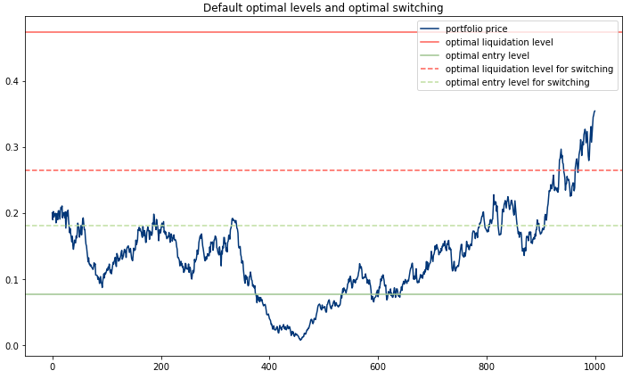

.. _optimal_mean_reverting_strategies-cir_model:

.. note::
   The following implementations and documentation closely follow the work of Tim Leung:
   `Tim Leung and Xin Li Optimal Mean reversion Trading: Mathematical Analysis and Practical Applications
   <https://www.amazon.com/Optimal-Mean-Reversion-Trading-Mathematical/dp/9814725919>`_.

==========================================
Trading Under the Cox-Ingersoll-Ross Model
==========================================
.. warning::

    Alongside with Leung's research we are using :math:`\theta` for mean and :math:`\mu` for mean-reversion
    speed, while other sources e.g. Wikipedia, use :math:`\theta` for mean reversion speed and :math:`\mu` for
    mean.

Model fitting
#############

.. note::
   We are solving the optimal stopping problem for a mean-reverting portfolio that is constructed by holding
   :math:`\alpha = \frac{A}{S_0^{(1)}}` of a risky asset :math:`S^{(1)}` and shorting
   :math:`\beta = \frac{B}{S_0^{(2)}}` of another risky asset :math:`S^{(2)}`, yielding a portfolio value:

   .. math::
      Y_t^{\alpha,\beta} = \alpha S^{(1)} - \beta S^{(2)}, t \geq 0

   Since in terms of mean-reversion we care only about the ratio between :math:`\alpha` and :math:`\beta`, without the
   loss of generality we can set :math:`\alpha = const` and A = $1, while varying :math:`\beta` to find the optimal strategy
   :math:`(\alpha,\beta^*)`

We establish a **Cox-Ingersoll-Ross process** driven by the SDE:

.. math::
    :nowrap:

    \begin{gather*}
    dY_t = \mu(\theta - Y_t)dt + \sigma \sqrt{Y_t} dB_t,\\

    \theta, \mu, \sigma > 0,\\

    B\ -\text{a standard Brownian motion}
    \end{gather*}

* :math:`\theta` − long term mean level, all future trajectories of Y will evolve around a mean level 𝜃 in the long run.

* :math:`\mu` - speed of reversion, characterizes the velocity at which such trajectories will regroup around :math:`\theta` in time.

* :math:`\sigma` - instantaneous volatility, measures instant by instant the amplitude of randomness entering the system. Higher values imply more randomness.

To fit the model to our data and find optimal parameters we define the average
log-likelihood function as in Borodin and Salminen (2002):

.. math::
    :nowrap:

    \begin{gather*}
    \ell (\theta,\mu,\sigma|y_0^{\alpha\beta},y_1^{\alpha\beta},\cdots,y_n^{\alpha\beta}) := \frac{1}{n}\sum_{i=1}^{n} ln
    f^{CIR}(y_i|y_{i-1};\theta,\mu,\sigma)\\
    \end{gather*}

.. math::
    \begin{gather*}
    = -ln(\tilde{\sigma}) - \frac{1}{n\tilde{\sigma}}\sum_{i=1}^{n} [y_i +y_{i-1}e^{-\mu \Delta t}] - \frac{1}{n} \sum_{i=1}^{n} [\frac{q}{2}ln(\frac{y_i}{y_{i-1}e^{-\mu\Delta t}}) - ln I_q(\frac{2}{\tilde{\sigma}^2}\sqrt{y_i y_{i-1}e^{-\mu\Delta t}})
    \end{gather*}

Then, maximizing the log-likelihood function by applying maximum likelihood estimation(MLE) we are able to determine
the parameters of the model and fit the observed portfolio prices to a CIR process. Let's denote the maximized average
log-likelihood by :math:`\hat{\ell}(\theta^*,\mu^*,\sigma^*)`. Then for every :math:`\alpha` we choose
:math:`\beta^*`, where:

.. math::
    \beta^* = \underset{\beta}{\arg\max}\ \hat{\ell}(\theta^*,\mu^*,\sigma^*|y_0^{\alpha\beta},y_1^{\alpha\beta},\cdots,
    y_n^{\alpha\beta})

Optimal Timing of Trades
########################

To find the optimal timing of trades we have implemented two approaches - optimal stopping and optimal switching.
The main difference between the two is the assumption about the number of trades in regards to which we are searching
for the optimal timing of trades. In case of an optimal stopping problem, we assume that we want to search for such
optimal levels that will maximize the output of a single entry-exit pair of trades. On the other hand, the optimal
switching approach is aimed at maximizing the infinite amount of entry-exit trades, thus accounting for any number 
of consequent trades our investor might want to carry out.

Optimal stopping problem
************************

Suppose the investor already has a position with a value process :math:`(Y_t)_{t>0}` that follows the CIR process. When
the investor closes his position at the time :math:`\tau` he receives the value :math:`(Y_{\tau})` and pays a
constant transaction cost :math:`c_s \in \mathbb{R}` To maximize the expected discounted value we need to solve
the optimal stopping problem:

.. math::
    V^{\chi}(y) = \underset{\tau \in T}{\sup} \mathbb{E}({e^{-r \tau} (Y_{\tau} - c_s)| Y_0 = y})

where :math:`T` denotes the set of all possible stopping times and :math:`r > 0` is our subjective constant
discount rate. :math:`V^{\chi}(y)` represents the expected liquidation value accounted with y.

Current price plus transaction cost  constitute the cost of entering the trade and in combination with :math:`V^{\chi}(y)`
we can formalize the optimal entry problem:

.. math::
    J^{\chi}(y) = \underset{\nu \in T}{\sup} \mathbb{E}({e^{-\hat{r} \tau} (V^{\chi}(Y_{\nu}) - Y_{\nu} - c_b)| Y_0 = y})

with

.. math::
    \hat{r}>0,\ c_b \in \mathbb{R}

To sum up this problem, we, as an investor, want to maximize the expected difference between the current price
of the position - :math:`Y_{\nu}` and its' expected liquidation value :math:`V^{\chi}(Y_{\nu})` minus transaction cost
:math:`c_b`

.. note::

    Following part of the chapter presents the analytical solution for the optimal stopping problem, both the default
    version and the version with the inclusion of the stop-loss level.

To solve this problem we denote the CIR process infinitesimal generator:

.. math::

    L = \frac{\sigma^2y}{2} \frac{d^2}{dy^2} + \mu(\theta - y) \frac{d}{dy}

and recall the classical solution of the differential equation

.. math::

    L u(y) = ru(y), \text{for}\ y \in R_{+}

.. math::

    F^{\chi}(y) = M(\frac{r}{\mu},\frac{2\mu\theta}{\sigma^2},\frac{2\mu y}{\sigma^2})

.. math::

    G^{\chi}(y) = U(\frac{r}{\mu},\frac{2\mu\theta}{\sigma^2},\frac{2\mu y}{\sigma^2})

.. math::

    where\ M(a,b,z) = \sum_{n=0}^{\infty}\frac{a_n z^n}{b_n n!},\ \  a_0=1, a_n=a(a+1)(a+2)...(a+n-1)

.. math::

    U(a,b,z) = \frac{\Gamma(1-b)}{\Gamma(a-b+1)}M(a,b,z) + \frac{\Gamma(b-1)}{\Gamma(a)}z^{1-b}M(a-b+1,2-b,z)

Then we are able to formulate the following theorems (proven in `Optimal Mean reversion Trading:
Mathematical Analysis and Practical Applications
<https://www.amazon.com/Optimal-Mean-Reversion-Trading-Mathematical/dp/9814725919>`_  by Tim Leung and Xin Li)
to provide the solutions to the following problems:

Theorem 4.2 (p.85):

**The optimal liquidation problem admits the solution:**

.. math::
    :nowrap:

    \begin{gather*}
    V^{\chi}(x) = \begin{cases} (b^{\chi*} - c_s) \frac{F^{\chi}(x)}{F^{\chi}(b^{\chi*})} , & \mbox{if } x \in [0,b^{\chi*})\\
    \\ x - c_s, &  \mbox{ otherwise}  \end{cases}\\
    \end{gather*}

The optimal liquidation level :math:`b^{\chi*}` is found from the equation:

.. math::

    F^{\chi} (b^{\chi}) - (b^{\chi} - c_s)F'^{\chi}(b^{\chi}) = 0\\

Corresponding optimal liquidation time is given by

.. math::
    \tau^{\chi*} = inf [t\geq0:Y_t \geq b^{\chi*}]

Theorem 4.4 (p.86):

**The optimal entry timing problem admits the solution:**

.. math::
    :nowrap:

    \begin{gather*}
    J(x) = \begin{cases} V^{\chi}(x) - x - c_b, & \mbox{if } x \in [0,d^{\chi*})\\
    \\ \frac{V^{\chi}(d^{\chi*}) - d^{\chi*} - c_b}{\hat{G^{\chi}}(d^{\chi*})}, & \mbox{if } x \in (d^{\chi*}, \infty)  \end{cases}
    \end{gather*}

The optimal entry level :math:`d^{\chi*}` is found from the equation:

.. math::

    \hat{G}^{\chi}(d^{\chi})(V'^{\chi}(d^{\chi}) - 1) - \hat{G}'^{\chi}(d^{\chi})(V^{\chi}(d^{\chi}) - d^{\chi} - c_b) = 0

Where ":math:`\hat{\ }`" represents the use of transaction cost and discount rate of entering.

Optimal switching problem
*************************

To find the optimal levels, first, two critical constants have to be denoted:

.. math::

    y_s:=\frac{\mu\theta+rc_s}{\mu+r} \\
    y_b:=\frac{\mu\theta-rc_b}{\mu+r}

Theorem 4.7 (p.56):

**Under the optimal switching approach it is optimal to re-enter the market if and only if all of the following conditions
hold true:**

a) If :math:`y_b>0`

b) The following inequality must hold true:

.. math::

    c_b < \frac{b^{\chi*}-c_s}{F^{\chi}(b^{\chi*})}

In case any of the conditions are not met - re-entering the market is deemed not optimal. It would be advised to exit
at the optimal liquidation price without re-entering, or not enter the position at all. The difference between the
options depends on whether the investor had already entered the market beforehand,
or did he or she start with a zero position.

How to use this submodule
#########################

This module provides you tools for obtaining the solutions to optimal stopping and optimal switching problems for
the CIR model.

Step 1: Model fitting
*********************

During the module fitting stage, we need to use :code:`fit` function to fit the CIR model to our training data. The data provided
should consist of a log-price of an already created mean-reverting portfolio.

Implementation
==============

.. py:currentmodule:: arbitragelab.optimal_mean_reversion.cir_model.CoxIngersollRoss

.. autofunction:: fit

.. tip::

    To retrain the model just use one of the functions :code:`fit_to_portfolio` or :code:`fit_to_assets`.
    You have a choice either to use the new dataset or to change the training time interval of your currently
    used dataset.

    .. autofunction:: fit_to_portfolio

    .. autofunction:: fit_to_assets

Step 2: Determining the optimal entry and exit values
*****************************************************

To get the optimal liquidation or entry level for your data we need to call one of the functions mentioned below.
They present the solutions to the equations established during the theoretical part.
To choose whether to account for the stop-loss level or not choose the respective set of functions.

Implementation
==============

:math:`b^{\chi*}`: - optimal level of liquidation:

.. autofunction:: optimal_liquidation_level

:math:`d^{\chi*}` - optimal level of entry, accounting for preferred stop-loss level:

.. autofunction:: optimal_entry_level

.. tip::

    General rule for the use of the optimal levels:

      *  If not bought, buy the portfolio as soon as portfolio price reaches the optimal entry level
         (enters the interval).

      *  If bought, liquidate the position as soon as portfolio price reaches the optimal liquidation level.

Step 3: Determining the optimal switching entry and exit values
****************************************************************

To get the optimal switching values we need to use the :code:`optimal_switching_levels` function that either returns
the interval of optimal switching prices or an optimal liquidation level if it is deemed not optimal to re-enter the market.

Implementation
==============

.. autofunction:: optimal_switching_levels

Step 4: (Optional) Plot the optimal levels on your data
*******************************************************

Additionally, you have the ability to plot your optimal levels for default problem and optimal switching onto your out-of-sample data.
You have a choice whether you want the optimal switching levels displayed or not.

   An exemplary output of the cir_plot_levels function.

Implementation
==============

.. autofunction:: cir_plot_levels

.. tip::
    To view all the model stats, including the optimal levels call the :code:`cir_description` function.

    .. autofunction:: cir_description

    .. figure:: images/cir_description.png
       :scale: 70 %
       :align: center
       :figclass: align-center

Example
#######

.. code-block::

    import numpy as np
    from arbitragelab.optimal_mean_reversion import CoxIngersollRoss

    example = CoxIngersollRoss()

    # We establish our training sample
    delta_t = 1/252
    np.random.seed(30)
    cir_example =  example.cir_model_simulation(n=1000, theta_given=0.2, mu_given=0.2,
                                                sigma_given=0.3, delta_t_given=delta_t)
    # Model fitting
    example.fit(cir_example, data_frequency="D", discount_rate=0.05,
                transaction_cost=[0.001, 0.001])

    # You can separately solve optimal stopping
    # and optimal switching problems

    # Solving the optimal stopping problem
    b = example.optimal_liquidation_level()

    d = example.optimal_entry_level()

    # Solving the optimal switching problem
    d_switch, b_switch = example.optimal_switching_levels()

    # You can display the results using the plot
    fig = example.cir_plot_levels(cir_example, switching=True)

    # Or you can view the model statistics
    example.cir_description(switching=True)

Research Notebook
#################

The following research notebook can be used to better understand the concepts of trading under the Cox-Ingersoll-Ross Model.

* `Trading Under the Cox-Ingersoll-Ross Model`_

.. _`Trading Under the Cox-Ingersoll-Ross Model`: https://github.com/Hudson-and-Thames-Clients/arbitrage_research/blob/master/Optimal%20Mean%20Reversion/cir_model.ipynb

References
##########

1. `Leung, T.S.T. and Li, X., 2015. Optimal mean reversion trading: Mathematical analysis and practical applications (Vol. 1). World Scientific. <https://www.amazon.co.uk/Optimal-Mean-Reversion-Trading-Mathematical/dp/9814725919/>`__
