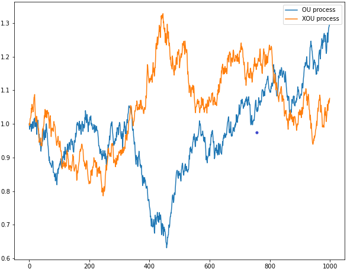
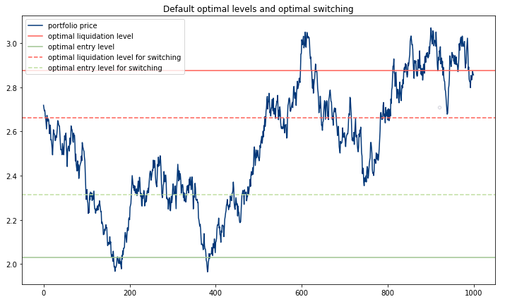

.. _optimal_mean_reverting_strategies-xou_model:

.. note::
   The following implementations and documentation closely follow the work of Tim Leung:
   `Tim Leung and Xin Li Optimal Mean reversion Trading: Mathematical Analysis and Practical Applications
   <https://www.amazon.com/Optimal-Mean-Reversion-Trading-Mathematical/dp/9814725919>`_.

========================================================
Trading Under the Exponential Ornstein-Uhlenbeck Model
========================================================

Model fitting
#############

.. note::
   We are solving the optimal stopping problem for a mean-reverting portfolio that is constructed by holding
   :math:`\alpha = \frac{A}{S_0^{(1)}}` of a risky asset :math:`S^{(1)}` and shorting
   :math:`\beta = \frac{B}{S_0^{(2)}}` of another risky asset :math:`S^{(2)}`, yielding a portfolio value:

   .. math::

      X_t^{\alpha,\beta} = \alpha S^{(1)} - \beta S^{(2)}, t \geq 0

   Since in terms of mean-reversion we care only about the ratio between :math:`\alpha` and :math:`\beta`, without the
   loss of generality we can set :math:`\alpha = const` and A = $1, while varying :math:`\beta` to find the optimal strategy
   :math:`(\alpha,\beta^*)` .

The Exponential Ornstein-Uhlenbeck (XOU) process is defined the following way:

.. math::

    \xi_t = e^{X_t},\ t \geq 0

where :math:`X` is the Ornstein-Uhlenbeck process.

.. note::

    The definition of the OU process and the fitting procedure details are presented in
    :ref:`Trading Under the Exponential Ornstein-Uhlenbeck Model <optimal_mean_reverting_strategies-ou_model>`.

In other words, :math:`X` is a *log-price* of a positive XOU
process :math:`\xi`.

   Comparison between simulated OU and XOU data.

The main parameters of the XOU model coincide with the parameters of the OU model:

* :math:`\theta` − long term mean level, all future trajectories of 𝑋 will evolve around a mean level 𝜃 in the long run.

* :math:`\mu` - the speed of reversion, characterizes the velocity at which such trajectories will regroup around :math:`\theta` in time.

* :math:`\sigma` - instantaneous volatility, measures instant by instant the amplitude of randomness entering the system. Higher values imply more randomness.

To fit the XOU process to our data and find the optimal ratio between the two assets we
are using the same approach as we utilized for the OU process:
firstly, we are maximizing the average log-likelihood function with respect to model parameters, and secondly
choosing the :math:`\beta^*` that provides the maximum value of the said max log-likelihood function.

Optimal Stopping Approach
#########################

First of all, let's assume that the investor already has a position the value of which follows the XOU process. When
the investor closes his position at the time :math:`\tau` he receives the value :math:`\xi_{\tau}=e^{X_{\tau}}` and pays a
constant transaction cost :math:`c_s > 0`. To maximize the expected discounted value we need to solve
the optimal stopping problem:

.. math::
    V^{\xi}(x) = \underset{\tau \in T}{\sup} \mathbb{E}({e^{-r \tau} (e^{X_{\tau}} - c_s)| X_0 = x}),

where :math:`T` denotes the set of all possible stopping times and :math:`r > 0` is our subjective constant
discount rate. :math:`V^{\xi}(x)` represents the expected liquidation value accounted with :math:`\xi`.

Current price plus transaction cost constitute the cost of entering the trade. After subtracting the found cost from
the expected optimal value of liquidation - :math:`V(x)` we can formalize the optimal entry problem:

.. math::
    J^{\xi}(x) = \underset{\nu \in T}{\sup} \mathbb{E}({e^{-\hat{r} \tau} (V^{\xi}(X_{\nu}) - e^{X_{\nu}} - c_b)| X_0 = x})

with

.. math::
    \hat{r}>0,\ c_b > 0

To sum up this problem, we, as an investor, want to maximize the expected discounted difference between the current price
of the position - :math:`e^{x_{\nu}}` and its expected liquidation value :math:`V^{\xi}(X_{\nu})` minus transaction cost
:math:`c_b`.

.. note::
    This approach presumes that the investor wants to commit only two trades: entering the position, and
    liquidating it.

Optimal stopping problem
*************************

Theorem 3.2 (p.54):

**The optimal liquidation problem admits the solution:**

.. math::
    :nowrap:

    \begin{gather*}
    V^{\xi}(x) = \begin{cases} (e^{b^{\xi*}} - c_s) \frac{F(x)}{F(b^{\xi*})} , & \mbox{if } x \in (-\infty,b^{\xi*})\\
    \\ e^x - c_s, &  \mbox{ otherwise}  \end{cases}\\
    \end{gather*}

The optimal liquidation level :math:`b^*` is found from the equation:

.. math::

    e^b F(b) - (e^b - c_s)F'(b) = 0\\

Corresponding optimal liquidation time is given by

.. math::
    \tau^{\xi*} = \inf [t\geq0:X_t \geq b^{\xi*}] = \inf [t\geq0:\xi \geq e^{b^{\xi*}}]

Theorem 3.4 (p.54):

**The optimal entry timing problem admits the solution:**

.. math::
    :nowrap:

    \begin{gather*}
    J^{\xi}(x) = \begin{cases} P^{\xi}{F}(x),  & \mbox{if } x \in (-\infty,a^{\xi*})\\
    \\ V^{\xi}(x) - e^x - c_b, & \mbox{if } x \in [a^{\xi*}, d^{\xi*}]\\
    \\ Q^{\xi}{G}(x), & \mbox{if } x \in (d^{\xi*}, \infty)\end{cases}\\
    \end{gather*}

The optimal entry interval :math:`(a^{\xi*},d^{\xi*})` is found using the respective equations:

.. math::
    :nowrap:

    \begin{gather*}
    G(d)(V^{\xi'}(d) - e^d) - G'(d)(V^{\xi}(d) - e^d - c_b) = 0\\
    F(a)(V^{\xi'}(a) - e^a) - F'(a)(V^{\xi}(a) - e^a - c_b) = 0
    \end{gather*}

Corresponding optimal entry time is given by

.. math::
    \nu_{a^{\xi*}, d^{\xi*}} = \inf [t\geq0:X_t \in [a^{\xi*}, d^{\xi*}]]

To summarize: the investor should enter the market when the price enters the interval
:math:`[e^{a^{\xi*}}, e^{d^{\xi*}}]` for the first time, and exit as soon as it reaches the price level
:math:`e^{b{\xi*}}`.

Optimal Switching Approach
##########################

If there is no limit on the number of times the investor will open or close the position, the sequential trading times
are modeled by the stopping times :math:`\nu_1,\tau_1,\nu_2,\tau_2,... \in T` such that

.. math::

        0\leq\nu_1\leq\tau_1\leq\nu_2\leq\tau_2\leq...

Where :math:`\nu_i` are times when the share of a risky asset was bought and :math:`\tau_i` - when it was sold. In the case
of pairs trading, we consider our spread as such an asset.

Naturally, the optimal timing of trades would depend on the initial position at the beginning of the training period.
Under the XOU model, if the investor starts with a **zero position** the first move to make in that case would be
to **buy** the share. Therefore, we can formulate the following problem :

.. math::

    \tilde{J}^{\xi}(x) = \underset{\Lambda_0} \sup \{\mathbb{E_x}\sum^{\infty}_{n=1}[e^{-r\tau_n}h^{\xi}_s(X_{\tau_n}) - e^{-r\nu_n}h^{\xi}_b(X_{\nu_n})]\}

Where :math:`\Lambda_0` is the set of admissible times, and helper functions denoted as such:

.. math::

    h^{\xi}_s=e^x-c_s\ \text{and}\ h^{\xi}_s=e^x+c_b

However, if the investor already holds a position in a said asset, the first action would be to sell, and the problem will
look the following way:

.. math::

    \tilde{V}^{\xi}(x) = \underset{\Lambda_1} \sup \{\mathbb{E_x}{e^{-r\tau_1}h^{\xi}_s(X_{\tau_1})+\sum^{\infty}_{n=2}[e^{-r\tau_n}h^{\xi}_s(X_{\tau_n}) - e^{-r\nu_n}h^{\xi}_b(X_{\nu_n})]}\}

With :math:`\Lambda_1` as the set of admissible times.

Optimal switching problem
*************************

To find the optimal levels, first, two helper functions have to be denoted:

.. math::

    f_s(x):=(\mu\theta+\frac{1}{2}\sigma^2-r) - \mu x + r c_s e^{-x}\\
    f_b(x):=(\mu\theta+\frac{1}{2}\sigma^2-r) - \mu x - r c_b e^{-x}

Theorem 3.7 (p.56):

Under the optimal switching approach it is optimal to re-enter the market if and only if **all** of the following conditions hold true:

a) There are two distinct roots to :math:`f_b:\ x_{b1},x_{b2}`
b) :math:`\exists \tilde{a}^* \in (x_{b1},x_{b2})` satisfying :math:`F(\tilde{a}^*)e^{\tilde{a}^*}=F'(\tilde{a}^*)(e^{\tilde{a}^*}+c_b)`
c) The following inequality must hold true:

.. math::

    \frac{e^{\tilde{a}^*}+c_b}{F(\tilde{a}^*)}\geq\frac{b^{\xi*}-c_s}{F(b^{\xi*})}

In case any of the conditions are not met - re-entering the market is deemed not optimal. It would be advised to exit
at the optimal liquidation price without re-entering in the case when the investor had already entered the market beforehand,
or don't enter the market at all in the case when he or she starts with a zero position.

How to use this submodule
#########################

In this module, the user can obtain the solution to the optimal stopping problem that is established for one entry and one exit point,
or to the optimal switching problem that accounts for multiple entries and exit points.

Step 1: Model fitting
*********************

During the module fitting stage, we need to use the :code:`fit` function to fit the XOU model to our training data. The data provided
should consist of a log-price of an already created mean-reverting portfolio.

Implementation
==============

.. py:currentmodule:: arbitragelab.optimal_mean_reversion.xou_model.ExponentialOrnsteinUhlenbeck

.. autofunction:: fit

.. tip::

    To retrain the model just use one of the functions :code:`fit_to_portfolio` or :code:`fit_to_assets`.
    You have a choice either to use the new dataset or to change the training time interval of your currently
    used dataset.

    .. autofunction:: fit_to_portfolio

    .. autofunction:: fit_to_assets

Step 2: Determining the optimal entry and exit values
*****************************************************

To get the optimal liquidation or entry level for your data we need to call one of the functions mentioned below.
They present the solutions to the equations established during the theoretical part.
To choose whether to account for the stop-loss level or not choose the respective set of functions.

Implementation
==============

:math:`b^{\xi*}`: - optimal level of liquidation:

.. autofunction:: xou_optimal_liquidation_level

:math:`[a^{\xi*}, d^{\xi*}]` - optimal level of entry, accounting for preferred stop-loss level:

.. autofunction:: xou_optimal_entry_interval

.. tip::

    General rule for the use of the optimal levels:

      *  If not bought, buy the portfolio as soon as portfolio price reaches the optimal entry level
         (enters the interval).

      *  If bought, liquidate the position as soon as portfolio price reaches the optimal liquidation level.

Step 3: Determining the optimal switching entry and exit values
****************************************************************

To get the optimal switching values we need to use the :code:`optimal_switching_levels` function that either returns
the interval of optimal switching prices or an optimal liquidation level if it is deemed not optimal to re-enter the market.

Implementation
==============

.. autofunction:: optimal_switching_levels

Step 4: (Optional) Plot the optimal levels on your data
*******************************************************

Additionally, you have the ability to plot your optimal levels for default problem and optimal switching onto your out-of-sample data.
Similarly to the fit step you have a choice whether to use portfolio prices or an array of asset prices. In the case of
the latter optimal coefficient found during the fit stage will be used to create a portfolio.

   An exemplary output of the xou_plot_levels function.

Implementation
==============

.. autofunction:: xou_plot_levels

.. tip::
    To view all the model stats, including the optimal levels call the ``xou_description`` function.

    .. autofunction:: xou_description

Example
#######

.. code-block::

    import numpy as np
    from arbitragelab.optimal_mean_reversion import ExponentialOrnsteinUhlenbeck

    example = ExponentialOrnsteinUhlenbeck()

    # We establish our training sample
    delta_t = 1/252
    np.random.seed(30)
    xou_example =  example.ou_model_simulation(n=1000, theta_given=1, mu_given=0.6,
                                               sigma_given=0.2, delta_t_given=delta_t)
    # Model fitting
    example.fit(xou_example, data_frequency="D", discount_rate=0.05,
                transaction_cost=[0.02, 0.02])

    # You can separately solve optimal stopping
    # and optimal switching problems

    # Solving the optimal stopping problem
    b = example.xou_optimal_liquidation_level()

    a,d = example.xou_optimal_entry_interval()

    # Solving the optimal switching problem
    d_switch, b_switch = example.optimal_switching_levels()

    # You can display the results using the plot
    fig = example.xou_plot_levels(np.exp(xou_example), switching=True)

    # Or you can view the model statistics
    example.xou_description(switching=True)
