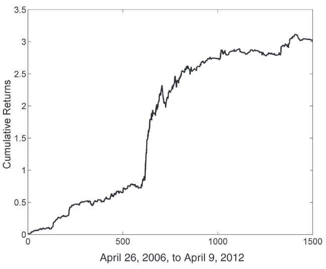
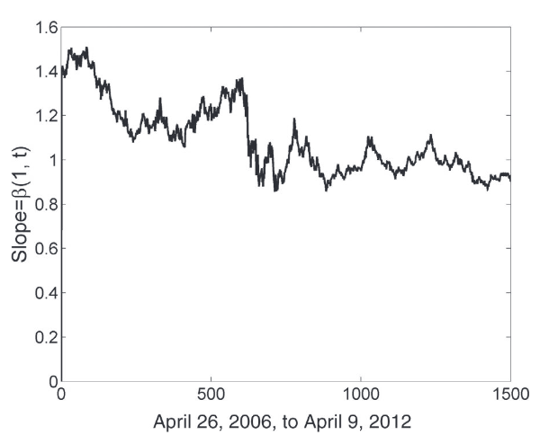
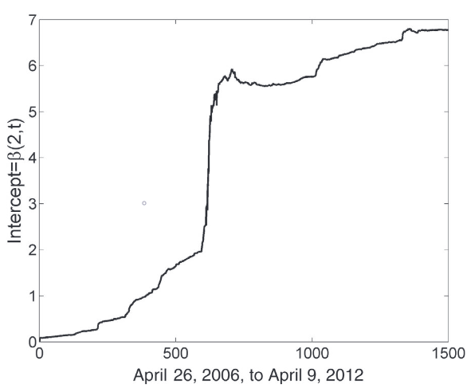

.. _other_approaches-kalman_filter:

.. note::
   The following documentation closely follows the book by Ernest P. Chan:
   `Algorithmic Trading: Winning Strategies and Their Rationale <https://www.wiley.com/en-us/Algorithmic+Trading%3A+Winning+Strategies+and+Their+Rationale-p-9781118460146>`__.

=============
Kalman Filter
=============

Introduction
############

While for truly cointegrating price series we can use the tools described in the cointegration approach
(Johansen and Engle-Granger tests), however, for real price series we might want to use other tools to estimate the
hedge ratio, as the cointegration property can be hard to achieve as the hedge ratio changes through time.

Using a look-back period, as in the cointegration approach to estimate the parameters of a model
has its disadvantages, as a short period can cut a part of the information. Then we might improve these
methods by using an exponential weighting of observations, but it's not obvious if this weighting is
optimal either.

    Cumulative returns of Kalman Filter Strategy on a EWC-EWA pair.
    An example from `"Algorithmic Trading: Winning Strategies and Their Rationale" <https://www.wiley.com/en-us/Algorithmic+Trading%3A+Winning+Strategies+and+Their+Rationale-p-9781118460146>`__
    by Ernest P. Chan.

This module describes a scheme that allows using the Kalman filter for hedge ratio updating, as presented in the
book by Ernest P. Chan "Algorithmic Trading: Winning Strategies and Their Rationale".

One of the advantages of this approach is that we don't have to pick a weighting scheme for observations in the
look-back period. Based on this scheme a Kalman Filter Mean Reversion Strategy can be created, which it is also
described in this module.

Kalman Filter
#############

Following the descriptions by Ernest P. Chan:

The "Kalman filter is an optimal linear algorithm that updates the expected value of a hidden
variable based on the latest value of an observable variable.

It is linear because it assumes that the observable variable is a linear function of the hidden
variable with noise. It also assumes the hidden variable at time :math:`t` is a linear function
of itself at time :math:`t − 1` with noise, and that the noises present in these functions
have Gaussian distributions (and hence can be specified with an evolving covariance
matrix, assuming their means to be zero.) Because of all these linear relations, the expected
value of the hidden variable at time :math:`t` is also a linear function of its expected value
prior to the observation at :math:`t`, as well as a linear function of the value of the observed
variable at :math:`t`.

The Kalman filter is optimal in the sense that it is the best estimator
available if we assume that the noises are Gaussian, and it minimizes the mean square error of
the estimated variables."

As we're searching for the hedge ratio, we're using the following linear function:

.. math::

    y(t) = x(t) \beta(t) + \epsilon(t)

where :math:`y` and :math:`x` are price series of the first and the second asset, :math:`\beta` is the
hedge ratio that we are searching and :math:`\epsilon` is the Gaussian noise with variance :math:`V_{\epsilon}`.

Allowing the spread between the :math:`x` and :math:`y` to have a nonzero mean, :math:`\beta`
will be a vector of size :math:`(2, 1)` denoting both the intercept and the slope of
the linear relation between :math:`x` and :math:`y`. For this needs, the :math:`x(t)`
is augmented with a vector of ones to create an array of size :math:`(N, 2)`.

Next, an assumption is made that the regression coefficient changes in the following way:

.. math::

    \beta(t) = \beta(t-1) + \omega(t-1)

where :math:`\omega` is a Gaussian noise with covariance :math:`V_{\omega}`. So the regression
coefficient at time :math:`t` is equal to the regression coefficient at time :math:`t-1` plus
noise.

With this specification, the Kalman filter can generate the expected value of the hedge ratio
:math:`\beta` at each observation :math:`t`.

Kalman filter also generates an estimate of the standard deviation of the forecast error
of the observable variable. It can be used as the moving standard deviation of a Bollinger band.

    Slope estimated between EWC(y) and EWA(x) using the Kalman Filter.
    An example from `"Algorithmic Trading: Winning Strategies and Their Rationale" <https://www.wiley.com/en-us/Algorithmic+Trading%3A+Winning+Strategies+and+Their+Rationale-p-9781118460146>`__
    by Ernest P. Chan.

    Intercept estimated between EWC(y) and EWA(x) using the Kalman Filter.
    An example from `"Algorithmic Trading: Winning Strategies and Their Rationale" <https://www.wiley.com/en-us/Algorithmic+Trading%3A+Winning+Strategies+and+Their+Rationale-p-9781118460146>`__
    by Ernest P. Chan.

Implementation
**************

.. py:currentmodule:: arbitragelab.other_approaches.kalman_filter

.. autoclass:: KalmanFilterStrategy
   :members: __init__, update

Kalman Filter Strategy
######################

Quantities that were computed using the Kalman filter can be utilized to generate trading
signals.

The forecast error :math:`e(t)` can be interpreted as the deviation of a pair spread from
the predicted value. This spread can be bought when it has high negative values and sold
when it has high positive values.

As a threshold for the :math:`e(t)`, its standard deviation :math:`\sqrt{Q(t)}` is used:

- If :math:`e(t) < - entry\_std\_score * \sqrt{Q(t)}`, a long position on the spread should be taken: Long :math:`N`
  units of the :math:`y` asset and short :math:`N*\beta` units of the :math:`x` asset.

- If :math:`e(t) \ge - exit\_std\_score * \sqrt{Q(t)}`, a long position on the spread should be closed.

- If :math:`e(t) > entry\_std\_score * \sqrt{Q(t)}`, a short position on the spread should be taken: Short :math:`N`
  units of the :math:`y` asset and long :math:`N*\beta` units of the :math:`x` asset.

- If :math:`e(t) \le exit\_std\_score * \sqrt{Q(t)}`, a short position on the spread should be closed.

So it's the same logic as in the Bollinger Band Strategy from the Mean Reversion module.

    Cumulative returns of Kalman Filter Strategy on a EWC-EWA pair.
    An example from `"Algorithmic Trading: Winning Strategies and Their Rationale" <https://www.wiley.com/en-us/Algorithmic+Trading%3A+Winning+Strategies+and+Their+Rationale-p-9781118460146>`__
    by Ernest P. Chan.

Implementation
**************

.. autoclass:: KalmanFilterStrategy
   :noindex:
   :members: trading_signals

Examples
********

.. code-block::

   # Importing packages
   import pandas as pd
   from arbitragelab.other_approaches.kalman_filter import KalmanFilterStrategy

   # Getting the dataframe with time series of asset prices
   data = pd.read_csv('X_FILE_PATH.csv', index_col=0, parse_dates = [0])

   # Running the Kalman Filter to find the slope, forecast error, etc.
   filter_strategy = KalmanFilterStrategy()

   # We assume the first element is X and the second is Y
   for observations in data.values:
      filter_strategy.update(observations[0], observations[1])

   # Getting a list of the hedge ratios
   hedge_ratios = filter_strategy.hedge_ratios

   # Getting a list of intercepts
   intercepts = filter_strategy.intercepts

   # Getting a list of forecast errors
   forecast_errors = filter_strategy.spread_series

   # Getting a list of forecast error standard deviations
   error_st_dev = filter_strategy.spread_std_series

   # Getting a DataFrame with trading signals
   target_quantities = filter_strategy.trading_signals(self,
                                                       entry_std_score=3,
                                                       exit_std_score=-3)

Research Notebooks
##################

The following research notebook can be used to better understand the Kalman Filter approach and strategy described above.

* `Kalman Filter`_

.. _`Kalman Filter`: https://github.com/Hudson-and-Thames-Clients/arbitrage_research/blob/master/Other%20Approaches/kalman_filter.ipynb

References
##########

* `Chan, E., 2013. Algorithmic trading: winning strategies and their rationale (Vol. 625). John Wiley & Sons. <https://www.amazon.co.uk/Algorithmic-Trading-Winning-Strategies-Rationale/dp/1118460146>`_
