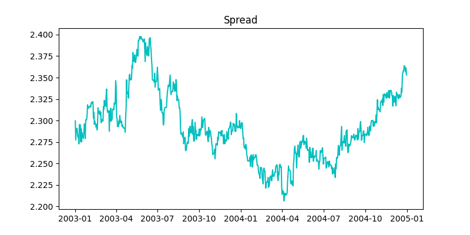
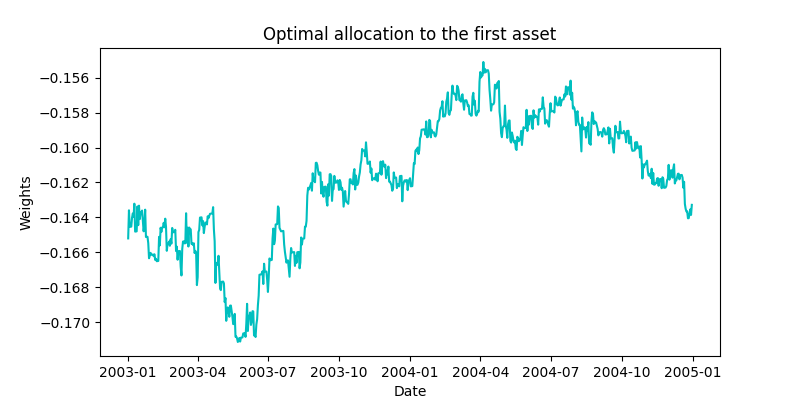
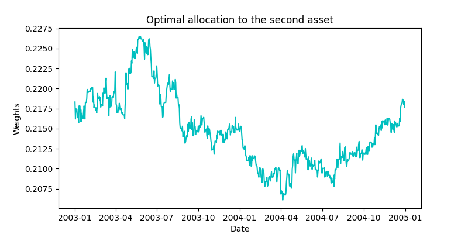
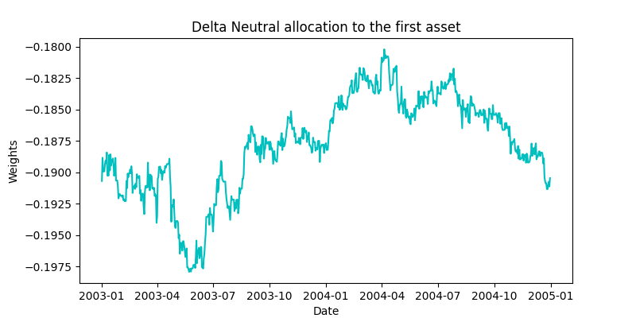
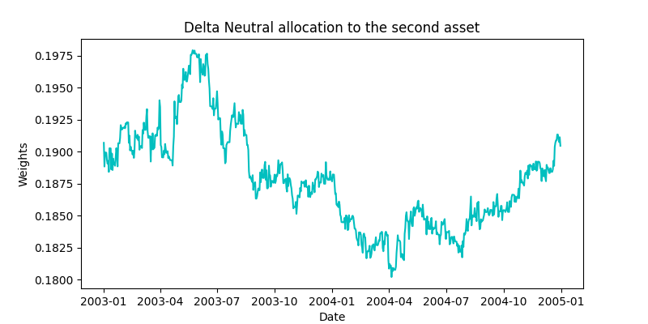

.. _stochastic_control_approach-optimal_convergence:

.. note::
    The following implementations and documentation closely follow the below work:

    `Liu, J. and Timmermann, A., 2013. Optimal convergence trade strategies. <https://citeseerx.ist.psu.edu/viewdoc/download?doi=10.1.1.905.236&rep=rep1&type=pdf>`__

===================
Optimal Convergence
===================

Introduction
############

Convergence trades resemble the standard long-short arbitrage strategy
popular in industry and covered in academic studies. Conventionally,
such strategies take positions of equal size but opposite signs
either in portfolio weight or in number of shares. This seems intuitively
reasonable and ensures that future liabilities offset. However, as shown in the paper, such delta neutral strategies
will typically not be optimal.

The objective of optimally trading off risk and returns can lead to quite different solutions compared
with the standard arbitrage objective assumed in convergence trades.
Traditional arbitrage strategies and/or delta neutral convergence trades are
designed to explore long-term arbitrage opportunities but usually do not
exploit the short-run risk-return trade-off optimally. By placing arbitrage
opportunities in the context of a portfolio maximization problem, the
optimal convergence strategy accounts for both arbitrage opportunities and
diversification benefits.

Modelling
#########

In the paper, the authors assume that there is a riskless asset that pays a constant rate of return, :math:`r`. A
risky asset trading at the price :math:`P_{mt}` represents the market index. This follows a
geometric random walk process,

.. math::
    \frac{d P_{m t}}{P_{m l}}=\left(r+\mu_{m}\right) d t+\sigma_{m} d B_{t}

where the market risk premium, :math:`\mu_{m}`, and market volatility, \sigma_{m}`, are both constant,
and :math:`B_t` is a standard Brownian motion.

In addition to the risk-free asset and the market index, the authors assume the presence
of two risky assets whose prices :math:`P_{it}, i = 1,2`, evolve according to the equations

.. math::
    \begin{array}{l}
    \frac{d P_{1 t}}{P_{1 t}}=\left(r+\beta \mu_{m}\right) d t+\beta \sigma_{m} d B_{t}+\sigma d Z_{t}+b d Z_{1 t}
    -\lambda_{1} x_{t} d t \\
    \frac{d P_{2 t}}{P_{2 t}}=\left(r+\beta \mu_{m}\right) d t+\beta \sigma_{m} d B_{t}+\sigma d Z_{t}+b d Z_{2 t}
    +\lambda_{2} x_{t} d t
    \end{array}

where :math:`\lambda_1`, :math:`\lambda_2`, :math:`\beta`, :math:`b`, and :math:`\sigma` are constant parameters.
:math:`Z_t` and :math:`Z_{it}` are standard
Brownian motions, and :math:`B_t` , :math:`Z_t` , and :math:`Z_{it}` are all mutually independent for :math:`i = 1,2`.

In the above equations, :math:`\beta \sigma_m d B_t` represents exposure to the market risk,
whereas :math:`\sigma d Z_{t}+b d Z_{t}` represents idiosyncratic risks. It is standard to assume
that idiosyncratic risks are independent across different stocks with the market
risk representing the only source of correlation among different assets.

:math:`x_t` represents pricing errors in our model and is the difference between the
logarithms of the two asset prices, :math:`p_{it} = \ln P_{it}` ,

.. math::
    x_t = p_{1t} − p_{2t} =\ln\bigg(\frac{P_{1t}}{P_{2t}}\bigg)

    Constructed spread for the Royal Dutch - Shell pair.

The authors make a key assumption here, that :math:`\lambda_1 + \lambda_2 > 0`. This implies that :math:`x_t` is stationary
and the logarithms of the prices are cointegrated with cointegrating vector :math:`(1,−1)`.

The cointegration setup captures the feature that two assets with identical
payoffs can trade at different prices. Examples include pairs of stocks that have
the same claim to dividends and identical voting rights but are traded in different
markets and two stocks with the same payoffs, such as the target and acquirer
stocks in a merger.

:math:`−\lambda_1 x_t` and :math:`\lambda_2 x_t` capture the absolute mispricing of each asset relative to CAPM.
For further information regarding the utility of :math:`\lambda`'s, interested readers can refer to Section 1.1 in the paper.

Cointegration and relative mispricing
*************************************

:math:`x_t` represents the relative mispricing between both assets. This is considered stationary and the dynamics of this term
is given by,

.. math::
    d x_{t}=-\lambda_{x} x_{t} d t+b_{x} d Z_{x t}

where,

.. math::

    \begin{array}{c}
    \lambda_{x}=\lambda_{1}+\lambda_{2}, \\
    b_{x} d Z_{x t}=b d Z_{1 t}-b d Z_{2 t}, \\
    b_x = \sqrt 2 b
    \end{array}

In this paper, the authors considered two cases for both the unconstrained and constrained(delta neutral) portfolios.
The first case deals with recurring arbitrage opportunities, the price differential, :math:`x_t` , only spends an
infinitesimally short time at zero, is characterized at all times by the dynamics in the above equation, and so follows
a stationary process.
In the second case (“nonrecurring arbitrage opportunities”),
any price difference is temporary and gets permanently eliminated the first time
the two prices converge and :math:`x_t = 0`. In this case, the price dynamics is subject
to the additional restriction that :math:`x_{\tau + \delta} = 0` for all :math:`\delta ≥ 0`, where :math:`\tau = min(t : x_t = 0)`
is a stopping time. In this case, prices remain identical after they converge.
The optimal portfolio weights are different for these cases.

In the absence of intermediate consumption, the investor’s wealth, :math:`W_t` , evolves according to the process,

.. math::

    \begin{aligned}
    d W_{t}=& W_{t}\left(r d t+\phi_{m t}\left(\frac{d P_{m t}}{P_{m t}}-r d t\right)+\phi_{1 t}
    \left(\frac{d P_{1 t}}{P_{1 t}}-r d t\right)+\phi_{2 t}\left(\frac{d P_{2 t}}{P_{2 t}}-r d t\right)\right) \\
    =& W_{t}\left(r d t+\left(\phi_{m t}+\beta\left(\phi_{1 t}+\phi_{2 t}\right)\right)\left(\mu_{m} d t+\sigma_{m}
    d B_{t}\right)\right.\\
    &+\phi_{1 t}\left(\sigma d Z_{t}+b d Z_{1 t}-\lambda_{1} x_{t} d t\right) \\
    &\left.+\phi_{2 t}\left(\sigma d Z_{t}+b d Z_{2 t}+\lambda_{2} x_{t} d t\right)\right) .
    \end{aligned}

We assume that the investor maximizes the expected value of a power utility
function defined over terminal wealth, :math:`W_T`. The investor’s value function is given by

.. math::

    J(t, x, W)=\frac{1}{1-\gamma} \mathrm{E}_{t}\left[W_{T}^{*(1-\gamma)}\right]

where :math:`W^{*}_T` is the wealth at time :math:`T` obtained by the optimal trading strategy with
:math:`W_t = W` and :math:`x_t = x` at time :math:`t`.

Unconstrained Optimal Investment Strategies
*******************************************

For the continuing cointegrated price process (recurring arbitrage opportunities), we get a closed-form solutions
for the optimal portfolio weights.

The optimal weights on the market portfolio, :math:`\phi_{m t}^{*}` , and the individual assets,
:math:`(\phi_{1 t}^{*}, \phi_{2 t}^{*})`, are given by

.. math::

    \begin{array}{c}
    \phi_{m t}^{*}=\frac{\mu_{m}}{\gamma \sigma_{m}^{2}}-\left(\phi_{1 t}^{*}+\phi_{2 t}^{*}\right) \beta \\
    \left(\begin{array}{c}
    \phi_{1 t}^{*} \\
    \phi_{2 t}^{*}
    \end{array}\right)=\frac{1}{\gamma\left(2 \sigma^{2}+b^{2}\right) b^{2}}\left(\begin{array}{cc}
    \sigma^{2}+b^{2} & -\sigma^{2} \\
    -\sigma^{2} & \sigma^{2}+b^{2}
    \end{array}\right)\left(\begin{array}{c}
    -\lambda_{1}+b^{2} C(t) \\
    \lambda_{2}-b^{2} C(t)
    \end{array}\right) \ln \left(\frac{P_{1 t}}{P_{2 t}}\right)
    \end{array}

    Optimal Portfolio Weights for the first asset in the Royal Dutch - Shell pair.

    Optimal Portfolio Weights for the second asset in the Royal Dutch - Shell pair.

Optimal Delta Neutral Strategy
******************************

In the model considered in the paper, where the two stocks are assumed to have identical market betas,
delta neutrality directly translates into the constraint :math:`\phi_{1t} = −\phi_{2t}`.
The authors suggest that the best way to achieve a delta neutral position
is to use the market index to hedge away the market exposure in the mispriced
assets. Using mispriced assets alone to achieve delta neutrality will necessarily
underexploit opportunities offered by mispricing in the individual stocks.

For the continuing cointegrated price process (recurring arbitrage opportunities), we get closed-form solutions.

.. math::

    \begin{array}{l}
    \check{\phi}_{m t}^{*}=\frac{\mu_{m}}{\gamma \sigma_{m}^{2}}, \\
    \check{\phi}_{1 t}^{*}=\frac{-\left(\lambda_{1}+\lambda_{2}\right) \ln \left(\frac{P_{1 t}}{P_{2 t}}\right)+2 b^{2}
    D(t) \ln \left(\frac{P_{1 t}}{P_{2 t}}\right)}{2 \gamma b^{2}}
    \end{array}

.. note::
    The optimal strategy is delta neutral if :math:`\lambda_1 = \lambda_2`.

    Delta Neutral Portfolio Weights for the first asset in the Royal Dutch - Shell pair.

    Delta Neutral Portfolio Weights for the second asset in the Royal Dutch - Shell pair.

How to use this submodule
#########################

This submodule contains six public methods, of which two methods are necessary to calculate the optimal weights.
The first method ``fit`` is for estimating the parameters of the model
using training data, and the second method is for calculating the final optimal portfolio weights using evaluation data.

Model fitting
*************

We input the training data to the fit method, which calculates the spread
and the estimators of the parameters of the model.

Implementation
==============

.. automodule:: arbitragelab.stochastic_control_approach.optimal_convergence

.. autoclass:: OptimalConvergence
   :members: __init__

.. automethod:: OptimalConvergence.fit

.. tip::
    To view the estimated model parameters from training data, call the ``describe`` function.

    .. automethod:: OptimalConvergence.describe

    .. figure:: images/oc_describe.png
        :scale: 100 %
        :align: center
        :figclass: align-center

Optimal Unconstrained Portfolio Weights with recurring arbitrage opportunities
******************************************************************************

In this step we input the evaluation data and specify the utility function parameter :math:`\gamma`.

.. warning::
    Please make sure the value of ``gamma`` is positive.

Implementation
==============

.. automethod:: OptimalConvergence.unconstrained_portfolio_weights_continuous

Delta Neutral Portfolio Weights with recurring arbitrage opportunities
**********************************************************************

In this step we input the evaluation data and specify the utility function parameter :math:`\gamma`.

.. warning::
    Please make sure the value of ``gamma`` is positive.

Wealth gain in continuous case
******************************

In this step we specify the utility function parameter :math:`\gamma`.

.. warning::
    Please make sure the value of ``gamma`` is positive.

Implementation
==============

.. automethod:: OptimalConvergence.wealth_gain_continuous

Wealth gain in continuous case
******************************

In this step we can plot the wealth process using the calculated portfolio weights.
We input the pricing data along with the calculated portfolio weights.

Implementation
==============

.. automethod:: OptimalConvergence.plot_wealth_process

Examples
########

We use GLD and GDX tickers from Yahoo Finance as the dataset for this example.

.. code-block::

    import yfinance as yf
    
    data1 =  yf.download("GLD GDX", start="2009-03-25", end="2019-03-25")
    data2 =  yf.download("GLD GDX", start="2019-03-27", end="2020-03-27")
    
    data_train_dataframe = data1["Adj Close"][["GLD", "GDX"]]
    data_test_dataframe = data2["Adj Close"][["GLD", "GDX"]]

Example 1
*********

In the following code block, after initializing the class firstly,
we use the fit method to generate the parameters of the model.
Then, we call ``describe`` to view the estimated parameters.
Finally, we use the out-of-sample test data to calculate the optimal portfolio weights using the fitted model.

.. code-block::

    from arbitragelab.stochastic_control_approach.optimal_convergence import OptimalConvergence
    
    oc = OptimalConvergence()
    oc.fit(data_train_dataframe, r = 0.02, mu_m = 0.05, sigma_m = 0.10)
    
    print(oc.describe())
    
    phi_1, phi_2, phi_m = oc.unconstrained_portfolio_weights_continuous(data_test_dataframe, gamma=4)

Example 2
*********

In the following code block, after initializing the class firstly,
we use the fit method to generate the parameters of the model.
Then, we call ``describe`` to view the estimated parameters.
Finally, we use the out-of-sample test data to calculate the delta neutral portfolio weights using the fitted model.

.. code-block::

    from arbitragelab.stochastic_control_approach.optimal_convergence import OptimalConvergence
    
    oc = OptimalConvergence()
    oc.fit(data_train_dataframe, r = 0.02, mu_m = 0.05, sigma_m = 0.10)
    
    print(oc.describe())
    
    phi_1, phi_2, phi_m = oc.delta_neutral_portfolio_weights_continuous(data_test_dataframe, gamma=4)

Research Notebook
#################

The following research notebook can be used to better understand the approach described above.

* `Optimal Convergence Trade Strategies`_

.. _`Optimal Convergence Trade Strategies`:

References
##########

* `Liu, J. and Timmermann, A., 2013. Optimal convergence trade strategies. The Review of Financial Studies, 26(4), pp.1048-1086. <https://citeseerx.ist.psu.edu/viewdoc/download?doi=10.1.1.905.236&rep=rep1&type=pdf>`__