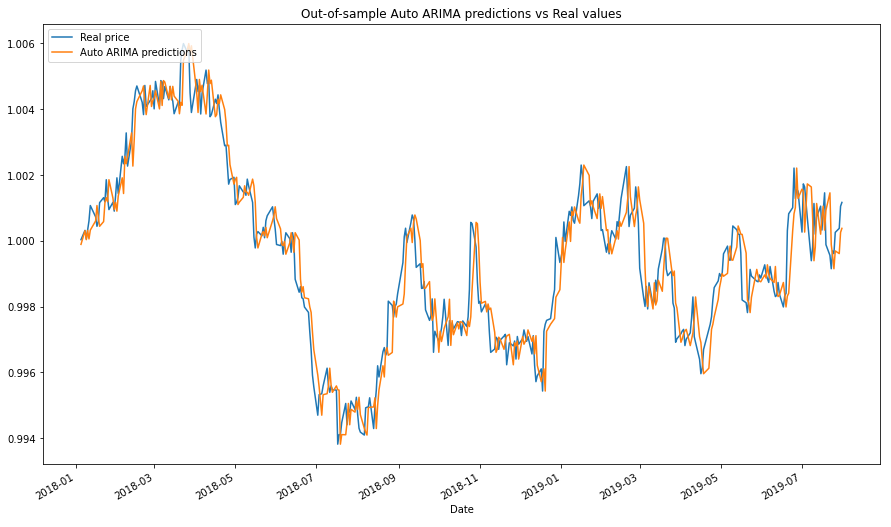

.. _time_series_approach-introduction:

============
Introduction
============

Time Series Approach
####################

This approach is not focusing on picking a set of comoving securities, but assumes that they have already
been chosen in the prior stage using either a standard cointegration test or one of the alternative methods.
The core idea of the time series approach is to model the spread of the pair or a set of assets, and
therefore generating the optimized trading signals.

    An example showing predicted spread values using the Auto ARIMA approach and real spread values.
    The Auto ARIMA model is used in the Quantile Time Series Strategy, described in the book by
    Simão Moraes Sarmento, and Nuno Horta
    `"A Machine Learning based Pairs Trading Investment Strategy" <https://www.springer.com/gp/book/9783030472504>`__.

Tools that can be used to model the spread include, but are not limited to: a time series model,
a state-space model, a Bayesian approach, models based on the OU processes, nonparametric approach
with renko and kagi.
