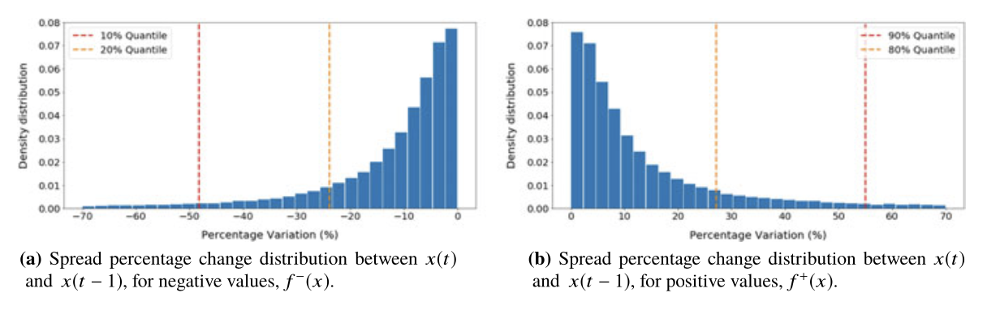
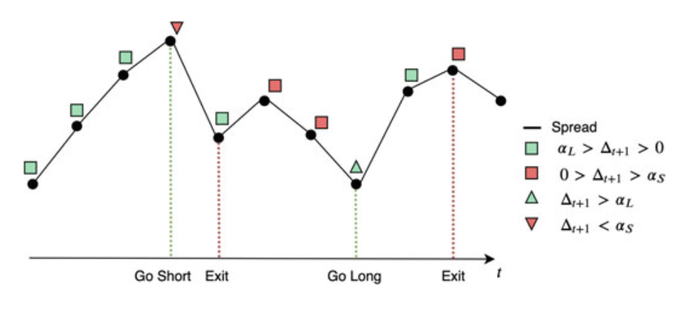
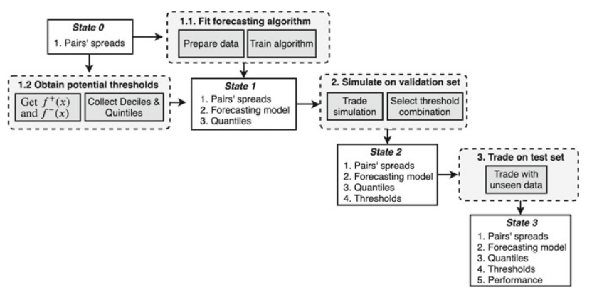

.. _time_series_approach-distance_approach:

.. note::
   The following documentation closely follows a book by Simão Moraes Sarmento, and Nuno Horta:
   `"A Machine Learning based Pairs Trading Investment Strategy" <https://www.springer.com/gp/book/9783030472504>`__.

=============================
Quantile Time Series Strategy
=============================

The authors propose a model based on the predicted future data - price spread. Originally, three
approaches were proposed and the most suitable, based on the empirical testing, was chosen.

The first approach is based on modeling the spread directly from the prices of two legs composing
a pair, later if a predicted return is higher than a predefined threshold, a trade is made.
The second approach is to look at the trends of the spread series and use a momentum strategy to trade
the spread. However, the authors find that these two approaches performed poorly in practice.
The approach that worked the best in empirical testing consisted of first forecasting the future
spread values and then generating the trading signals based on the difference between the forecasted
and actual values. The expectation in this method is that the investor can benefit from an abrupt
movement of the spread value.

Auto ARIMA
##########

This strategy needs a forecasting algorithm to work. In general, the algorithms for this
purpose can be subdivided into two categories - parametric and non-parametric.

The former supposes that the underlying process has a particular structure that can be described with
a small number of parameters. However, the models in this approach have their limitations.
The latter make no structural assumptions about the underlying structure of the process. These can
be Artificial Neural Networks.

Currently, in this module, the ARIMA model with automatically fit parameters is used to forecast the
spread values. As the input price series to this strategy are required to be cointegrated. This implies
that the spread is stationary (during the formation period) and therefore the process can be described
with a simpler model.

The ARIMA model describes a stochastic process as a composition of polynomials. The first polynomial
called the autoregression (AR) is regressing the variable at time :math:`t` on its own lagged values.
The second polynomial is the moving average (MA) and it's modeling the prediction error as a linear
combination of lagged error terms and a time series expected value. The integrated (I) part of the model
denotes the differences of series for stationarity. For our purposes, the input series should already be
stationary.

The ARIMA(p,d,q) model can be represented as:

.. math::

    x_{t} = c + \epsilon_{t} + \sum_{i=1}^{p} \phi_{i} x_{t-1} + \sum_{i=1}^{q} \Theta_{i} \epsilon_{t-i}

Where the :math:`c` included a constant and a mean value of the :math:`x_{t}` series. The
:math:`\epsilon_{t}, \epsilon_{t-1}, ..., \epsilon_{t-q}` are random variables corresponding to white noise
error terms in the corresponding time instances. The :math:`\phi_{t}, ..., \phi_{p}, \Theta_{1}, ..., \Theta_{q}`
are the model parameters.

If the input series are cointegrated of order zero, then :math:`x_{t} = X_{t}`, where :math:`X_{t}` is the
input time series. If the cointegration order is one, then :math:`x_{t} = X_{t} - X_{t-1}` and so on.

The best fitting ARIMA model is chosen using the Akaike Information Criterion (AIC):

.. math::

    AIC = 2k - 2ln(L)

Where :math:`k` is the number of moel parameters and :math:`L` is the likelihood function.

.. figure:: images/auto_arima_prediction.png
    :scale: 80 %
    :align: center

    An example showing predicted spread values using the Auto ARIMA approach and real spread values.

Implementation
**************

.. py:currentmodule:: arbitragelab.time_series_approach.arima_predict

.. autoclass:: AutoARIMAForecast
    :members:

    .. automethod:: __init__

Quantile Time Series Strategy
#############################

In this section, the method is described in more detail. The :math:`S_{t}` and :math:`S^{*}_{t}` are defined
as the true and predicted values of the spread at time :math:`t`. The signals generation is based on the
predicted change:

.. math::

    \delta_{t+1} = \frac{S^{*}_{t+1} - S_{t}}{S_{t}} * 100

Market entry conditions are based on the thresholds (:math:`\alpha_{L}, \alpha_{S}`):

.. math::

    Position  = \begin{cases}
                    \begin{split}
                        Long         &\text{, if } \Delta_{t+1} \ge \alpha_{L} \\
                        Short        &\text{, if } \Delta_{t+1} \le \alpha_{S} \\
                        No Position  &\text{, otherwise.}
                    \end{split}
                \end{cases}

One approach that can be taken is to solve a maximization problem to find the entry and exit conditions
that would result in a maximum profit. However, this would result in data-snooping and adding extra complexity,
as mentioned by the authors.

The approach that is used in this strategy is based on picking the quantiles of the percentage change
distribution during a formation period. First, the spread percentages at any time :math:`t` are calculated
as:

.. math::

   x_{t} = \frac{S_{t} - S_{t-1}}{S_{t-1}} * 100

Next, for :math:`f(x)` - the distribution of percentage changes, the negative and the positive changes are
considered separately to get the needed quantile values:

    Spread percentage change distributions. An example from the book by Simão Moraes Sarmento, and Nuno Horta
    `"A Machine Learning based Pairs Trading Investment Strategy" <https://www.springer.com/gp/book/9783030472504>`__.

Choosing quantiles as thresholds fits the idea of targeting the abrupt changes that occur frequently enough.
The authors recommend picking either 10% or 20% quantiles for thresholds. The illustration of the quantile
time series strategy is provided below.

    Proposed forecasting-based strategy. An example from the book by Simão Moraes Sarmento, and Nuno Horta
    `"A Machine Learning based Pairs Trading Investment Strategy" <https://www.springer.com/gp/book/9783030472504>`__.

On the above image, the triangles represent the times when one of the thresholds has been triggered and the
squares provide the information regarding the predicted direction.

    Model diagram as presented in the book by Simão Moraes Sarmento, and Nuno Horta
    `"A Machine Learning based Pairs Trading Investment Strategy" <https://www.springer.com/gp/book/9783030472504>`__.

Implementation
**************

.. py:currentmodule:: arbitragelab.time_series_approach.quantile_time_series

.. autoclass:: QuantileTimeSeriesTradingStrategy
    :members:

    .. automethod:: __init__

Examples
########

Code Example
************

.. doctest::

   >>> import pandas as pd
   >>> from arbitragelab.time_series_approach.arima_predict import AutoARIMAForecast
   >>> from arbitragelab.time_series_approach.quantile_time_series import (
   ...     QuantileTimeSeriesTradingStrategy,
   ... )
   >>> # Load Non-negative Crude and Gasoline futures data.
   >>> wti_contract_url = "https://raw.githubusercontent.com/hudson-and-thames/example-data/main/arbitrage_lab_data/NonNegative_CL_forward_roll.csv"
   >>> rbob_contract_url = "https://raw.githubusercontent.com/hudson-and-thames/example-data/main/arbitrage_lab_data/NonNegative_nRB_forward_roll.csv"
   >>> wti_contract_df = pd.read_csv(wti_contract_url, parse_dates=["Dates"]).set_index(
   ...     "Dates"
   ... )
   >>> rbob_contract_df = pd.read_csv(rbob_contract_url, parse_dates=["Dates"]).set_index(
   ...     "Dates"
   ... )
   >>> working_df = pd.concat([wti_contract_df, rbob_contract_df], axis=1)
   >>> # working_df.index = pd.to_datetime(working_df.index)
   >>> working_df.columns = ["wti", "gasoline"]
   >>> working_df.dropna(inplace=True)
   >>> # Calculate naive spread between gasoline and wti.
   >>> spread = working_df["gasoline"] - working_df["wti"]
   >>> # Split the dataset into two parts -- the first one for model training...
   >>> data_model_fitting = spread.loc[:"2019-01-01"]
   >>> # ...and the second one for signals generation
   >>> data_signals_generation = spread.loc["2019-01-01":]
   >>> # Create the ARIMA model
   >>> arima_model = AutoARIMAForecast(start_p=1, start_q=1, max_p=10, max_q=10)
   >>> # Finding the best fitting model
   >>> arima_model.get_best_arima_model(y_train=data_model_fitting)
   >>> # Getting the thresholds at 20% and 80% quantiles
   >>> time_series_trading = QuantileTimeSeriesTradingStrategy(
   ...     long_quantile=0.8, short_quantile=0.2
   ... )
   >>> # Calculate the thresholds for the data
   >>> time_series_trading.fit_thresholds(data_model_fitting)
   >>> # Plot thresholds used for trading
   >>> fig = time_series_trading.plot_thresholds()
   >>> fig  # doctest: +ELLIPSIS
   array(...)
   >>> # Generate out-of-sample ARIMA prediction
   >>> oos_prediction = arima_model.predict(
   ...     y=data_signals_generation, silence_warnings=True
   ... )  # doctest: +ELLIPSIS +NORMALIZE_WHITESPACE
   Progress...
   >>> # Use the difference between prediction and actual value to trade the spread
   >>> allocations = []
   >>> for prediction, actual in zip(oos_prediction, data_signals_generation):
   ...     allocation = time_series_trading.get_allocation(
   ...         predicted_difference=prediction - actual, exit_threshold=0
   ...     )
   ...     allocations.append(allocation)
   ...
   >>> allocations[:3]
   [0, 0, 0]
   >>> # Get the trading signals created using quantile time series strategy
   >>> positions = pd.Series(
   ...     index=data_signals_generation.index, data=time_series_trading.positions
   ... )
   >>> positions[:3]  # doctest: +ELLIPSIS +NORMALIZE_WHITESPACE
   Dates
   2019-01-01    0
   2019-01-02    0
   2019-01-03    0
   dtype: int64

Research Notebooks
******************

The following research notebook can be used to better understand the time series approach described above.

* `Quantile Time Series Strategy`_

.. _`Quantile Time Series Strategy`: https://hudsonthames.org/notebooks/arblab/quantile_time_series.html

.. raw:: html

    <a href="https://hudsonthames.org/notebooks_zip/arblab/quantile_time_series.zip"><button style="margin: 20px; margin-top: 0px">Download Notebook</button></a>
    <a href="https://hudsonthames.org/notebooks_zip/arblab/Sample-Data.zip"><button style="margin: 20px; margin-top: 0px">Download Sample Data</button></a>

References
##########

* `Sarmento, S.M. and Horta, N., A Machine Learning based Pairs Trading Investment Strategy <https://www.springer.com/gp/book/9783030472504>`__.
