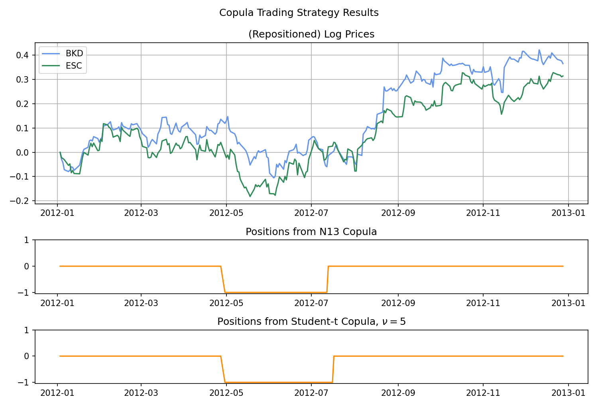

.. _trading-basic_copula:

=============================
Basic Copula Trading Strategy
=============================

.. Note::
    The following strategy closely follows the implementations:

    `Pairs trading: a copula approach. (2013) <https://link.springer.com/article/10.1057/jdhf.2013.1>`__ by Liew, Rong Qi, and Yuan Wu.

    `Trading strategies with copulas. (2013) <https://www.researchgate.net/publication/318054326>`__ by Stander, Yolanda, Daniël Marais, and Ilse Botha.

The trading strategy using copula is implemented as a long-short pairs trading scheme, and uses rules from the general
long-short pairs trading framework.

.. figure:: images/trading_opportunities.png
    :scale: 30 %
    :align: center

    (Figure and Caption from Botha et al. 2013.) An illustration of the areas where the values of U and V respectively 
    are considered extreme when using a 99% confidence level and the N14 copula dependence structure.

Conditional Probabilities
#########################

We start with a pair of stocks of interest :math:`S_1` and :math:`S_2`, which can be selected by various methods.
For example, using the Engle-Granger test for cointegration.
By consensus, we define the spread as :math:`S_1` in relation to :math:`S_2`.
e.g. Short the spread means buying :math:`S_1` and/or selling :math:`S_2`.

Use **prices** data of the stocks during the training/formation period, we proceed with a pseudo-MLE
fit to establish a copula that reflects the relation of the two stocks during the training/formation period.

Then we can calculate the **conditional probabilities** using trading/testing period data:

.. math::
    \begin{align}
    P(U_1\le u_1 | U_2 = u_2), \\
    P(U_2\le u_2 | U_1 = u_1).
    \end{align}

- :math:`u_i \in [0, 1]` is the quantile of trading period data mapped by a CDF formed in the training period.

- When :math:`P(U_1\le u_1 | U_2 = u_2) < 0.5`, then stock 1 is considered under-valued.

- When :math:`P(U_1\le u_1 | U_2 = u_2) > 0.5`, then stock 1 is considered over-valued.

Trading Logic
#############

Now we define an upper threshold :math:`b_{up}` (e.g. 0.95) and a lower threshold :math:`b_{lo}` (e.g. 0.05),
then the logic is as follows:

- If :math:`P(U_1\le u_1 | U_2 = u_2) \le b_{lo}` and :math:`P(U_2\le u_2 | U_1 = u_1) \ge b_{up}`, then stock 1 is
  undervalued, and stock 2 is overvalued. Hence we long the spread. ( :math:`1` in position)

- If :math:`P(U_2\le u_2 | U_1 = u_1) \le b_{lo}` and :math:`P(U_1\le u_1 | U_2 = u_2) \ge b_{up}`, then stock 2 is
  undervalued, and stock 1 is overvalued. Hence we short the spread. ( :math:`-1` in position)

- If both/either conditional probabilities cross the boundary of :math:`0.5`, then we exit the position, as we consider
  the position no longer valid. ( :math:`0` in position)

Ambiguities and Comments
************************

The authors did not specify what will happen if the followings occur:

1. When there is an open signal and an exit signal.
    
2. When there is an open signal and currently there is a position.
    
3. When there is a long and short signal together.

Here is our take:

1. Exit signal overrides open signal.

2. Flip the position to the signal's suggestion. For example, originally have a short position, and receives a long
   signal, then the position becomes long.
   
3. Technically this should never happen with the default trading logic. However, if it did happen for whatever
   reason, long + short signal will lead to no opening signal and the positions will not change, unless there is
   an exit signal and that resets the position to 0.

For exiting a position, the authors proposed using **'and'** logic: Both conditional probabilities need to cross :math:`0.5`.
However, we found this too strict and sometimes fails to exit a position when it should. Therefore we also provide the
**'or'** logic: At least one of the conditional probabilities cross :math:`0.5`.

    A visualised output of using a Student-t and N13 copula. The stock pair considered is BKD and ESC. 
    The thresholds are 0.95 and 0.05.
	
.. figure:: images/formation_copulas.png
    :scale: 40 %
    :align: center

    Sampling from the various fitted copulas, and plot the empirical density from training data
    from BKD and ESC.

Implementation
##############

.. Note::
    The new :code:`BasicCopulaTradingRule` class is created to allow on-the-go generation of trading signals and
    better management of opened and closed positions. It is a refactored version of the old :code:`BasicCopulaStrategy`
    class that worked as a monolith, outputting trading signals for a pandas DataFrame. The new class takes price
    values one by one and generates signals to enter or exit the trade, making its integration into an existing
    trading pipeline easier.

.. automodule:: arbitragelab.trading.basic_copula
        
.. autoclass:: BasicCopulaTradingRule
    :members: __init__, set_copula, set_cdf, update_probabilities, check_entry_signal, add_trade, update_trades

Example
*******

.. code-block::

    # Importing the module and other libraries
    from arbitragelab.copula_approach import fit_copula_to_empirical_data
    from arbitragelab.copula_approach.archimedean import Gumbel
    from arbitragelab.trading.basic_copula import BasicCopulaTradingRule
    import pandas as pd

    # Instantiating the module with set open and exit probabilities
    # and using the 'AND' exit logic:
    cop_trading = BasicCopulaTradingRule(exit_rule='and', open_probabilities=(0.5, 0.95),
                                         exit_probabilities=(0.9, 0.5))

    # Loading the data
    pair_prices = pd.read_csv('PRICE_DATA.csv', index_col='Dates', parse_dates=True)

    # Split data into train and test sets
    prices_train = pair_prices.iloc[:int(len(s1_price)*0.7)]
    prices_test = pair_prices.iloc[int(len(s1_price)*0.7):]

    # Fitting copula to data and getting cdf for X and Y series
    info_crit, fit_copula, ecdf_x, ecdf_y = fit_copula_to_empirical_data(x=prices_train['BKD'],
                                                                         y=prices_train['ESC'],
                                                                         copula=Gumbel)

    # Printing fit scores (AIC, SIC, HQIC, log-likelihood)
    print(info_crit)

    # Setting initial probabilities
    cop_trading.current_probabilities = (0.5, 0.5)
    cop_trading.prev_probabilities = (0.5, 0.5)

    # Adding copula to strategy
    cop_trading.set_copula(fit_copula)

    # Adding cdf for X and Y to strategy
    cop_trading.set_cdf(cdf_x, cdf_y)

    # Trading simulation
    for time, values in prices_test.iterrows():
        x_price = values['BKD']
        y_price = values['ESC']

        # Adding price values
        cop_trading.update_probabilities(x_price, y_price)

        # Check if it's time to enter a trade
        trade, side = cop_trading.check_entry_signal()

        # Close previous trades if needed
        cop_trading.update_trades(update_timestamp=time)

        if trade:  # Open a new trade if needed
            cop_trading.add_trade(start_timestamp=time, side_prediction=side)

    # Finally, check open trades at the end of the simulation
    open_trades = cop_trading.open_trades

    # And all trades that were opened and closed
    closed_trades = cop_trading.closed_trades

Research Notebooks
##################

The following research notebook can be used to better understand the copula strategy described above.

* `Basic Copula Strategy`_

.. _`Basic Copula Strategy`: https://hudsonthames.org/notebooks/arblab/Copula_Strategy_Basic.html

.. raw:: html

    <a href="https://hudthames.tech/3xsu5ws"><button style="margin: 20px; margin-top: 0px">Download Notebook</button></a>
    <a href="https://hudthames.tech/2S03R58"><button style="margin: 20px; margin-top: 0px">Download Sample Data</button></a>

Research Article
################

.. raw:: html

    

    <button class="special" onclick="window.open('https://hudsonthames.org/copula-for-pairs-trading-introduction/','_blank')">
      Read our article on the topic
    </button>

|

References
##########

* `Liew, R.Q. and Wu, Y., 2013. Pairs trading: A copula approach. Journal of Derivatives & Hedge Funds, 19(1), pp.12-30. <https://link.springer.com/article/10.1057/jdhf.2013.1>`__
* `Stander, Y., Marais, D. and Botha, I., 2013. Trading strategies with copulas. Journal of Economic and Financial Sciences, 6(1), pp.83-107. <https://www.researchgate.net/publication/318054326>`__
