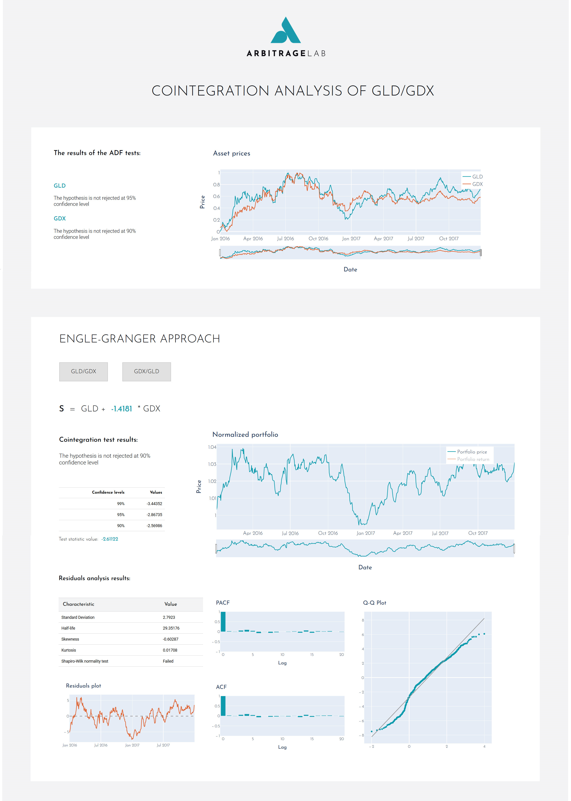
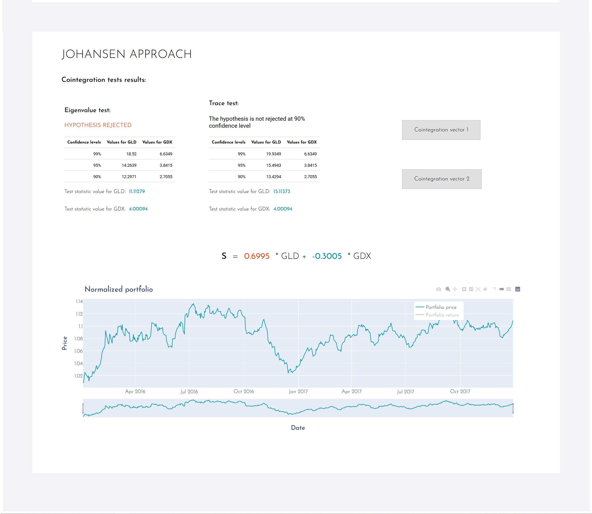
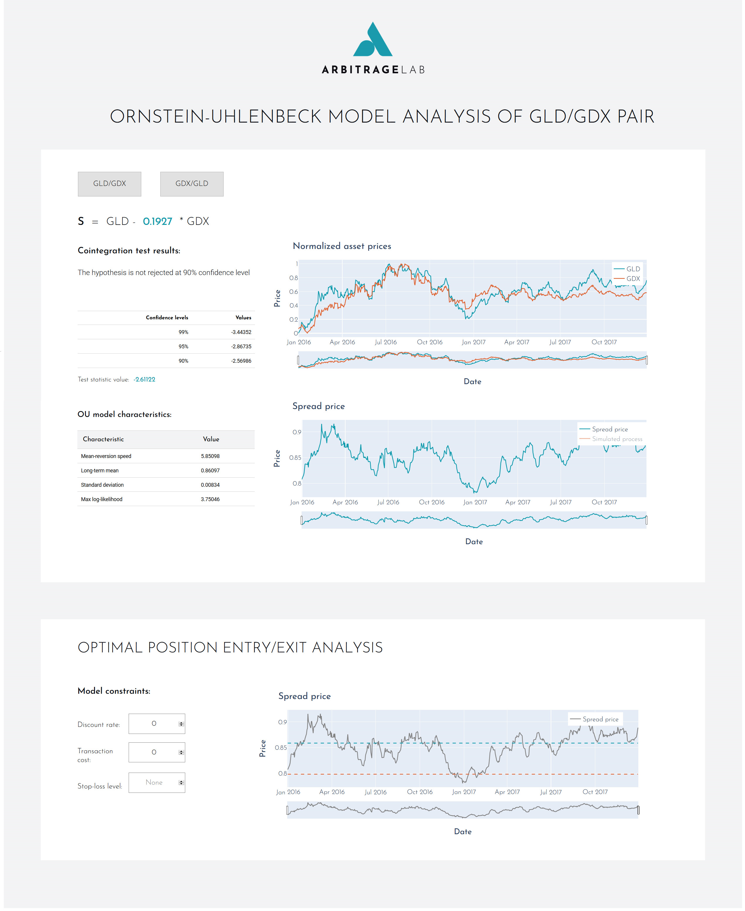

.. _tearsheet-tearsheet:

==========================
Visualization Tear Sheets
==========================

.. note::
   `Read our article on the topic <https://hudsonthames.org/introducing-arbitragelab-tear-sheets/>`_

`TearSheet` is the visualization class for the pairs analysis process
based on different modules implemented in the ArbitrageLab package. It creates a locally ran Flask server,
bringing an interactive approach to the data visualization with `Plotly's Dash <https://dash.plotly.com>`_.

.. Note::

    Running `run_server()` will produce the warning

    "Warning: This is a development server. Do not use app.run_server
    in production, use a production WSGI server like gunicorn instead."

    However, this is okay and the Dash server will run without a problem.

Currently, two tear sheets are present in the module:
Cointegration analysis and OU-model analysis available for the users.

Cointegration Tear Sheet
########################

.. raw:: html

    

        <iframe src="https://www.youtube.com/embed/dO0toCkR9ro"
                frameborder="0"
                allowfullscreen
                style="position: absolute;
                       top: 0;
                       left: 0;
                       width: 100%;
                       height: 100%;">
        </iframe>
         
    

|

.. Note::

    All the methods used in the creation of this tear sheet are available in the `arbitragelab.cointegration_approach` module.

**The first section** contains the ADF test results for each of the assets from the provided pair separately and a
plot of their normalized price series.

**The second section** is dedicated to the Engle-Granger cointegration test and further analysis. The results
are provided for both possible combinations of the assets in the Engle-Granger-type portfolio and you can
switch between them by clicking a respective button.

Provided data:

* Portfolio coefficient
* Cointegration test results
* Normalized portfolio price/returns plot
* Model residuals analysis

    * Statistical characteristics
    * Residuals plot
    * ACF and PACF plots
    * Q-Q plot

**The third section** is focused on the Johansen cointegration test and further portfolio analysis. The results
are provided for both possible cointegration vectors of the assets in the Johansen-type portfolio, and you can
switch between them by clicking a respective button.

Provided data:

* Cointegrated portfolio coefficients
* Cointegration test results for both eigen and trace cointegration tests
* Normalized portfolio price/returns plot

Implementation
**************

.. automodule:: arbitragelab.tearsheet.tearsheet

.. autoclass:: TearSheet
   :members: __init__

.. automethod:: TearSheet.cointegration_tearsheet

Code Example
************

.. code-block::

    # Import ArbitrageLab tools
    from arbitragelab.tearsheet import TearSheet

    # Initialize TearSheet class
    tearsheet = TearSheet()

    # Get server app
    server = tearsheet.cointegration_tearsheet(data)

    # Run server
    server.run_server(port=8050)

OU Model Tear Sheet
###################

.. raw:: html

    

        <iframe src="https://www.youtube.com/embed/HGbWL2hhEUU"
                frameborder="0"
                allowfullscreen
                style="position: absolute;
                       top: 0;
                       left: 0;
                       width: 100%;
                       height: 100%;">
        </iframe>
         
    

|

.. Note::

    All the methods used in the creation of this tear sheet are availible in the `arbitragelab.optimal_mean_reversion` module.

**The first section** contains the information regarding the cointegration of the provided assets and
also parameters of the fitted OU model to created optimal spread. The results are provided for both possible combination
of the assets in the Engle-Granger-type portfolio, and you can switch between them by clicking the respective button.

Provided data:

* Optimal portfolio coefficient
* Cointegration test results for the two assets
* Normalized portfolio price/returns plot
* Fitted OU process characteristics
* Spread price
* Simulated OU process with the same parameters

**The second section** serves as a testing ground for the optimal stopping and liquidation levels calculation.
The user is invited to alter the values of the discount rate, transaction cost, or set a stop-loss level - if
optimal solutions exist, all the changes will be reflected onto the optimal levels graph.

.. Note::
    The optimal levels graph may appear blank or unchanging after new parameters have been entered, since it takes time
    for the model to be retrained. However, they will load eventually.

Implementation
**************

.. automethod:: TearSheet.ou_tearsheet

Code Example
************

.. code-block::

    # Import ArbitrageLab tools
    from arbitragelab.tearsheet import TearSheet

    # Initialize TearSheet class
    tearsheet = TearSheet()

    # Get server app
    server = tearsheet.ou_tearsheet(data)

    # Run server
    server.run_server(port=8050)

Running Dash in Jupyter
#######################

You can easily run a Dash server within Jupyter Notebook. The `Jupyter Dash library <https://github.com/plotly/jupyter-dash>`_ is used to provide this functionality.

When you initialize the server by using either `cointegration_tearsheet` or `ou_tearsheet` functions, you must add argument ``app_display='jupyter'``.

.. Warning::
    Jupyter layout may not be optimal for all devices as it depends on the screen ratio, resolution and scaling.

To run the visualizations in Jupyter, replace:

.. code-block::

    # Import ArbitrageLab tools
    from arbitragelab.tearsheet import TearSheet

    # Initialize TearSheet class
    tearsheet = TearSheet()

    # Get server app
    server = tearsheet.cointegration_tearsheet(data)

    # Run server
    server.run_server(port=8050)

With:

.. code-block::

    # Import ArbitrageLab tools
    from arbitragelab.tearsheet import TearSheet

    # Initialize TearSheet class
    tearsheet = TearSheet()

    # Get server app with extra argument 'jupyter'
    server = tearsheet.cointegration_tearsheet(data, app_display='jupyter')

    # Run server
    server.run_server(mode='inline', port=8050)

Initialising the server with an additional argument ``'jupyter'``, creates a JuptyerDash class instead of a Dash class.
Running ``mode='inline'`` will allow the interactive visualisations to display within a cell output of the Jupyter notebook.
For detailed explanations of the different modes, refer to
`this article <https://medium.com/plotly/introducing-jupyterdash-811f1f57c02e>`_ on Jupyter Dash.
